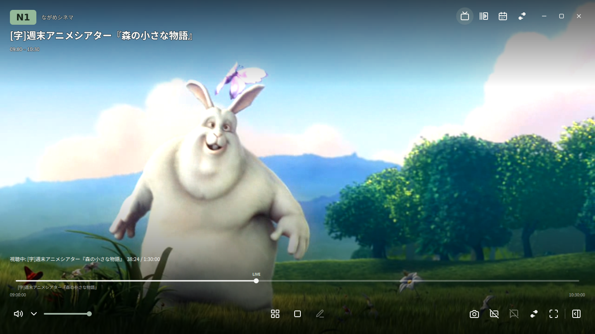
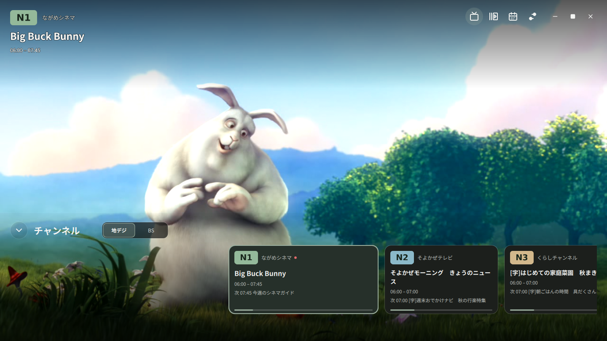
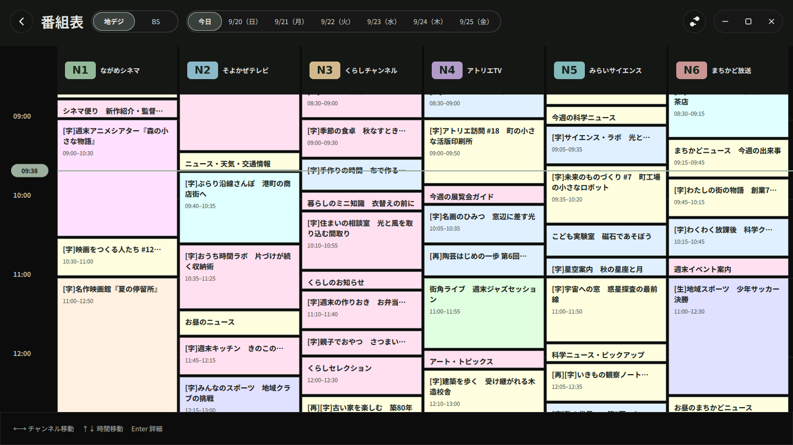

# NagameTV (ながめTV)

[日本語](README.md) | English

NagameTV is a TV viewer and recording player for Linux desktops, designed for Japanese digital TV broadcasts. It supports live terrestrial, BS, and CS broadcasts through a Mirakurun server, as well as playback of local MPEG-2 TS recordings.

Features include a seven-day electronic program guide (EPG), ARIB-compliant subtitles, and live comment overlays and posting through NX-Jikkyo.

**[Download the latest development build (Linux x86_64)](https://github.com/ouvill/NagameTV/releases/tag/latest-build)** · [Installation](#installation)



| Channel list | Program guide |
| :---: | :---: |
|  |  |

The detailed documentation linked below is currently available in Japanese.

---

## Features

### Live TV

- **Mirakurun integration**: Connect to a Mirakurun server on your network to receive and play TV broadcasts.
- **Channel selection**: Browse a channel carousel with station logos, and filter channels using terrestrial, BS, CS, and CATV tabs.
- **Channel switching**: Use Page Up and Page Down to switch to the previous or next channel.

### Recordings, video files, and timeshift

- **Local playback**: Drag and drop TS, MP4, or MKV files onto the window, or open them with the file picker. This works without a configured Mirakurun server. MP4 and MKV playback has been tested with H.264/HEVC video and AAC audio. [Supported formats and limitations](docs/recording-playback.md#mp4mkvの再生)
- **HTTP recording playback**: Paste the URL of a recording from EPGStation or another server into “Open recording” to play it. The server must support HTTP Range requests. [Usage and supported features](docs/recording-playback.md#epgstationの録画url)
- **EPGStation recording browser**: Search recordings on the server and choose an original TS recording or an encoded video to play. Supports the common APIs of upstream EPGStation v2 and username/password authentication in the stuayu fork. [Connection setup and supported features](docs/epgstation.md)
- **Playback controls**: Seek with the progress bar, skip backward or forward by 10 seconds, pause, and resume.
- **Program information during playback**: Read metadata (EIT/SDT/TOT) embedded in TS streams to display the program title, description, and genre for the current playback position.
- **Timeshift**: Choose “Only when paused,” “Always enabled,” or “Off.” In “Only when paused” mode, resume from where you paused; returning to live TV clears the buffered history. You can also rewind within the retained buffer and play at increased speed.

### Electronic program guide (EPG)

- **Weekly guide**: View schedules across multiple channels for seven days starting today.
- **Program details**: Check program titles, descriptions, genres, and broadcast dates and times.

### Live comments (NX-Jikkyo integration)

- **Comment overlays (danmaku)**: Receive NX-Jikkyo comments for the station you are watching and display them over the video.
- **Display styles**: Choose horizontal scrolling or a fountain effect, with comments following parabolic paths from the bottom of the screen.
- **Posting comments**: Send comments using a dedicated input field. Your own posts are highlighted with a yellow border.
- **Appearance settings**: Adjust font size (14–72 px), opacity, speed, and shadows.

### Subtitles and audio

- **Video subtitles**: Select embedded text subtitles in MP4/MKV files or external SRT and ASS/SSA files from the playback controls. [Subtitle and comment support](docs/recording-playback.md#一般動画の字幕)
- **ARIB subtitles**: Display subtitles for terrestrial and BS broadcasts using a font with ARIB extended characters and transmitted DRCS bitmaps, with an option to always draw outlines.
- **Audio track selection**: Switch between primary and secondary audio tracks.
- **Dual mono audio**: For dual mono broadcasts, choose primary audio only, secondary audio only, or both channels as stereo output.
- **Volume control**: Adjust volume with a slider, mute audio, and retain the volume level when playback resumes.

### Screenshots and external control

- **Screenshots**: Save the current video frame as a PNG image, including visible subtitles and comment overlays.
- **Autoplay on startup**: Optionally resume the last watched channel when the app starts.
- **Interface languages**: Japanese and English are supported.
- **Remote control API**: Control channel selection and playback from another device on your home LAN using gRPC or gRPC-Web.

---

## System requirements

The following environment is required to run the application:

- **OS**: A Linux desktop environment (X11 or XWayland).
  - Tested on Ubuntu 24.04 LTS, Ubuntu 26.04 LTS, and Fedora 40 or later.
- **Audio server**: PipeWire or PulseAudio.
- **Mirakurun server**: Required for live TV and fetching EPG data. A Mirakurun server is not required to play recordings or video files.
- **Graphics**: An OpenGL-capable GPU is recommended.

---

## Installation

Prebuilt packages are available from [GitHub Releases](https://github.com/ouvill/NagameTV/releases).
The [latest development build (pre-release)](https://github.com/ouvill/NagameTV/releases/tag/latest-build) is updated after successful CI runs on `main`.
It includes changes ahead of formal releases, and its contents may change even when the version and filename stay the same.

Use the download links in the release description or the **Assets** section at the bottom of the release to download one package for your environment.
If the asset list is collapsed, click its heading to expand it.
`Source code (zip)` and `Source code (tar.gz)` are source archives. To install the app, choose one of the packages below.

| Environment / format | File to download (Linux x86_64 / amd64) |
| --- | --- |
| Ubuntu 24.04 | `nagametv_…ubuntu24.04_amd64.deb` |
| Ubuntu 26.04 | `nagametv_…ubuntu26.04_amd64.deb` |
| Linux with Flatpak installed | `nagametv-…-x86_64.flatpak` |
| Run a single file on Linux with glibc 2.39 or later | `nagametv-…-x86_64.AppImage` |

Run the following commands in the directory where you downloaded the package. Replace the example filenames with the ones you downloaded.
To verify the SHA-256 checksum, save the matching `.sha256` file in the same directory and run `sha256sum --check filename.sha256`.

### 1. Ubuntu deb package (Ubuntu 24.04 / 26.04)

Install the package and its dependencies with APT:

```sh
# For Ubuntu 24.04
sudo apt install ./nagametv_0.1.0-1ubuntu24.04_amd64.deb

# For Ubuntu 26.04
sudo apt install ./nagametv_0.1.0-1ubuntu26.04_amd64.deb
```

After installation, launch NagameTV from your application launcher or run `nagametv` in a terminal. See the [deb guide](docs/deb.md) for package details and build instructions.

### 2. Flatpak package

Use Flatpak to run the app in a sandbox across Linux distributions.

```sh
flatpak install --user ./nagametv-0.1.0-x86_64.flatpak
flatpak run io.github.ouvill.nagametv
```

Required runtimes are downloaded from Flathub during installation. See the [Flatpak guide](docs/flatpak.md) for details.

### 3. AppImage package

Use AppImage to run the app directly from a single file without installing a package.

```sh
chmod +x ./nagametv-0.1.0-x86_64.AppImage
./nagametv-0.1.0-x86_64.AppImage
```

See the [AppImage guide](docs/appimage.md) for build instructions and glibc compatibility requirements. To build directly from source, see the [development, build, and diagnostics guide](docs/development.md).

---

## Uninstallation

For removal instructions and information about saved data, see the guide for your installation format:

- [Ubuntu deb package](docs/deb.md#インストール更新削除)
- [Flatpak package](docs/flatpak.md#アンインストール)
- [AppImage package](docs/appimage.md#更新削除)
- [Manually built or installed native version](docs/development.md#手動ビルド版の削除)

---

## Basic usage

### 1. Initial setup (connecting to Mirakurun)

On first launch, the “Connect to Mirakurun” screen appears. Enter the URL of a running Mirakurun server (for example, `http://192.168.1.100:40772`) and select “Connect.” Once the connection is verified, the settings are saved and the channel selection screen opens. You can change the server later under “Connection” in Settings.

### 2. Selecting a channel

Open the channel list using the channel button at the bottom of the screen or the `S` key. Filter the list using tabs such as terrestrial or BS, then click a card to tune in. While watching live TV, use `PgUp` / `PgDown` to switch to the previous or next channel.

### 3. Opening the program guide

Press `G` or use the program guide button to open the seven-day EPG. You can view it while watching live TV, while playback is stopped, or while offline.

### 4. Playing TS recordings

Drag and drop a TS file onto the window, or press `Ctrl + O` to open “Open recording,” then select a file or enter a recording URL. During playback, press `Space` to pause or resume and the left/right arrow keys to skip backward or forward by 10 seconds. To return to live TV, click the TV button at the top right or select a station from the channel list.

### 5. Viewing and posting live comments

Comments are enabled by default. Toggle comment overlays and adjust their motion (scrolling or fountain), font size, and opacity under “Comments” in Settings or “Playback settings” on the playback bar. Press `C` to open the comment input at the bottom of the screen, enter your text, and press `Ctrl + Enter` to send it. You can configure the app to send with `Enter` alone.

### 6. Taking screenshots

Click the camera button on the playback bar or press `Ctrl + S` to save the current frame as a PNG image. Visible subtitles and comment overlays are included. By default, screenshots are saved in the `nagametv` subdirectory of your desktop's Pictures folder (typically `~/Pictures/nagametv/`). You can change the destination under “Display” in Settings.

---

## Keyboard shortcuts

| Key | Action | Notes |
| :--- | :--- | :--- |
| `↑` / `↓`, `Enter` | Move focus from the video to the controls | Up opens the top navigation; Down or Enter moves to the playback controls. When a button has focus, use arrow keys to navigate and Enter to activate it. |
| `S` | Toggle the channel list | Shows the channel carousel. |
| `C` | Open the comment input | Moves focus to the input field. |
| `G` | Toggle the program guide | Shows the seven-day EPG. |
| `Space` | Play / pause | Available when the video has focus during recording playback, or during live TV when pausing is available. |
| `←` / `→` | Skip backward / forward by 10 seconds | Available when the video has focus during recording or timeshift playback. Within controls, these keys move focus or adjust values. |
| `PgUp` / `PgDown` | Previous / next channel | Available during live TV. |
| `Ctrl + S` | Save a screenshot | Saves a PNG including subtitles and comment overlays. |
| `Ctrl + O` | Open a recording (file / URL) | Also available on the initial connection screen. |
| `F11` | Toggle fullscreen | You can also double-click the video area. |
| `Escape` / Back button | Close a panel / return to the video / exit fullscreen | Goes back one level at a time, starting with the topmost panel. Supports keyboard and remote control Back keys, as well as the mouse Back button. |

While typing in a text field, such as the comment input, letter-key navigation shortcuts and seeking shortcuts are automatically disabled to prevent accidental actions.

---

## Settings storage

The server URL, last selected channel, volume, and display preferences are saved on exit and restored the next time the app starts.

- **Native and AppImage versions**: `~/.config/nagametv/` (`$XDG_CONFIG_HOME/nagametv/`).
- **Flatpak version**: `~/.var/app/io.github.ouvill.nagametv/config/nagametv/`.

Enable “Play automatically on startup” under Settings → Connection to start playing the last selected channel when the app launches.

---

## Remote control API

NagameTV provides a gRPC / gRPC-Web API (`viewer.v1.PlayerService`) for controlling the app from another device on your home LAN.

- Supports channel selection, playback and stopping, volume adjustment, muting, subtitle toggling, and playback state subscriptions (`WatchState`).
- Enable it under Settings → Remote control (default port: `50051`).
- See the [remote control API documentation](docs/remote-control.md) and [Protocol Buffers definitions](docs/api/remote-control.md) for specifications and setup instructions.

---

## Related documentation

The [documentation index](docs/README.md) provides access to detailed architecture and specifications. These documents are in Japanese.

- **[Documentation index](docs/README.md)**: An index of all project documentation.
- **[Development, build, and diagnostics guide](docs/development.md)**: Build instructions, test commands, and diagnostics.
- **[Architecture](docs/architecture.md)**: Responsibilities of the playback core, UI, and supporting features.
- **[Coding conventions](docs/coding-conventions.md)**: Rust/QML/C++ design guidelines, including enums and typestate.
- **[TS recording playback](docs/recording-playback.md)**: The internal TS playback pipeline and supported features.
- **[Planned features and improvements](docs/backlog.md)**: Development roadmap and open improvements.

---

## Assets and credits

- **Sample video**: [Big Buck Bunny](https://peach.blender.org/about/)
  (c) copyright 2008, Blender Foundation / [www.bigbuckbunny.org](https://www.bigbuckbunny.org) — [CC BY 3.0](https://creativecommons.org/licenses/by/3.0/)
- See [docs/media/README.md](docs/media/README.md) for details about the assets used in screenshots and their credits.

---

## License

The source code is published under the license terms included in this repository.
See the individual source files and license notices for details.
