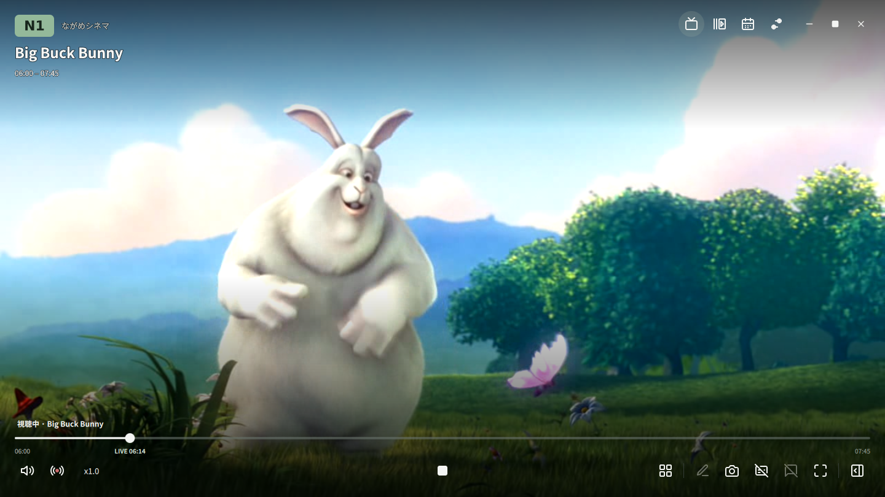
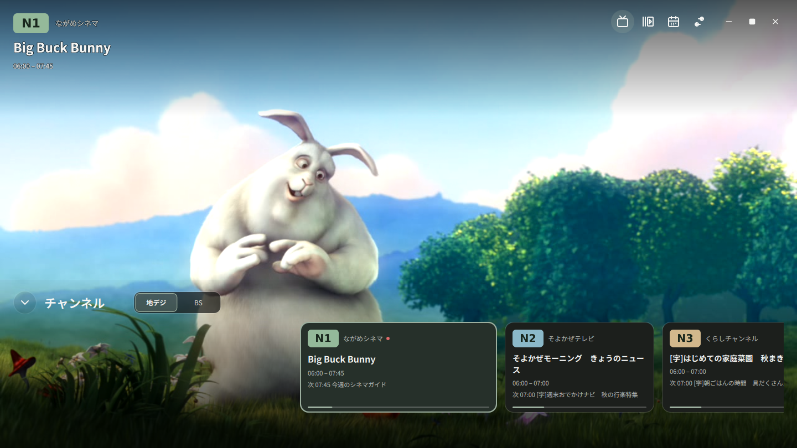
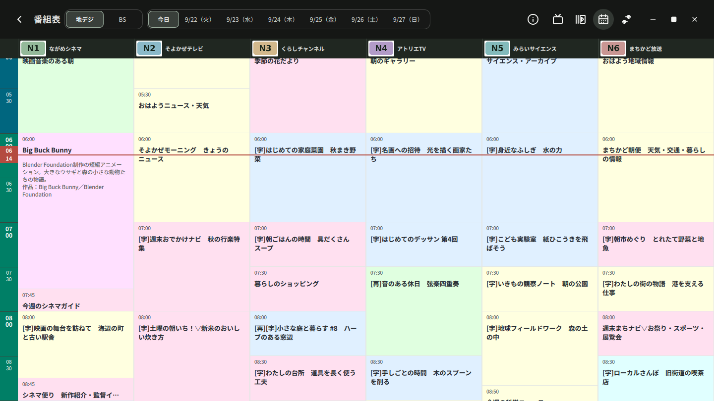

# ながめTV / NagameTV

Mirakurunサーバーのテレビ放送とローカルのTS録画を再生するLinux向けアプリです。
7日分の番組表、字幕表示、NX-Jikkyoの実況コメントに対応しています。



[スクリーンショット一覧](docs/media/README.md)

撮影には架空の局・番組編成を使用し、サンプル映像の番組名は作品名を表示しています。
映像: [Big Buck Bunny](https://peach.blender.org/about/),
(c) copyright 2008, Blender Foundation / www.bigbuckbunny.org —
[CC BY 3.0](https://creativecommons.org/licenses/by/3.0/)。[素材とクレジット](docs/media/README.md#素材とクレジット)

| 番組を見ながらチャンネル選択 | 今日から7日分の番組表 |
| --- | --- |
|  |  |

## できること

- ライブ視聴と、放送種別で絞り込めるチャンネル一覧
- ローカルTS録画の再生・一時停止・シークとTS由来の番組情報表示
- 現在の番組情報と、複数のチャンネルを並べた今日から7日分の番組表
- 字幕の表示／非表示
- NX-Jikkyoの実況受信、映像への弾幕表示、コメント投稿
- 音量・ミュート、音声トラックと二重音声の切り替え
- スクリーンショットの保存、起動時の自動再生
- 日本語／英語の表示切り替え

今後追加したい機能は[未実装機能・改善候補](docs/backlog.md)にまとめています。

## 利用に必要なもの

Linuxのデスクトップ環境が必要です。Flatpak版とAppImage版を利用できます。
ライブ視聴には接続可能なMirakurunサーバーも必要です。
テレビ放送の受信はMirakurun側で行うため、このアプリにはMirakurunの接続先を設定します。
現在のFlatpak版・AppImage版はX11／XWaylandで動作します。

## インストール

`.flatpak`ファイルを置いたディレクトリーで実行します。

```sh
flatpak install --user ./nagametv-0.1.0-x86_64.flatpak
flatpak run io.github.ouvill.nagametv
```

インストール後はアプリ一覧からも起動できます。初回は必要な実行環境も自動でダウンロードします。
パッケージの作成方法と、更新・削除の手順は[Flatpakの手順](docs/flatpak.md)を参照してください。

AppImage版はUbuntu 24.04（glibc 2.39）をビルド基準とします。
ファイルに実行権限を付けて起動します。

```sh
chmod +x ./nagametv-0.1.0-x86_64.AppImage
./nagametv-0.1.0-x86_64.AppImage
```

ビルド方法、必要な実行環境、OSの互換性条件は[AppImageの手順](docs/appimage.md)を参照してください。

## 使い方

1. 初回起動の「Mirakurun に接続」画面で、サーバーのURL（例: `http://192.168.1.100:40772`）を入力して「接続する」を押します。接続を確認できたら接続先を保存します。失敗した場合は同じ画面で修正・再試行できます。
2. 接続成功後に「チャンネルを選ぶ」を押し、視聴したいチャンネルを選びます。番組表の取得完了を待つ必要はありません。
3. 字幕は再生バーの字幕ボタン、または設定の「表示」で切り替えます。初期状態では非表示です。
4. 実況コメントの受信や映像への重ね表示は、設定の「コメント」で変更します。受信は初期状態で有効、映像への重ね表示はOFFです。

コメントの文字サイズは14〜72pxで調整でき、初期値は36px（映像の高さ720pxが基準）です。
ドロップシャドウもON／OFFを切り替えられます。
再生バーの「再生設定」からも変更できます。影は初期状態でONです。

接続先・選択局・音量・表示設定は次回起動時に復元します。
音量の初期値は100%です。
ネイティブ版・AppImage版の設定は `~/.config/nagametv/`
（`XDG_CONFIG_HOME`指定時はその配下）に保存します。
通常起動では前回の選択局で待機し、再生ボタンを押すと視聴を開始します。
設定の「接続」にある「起動時に自動再生する」をONにすると、次回起動から
前回の選択局を自動で再生します。初期状態ではOFFです。
番組表は再生停止中も利用できます。
接続先の変更は右上の設定ボタンから「接続」を開きます。
次回起動時に接続できない場合は「再接続」または「接続先を変更」から復旧できます。

再生中の操作部は、しばらく操作しないと隠れます。マウスを動かすと再表示します。

### スクリーンショットを保存する

再生バーのカメラボタン、または**Ctrl + S**で映像を撮影し、PNG画像をすぐ保存します。
既定の保存先は「ピクチャ」内の`nagametv`フォルダーです。フォルダーがなければ自動作成します。
ファイル名には日時を付け、同じ日時の撮影でも既存の画像を上書きしません。
表示中の字幕・弾幕コメントを含めて保存します。操作ボタン、番組情報、サイドパネルは入りません。

「設定 → 表示 → スクリーンショット」で保存先を変更できます。
同じ場所の「フォルダーを開く」で保存済み画像を確認でき、「既定の保存先に戻す」で初期設定に戻せます。
保存先の選択は次回起動にも引き継ぎます。

### 録画したTSを再生する

右上の録画モードボタン（「TSファイルを開く」）または **Ctrl + O** でファイルを選ぶか、TSファイルを1つウィンドウへ
ドラッグ＆ドロップすると再生します。初回の接続画面からも開けるため、Mirakurunの設定は不要です。
停止後や最後まで再生した後は、再生ボタンで同じファイルを先頭から再生できます。
ライブ視聴へ戻る場合は右上のテレビボタンを押すか、チャンネルを選びます。

188バイト形式のTSに対応しています。シークバー、10秒戻し・30秒送り、一時停止・再開を利用できます。
Spaceで一時停止/再開、左右キーで前後移動できます。TS内の番組情報があれば、再生位置に合わせて表示します。
MP4、倍速、再生位置の保存、録画サーバー連携は未実装です。
対応範囲と検証方法は[TS録画の再生](docs/recording-playback.md)を参照してください。

### コメントを投稿する

**C**キーまたは再生バーの鉛筆ボタンで、画面下部に一行の投稿欄を開いてフォーカスします。
**Ctrl + Enter**または送信ボタンで投稿します。設定の「コメント」でEnter送信にも切り替えられます。
日本語入力の変換中は送信しません。

投稿先は視聴中の局に対応するNX-Jikkyoのチャンネルです。
投稿成功の通知は3秒で消えます。弾幕に表示される自分のコメントは、細い黄色枠で強調します。

### キーボード操作

| キー | 操作 |
| --- | --- |
| S | チャンネル一覧の開閉 |
| C | コメント入力欄を開いてフォーカス |
| G | 番組表の開閉 |
| Ctrl + S | スクリーンショットを保存 |
| Ctrl + O | TSファイルを開く |
| PgUp / PgDown | 前／次のチャンネルへ選局 |
| Space | 録画・振り返りの再生／一時停止 |
| ← / → | 録画・振り返りで10秒戻る／30秒進む |
| F11 | 全画面の切り替え |
| Escape | 開いている画面やポップアップを閉じる、全画面表示を解除する |

文字入力中はS・C・G・PgUp・PgDownによる画面切り替えや選局、Ctrl + Sによる撮影は働きません。
Space・左右シークも文字入力中や番組表・局一覧の表示中は働きません。
スライダーにフォーカスがある場合、左右キーはスライダーを操作します。
設定画面の「ショートカット」でも現在の割り当てを確認できます。

ビルド・テスト・診断については[開発者向けガイド](docs/development.md)を参照してください。

### 遠隔操作API

gRPC／gRPC-Webで選局・再生／停止・音量・ミュート・字幕を操作し、
現在の状態を取得・購読できます。家庭内LANの端末を信頼し、認証なしで操作できます。
設定画面の「リモート操作」で有効にできます。初期状態はOFF、待受は`0.0.0.0:50051`です。
設定と呼び出し例は[遠隔操作API](docs/remote-control.md)を参照してください。
