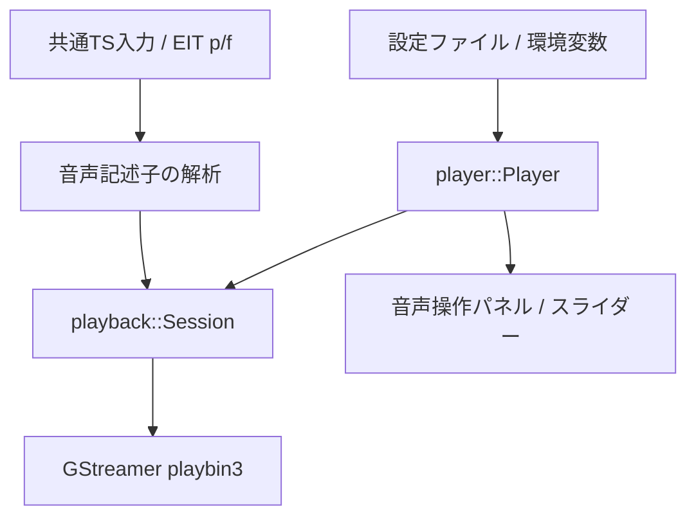

# 音声機能と出力制御

ながめTVにおける音声出力、音量・ミュート管理、音声トラック選択、二重音声（主音声／副音声）制御、再生時計同期、およびライブ受信バッファに関する統合仕様書です。

---

## 主な機能とアーキテクチャ

再生処理（GStreamer playbin3）とUI（Qt Quick）の間で、音声に関する状態管理を明確に分離しています。



### 1. 音量とミュート (Volume & Mute)
- **状態管理**: 音量レベル（0.0〜1.0）とミュート状態は独立して保持されます（`Output::Audible(Volume)` / `Output::Muted(Volume)`）。
- **ミュート復帰**: 消音を解除すると、直前の音量値へ復元されます。また、消音中に音量スライダーを操作した場合は自動的にミュートが解除され、操作後の音量が適用されます。
- **GStreamer連携**: playbin3の `volume` プロパティおよび `mute` プロパティを利用し、ソフトボリュームで制御します。
- **永続化**: 音量値は設定ファイル（`~/.config/nagametv/`）へ保存されます。ミュート状態はセッション内の一時状態として扱われ、次回起動時はミュート解除状態で復元されます。

---

## 音声パネルとUI操作

視聴画面下部のスピーカーアイコンをクリック（またはタップ）すると、一体型の **音声パネル** がポップアップ表示されます。

- **パネル構成**:
  - ミュート切り替えボタン
  - 音量スライダーおよびパーセント数値表示
  - 利用可能な音声トラック一覧（言語名・主音声／副音声の種別表示）
  - 二重音声（デュアルモノラル）時の出力モード選択（主音声 / 副音声 / 主＋副）
- **UI動作仕様**:
  - 音声ボタンのホバーではツールチップのみを表示し、誤操作を防ぐためクリック時のみパネルを開きます。
  - 音量スライダーのドラッグ中は即座に音量が変化し、操作終了時に設定が確定・保存されます。
  - 外側のクリック、音声ボタンの再クリック、または **`Escape`** キーでスムーズにパネルを閉じます（閉じた後はフォーカスを音声ボタンへ戻します）。
  - キーボード操作（Tab, 矢印キー, Space）に完全対応しています。

---

## 音声トラックと二重音声の選択

### 情報源と解析
日本のテレビ放送における主／副音声・言語・二重音声の情報は、TSストリームのEIT p/f（Event Information Table present/following）に含まれる **音声コンポーネント記述子（audio_component_descriptor, タグ: 0xc4）** から取得します。
- [ARIB STD-B10 Part 2, 6.2.26](https://www.arib.or.jp/english/html/overview/doc/6-STD-B10v5_13-E1.pdf) に準拠。
- `component_tag`, `component_type`, `main_component_flag`, 言語コードを解析。
- GStreamerの音声ストリームカタログとPMT（Program Map Table）のPID照合を行い、正確な音声トラックを選択します。

### 二重音声（デュアルモノラル）対応
ニュースの2か国語放送などで用いられる二重音声放送では、単一の音声トラック内に左チャンネル（主音声）と右チャンネル（副音声）が多重化されています。
ながめTVでは以下の3モードの切り替えをサポートしています：
1. **主音声のみ**（左チャンネルを両耳へ出力）
2. **副音声のみ**（右チャンネルを両耳へ出力）
3. **主＋副音声**（ステレオのまま出力）

---

## ライブ再生の余裕バッファ (Live Buffer)

ライブ放送の受信揺らぎやネットワーク遅延による音切れを防止するため、受信先端からの再生目標マージンを設定できます。

- **設定場所**: 「設定」→「接続」→「ライブ再生の余裕」
- **設定範囲**: `1` 〜 `1000 ms`（デフォルト: `250 ms`）
- **挙動**:
  - ライブ視聴開始時、選局時、およびタイムシフトから「ライブに戻る」際の目標位置を受信端から指定時間だけ手前に調整します。
  - 倍速による追いかけ再生時もこの時間を目標とし、遅れが設定値以下になった時点で自動的に等速再生へ戻ります。
  - ネットワークや受信環境の安定度に応じて調整可能です（音が途切れる場合は値を大きくします）。

---

## 音声出力シンクと再生時計の選択

### 音声出力シンク (Audio Sink)
- 通常はシステムのPipeWire / PulseAudio出力を自動検出して利用します。
- 環境変数 `NAGAMETV_AUDIO_SINK` で明示的にシンク（例: `pulsesink`, `alsasink`, `fakesink`）を指定することも可能です。

### 再生時計ポリシー (Playback Clock)
GStreamer内部の同期クロック方式を環境変数で選択できます。

```sh
# 自動選択（デフォルト: GStreamerが音声出力デバイスの時計を優先選択）
NAGAMETV_PLAYBACK_CLOCK=auto ./build/nagametv

# システム時計固定（音声出力は維持しつつSystemClockを同期基準にする）
NAGAMETV_PLAYBACK_CLOCK=system ./build/nagametv
```

---

## 関連ドキュメント
- [全体アーキテクチャ](architecture.md): 再生パイプラインとセッション管理
- [共通TS入力とタイムシフト再生](ts-input-implementation.md): EIT解析とTSバッファリング
- [GUIテスト専用環境](gui-test-environment.md): PipeWire仮想シンクを用いたテスト
