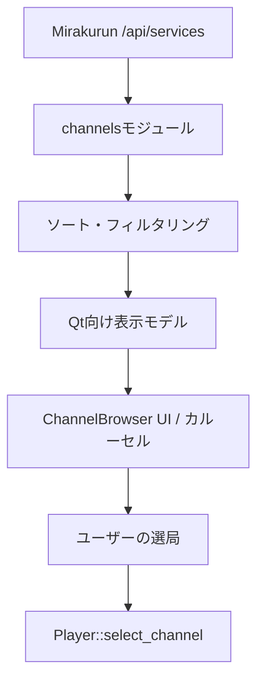

# チャンネル選局とブラウザー

ながめTVにおけるチャンネル選局、放送波の分類・ソート規則、Mirakurun連携、局ロゴの取得、およびチャンネルブラウザー（カルーセルUI）の統合仕様書です。

---

## 放送局の取得と分類・並び順

Mirakurunの `/api/services` から取得した放送局一覧を、Rustの `channels` モジュールで解析・ソートし、UI向けのデータモデルを構築します。

### 1. 放送種別（Band）の分類
放送サービスは以下の `Band` enum に分類されます：
- **`GR`** (地デジ: Terrestrial)
- **`BS`** (BS放送)
- **`CS`** (CS放送)
- **`SKY`** (スカパー！プレミアム等)
- **`Other`** (その他の独自チャンネル等)

### 2. 並び順（ソート規則）
1. **放送種別の優先度**: 地デジ（GR）→ BS → CS → SKY → Other
2. **チャンネル番号**:
   - 地デジ: `remoteControlKeyId`（リモコン番号: 1〜12）順
   - その他: `serviceId` 順
   - 番号未設定または0の局は同種別の末尾へ配置
3. **同一番号の競合**: 表示ラベル順 → `serviceId` 順 → `endpoint ID` 順で確定
4. **非表示対象**: テレビ以外のサービス（ラジオ・データ専用）、サービスIDが0の局、空白のみの名称、重複サービスIDは自動的に除外されます。

### 3. 識別と永続化
- 局の識別にはJavaScriptの数値精度の制限を受けないよう、Rust側で **u64 のサービスID** を一貫して保持します。
- 設定ファイルへの保存や再開時もサービスIDを用いて復元するため、局の並び順が変化しても同じ局が正しく選択されます。

---

## チャンネルブラウザー (UI)

画面下部の「チャンネル」ボタン、または **`S`** キーで開閉する横スクロール型のカルーセルUIです。

### 主なUI仕様
- **カード型レイアウト**: 各局のロゴ、局名、現在放送中の番組情報、番組進行バーを1つのカードに集約。
- **放送種別タブ (`BroadcastTabs`)**: 地デジ、BS、CSなどのタブで素早く絞り込み。タブの切り替えのみでは選局は行われず、カードをクリック（またはEnter）した時点で選局が実行されます。
- **局ロゴの取得**: Mirakurunにロゴデータが存在する局（`hasLogoData == true`）について、`/api/services/{id}/logo` から非同期に取得します。ロゴが存在しない場合や取得失敗時は局名テキスト表示へフォールバックします。
- **仮想化と軽量化**: `ListView` による画面外カードの仮想化を行い、多チャンネル環境でもメモリ使用量と描画負荷を最小限に抑えています。
- **キーボード操作**:
  - **`←` / `→`**: チャンネルカードのフォーカス移動
  - **`Enter`**: フォーカス中のチャンネルを選局
  - **`Escape`**: ブラウザーを閉じる（番組表よりも優先して閉じます）
- **前後選局**: ブラウザーを開いていない状態でも、**`PgUp`** / **`PgDown`** キーで前後のチャンネルへダイレクトにザッピング選局できます。

---

## 関連ドキュメント
- [ショートカットとウィンドウ・キー操作](shortcut-actions-design.md): SキーやPgUp/PgDownキーのスコープ制御
- [現在番組情報](current-program.md): チャンネルカードに表示する番組情報の取得
- [全体アーキテクチャ](architecture.md): 選局処理と再生パイプラインのライフサイクル
