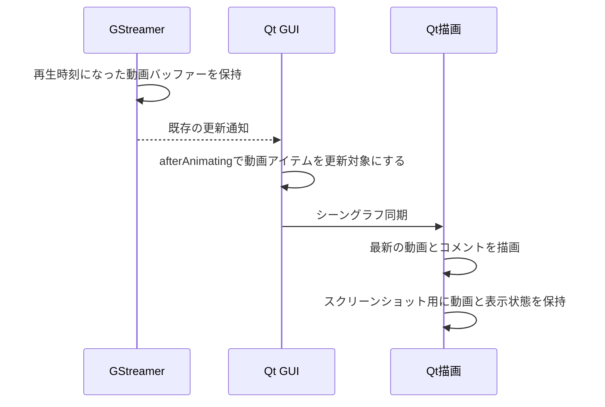

# 実況表示中の動画フレーム低下と実装方針

2026-09-24。専用シーングラフ描画へ変更した後も、実況表示中に滑らかさが落ちるという
報告を受けて調査した。影は全条件で無効にした。

## コメントがない間の動画更新（2026-09-26）

EPGStationからTS・MP4を再生した際の小さな引っ掛かりを受け、補助更新を
コメントの有無に依存しない形へ変更した。従来は実況のアニメーション中だけ
`afterAnimating`で動画を更新していたため、コメント非表示時やアニメーションが
止まった間は、Sinkからのキュー通知だけに依存していた。

通常再生中も動画をシーングラフ同期の対象にし、`FrameAnimation`でQtの
アニメーション周期を維持する。補助更新の条件だけを広げた比較では、Xwaylandの
更新頻度は改善しなかったため、周期の維持も必要だった。
新しい再生時計や固定間隔のタイマーは設けず、GStreamerが再生時計に合わせて
渡した動画を取り込む。両処理は同じ条件で動き、一時停止、シーク、終了、非表示、
最小化では止まる。[FrameAnimationの同期方式](https://doc.qt.io/qt-6/qml-qtquick-frameanimation.html)と
[同期前のGUIスレッド通知](https://doc.qt.io/qt-6/qquickwindow.html#afterAnimating)を使用する。

比較には、ローカルのHTTP Rangeサーバーから同じ録画の冒頭を配信し、製品の
HTTP Reader、再生処理、`Main.qml`を使用した。専用Weston、RTX 4070 Ti、
PipeWire仮想出力を検証してから、旧動作→修正→修正→旧動作の順に各約12秒再生した。
冒頭約4秒を除き、描画に取り込んだ異なるPTSの頻度と間隔を集計した。
実EPGStationの通信状態や、利用者が見た場面そのものの再現ではない。
計測中に利用者が別の作業も行っていると確認したため、CPU・GPUの負荷は一定と
みなせない。以下は各実行の観測値であり、負荷を揃えた改善量の測定ではない。
予備比較では、同じ専用画面でWaylandからXwaylandへ切り替えた後の再生開始待ちが
2回タイムアウトし、計測に進めなかった。原因は未特定である。表の最終比較は
表示方式ごとに専用環境を起動して実施し、全条件の再生と停止が完了した。

MP4は以前の調査と同じ29.970 fpsのAV1で、取得済みの冒頭だけを使った。
コメント非表示、RGBA出力での動画更新頻度は次のとおり。数値の幅は2回の比較を示す。

| 表示環境 | 旧動作（fps） | 修正後（fps） | 更新間隔p95・旧→修正（ms） |
| --- | ---: | ---: | ---: |
| Wayland | 27.30〜28.76 | 29.67〜29.75 | 55.2〜62.5 → 48.9〜50.0 |
| Xwayland | 18.61〜18.87 | 29.78〜29.86 | 70.2〜72.6 → 50.5 |

このMP4比較ではSinkの破棄は全条件0、観測終了時の映像キューは8フレームだった。
TSは1080iの放送録画をYADIFで59.940 fpsに変換した。Waylandでの動画更新は
両条件とも約39.4〜39.7 fps、Xwaylandでは旧動作が27.9〜39.6 fps、修正後が
30.0〜39.7 fpsとなり、TSの改善量は確認できていない。Sinkの破棄には開始時も含まれ、
XwaylandのTSでは旧動作が1・7、修正後が3・1だった。この仮想画面での短い測定から、
報告されたTSの引っ掛かりも同じ原因だとは断定できない。

音声同期は、同じPTSで1秒ごとに画面を点滅させ、音声パルスを出す30 fpsの
合成MP4でも比較した。Qtが点滅フレームを描画した時刻と、専用PipeWire monitorで
パルスを検出したサンプル時刻を同じ単調時計で照合した。各条件7〜9組の中央値は、
Waylandで旧動作が3.3〜8.3 ms、修正後が−4.8〜−0.5 ms、Xwaylandで旧動作が
−2.5〜19.5 ms、修正後が11.1〜16.2 msだった。正の値は映像側が遅いことを示す。
個々の時刻差は最大約76 msまでばらつき、負荷変動もあるため、同期精度の改善や
悪化を判定する根拠にはしない。音声の実スピーカー出力は計測していない。

物理モニターへの提示時刻や、利用者の環境での症状解消は未確認である。
計測用のソース差分、実行ファイル、HTTPサーバー、ログ、集計はGit対象外の
`build/epg-frame-investigation/`に保存した。

製品画面の起動テストと、Xwayland・Wayland両方の`screenshot-playback`が成功した。
コメント無効・非表示・アニメーション停止中にも動画更新を続け、一時停止・動画や
ウィンドウの非表示・シーク・停止では補助更新を止めることを確認した。一時停止後に
連続描画が残らないこと、保存画像と表示の一致、サイズ変更・全画面・字幕・コメントの
合成も検証した。試験用コメントの投入は廃止済みのQMLプロパティから現在の
Controller APIへ直し、実際にコメントが生成されたことを確認している。
QML全92ファイルの静的検査、Rustの書式検査、差分・文書リンクの検査も成功した。
`cmake --build build`で通常版の`build/nagametv`も更新した。

以下は2026-09-25までの調査・設計記録であり、実況中に限る条件は上記の修正で更新した。

## 採用した修正（2026-09-25）

動画アイテムをQtのシーングラフ同期に間に合うよう更新する処理を`Main.qml`へ追加した。
`afterAnimating`はGUIスレッドでアニメーションの進行後、シーングラフの同期前に通知される。
この時点で`video.update()`を呼び、Sinkのキュー通知が未処理でも動画を同期の対象にする。
[Qtの通知タイミング](https://doc.qt.io/qt-6/qquickwindow.html#afterAnimating)

コメントの計算はRustの`Engine`とQObjectアダプターへ、文字の描画はQMLへ戻した。
専用C++描画による軌道計算を削除し、運動モデルの実装とテストをRustへまとめた。
文字計測中の再入によって座標通知が重複する問題は、時刻更新と通知を分離して抑えている。
今回の調査では、計算をQtへ移すことは動画更新の改善に必須ではなかった。
[現在の責務分担](comment-display-redesign.md#rustとqmlの分担)

補助更新の有効・無効は、既存のRustの再生状態とQMLの表示・アニメーション状態から導く。
別の可変な再生状態は設けず、停止、一時停止、シーク、終了、非表示、最小化では無効にする。
接続はウィンドウが所有し、動画アイテムとともに破棄する。描画方式やスレッド優先度は変更しない。
2026-09-25、利用者から「なめらかになった」との確認を得た。
物理画面の提示時刻と音声の出力時刻の差は未計測。

## Rust→QML構成での比較（2026-09-25）

報告対象のFNS歌謡祭のAV1録画（29.970 fps）の冒頭を、Rust→QMLへ戻した同じ実装で比較した。
影は無効、合成コメントは毎秒6件、文字サイズ設定は36。各条件で先頭から約12秒再生し、
約4秒の準備期間後を集計した。比較用の条件では補助更新だけを無効にし、
座標通知の重複削減とスクリーンショットの表示状態取得は両条件で有効にした。
測定中は他のビルド・GUI試験を動かしていない。

下記の「動画更新」は、同期で取り込まれ、`frameSwapped`を迎えた異なるPTSの頻度。
同じ動画フレームの再描画を除いている。計測環境と方法の詳細は後述する。

| 表示環境 | 表示方式 | 補助更新なし（fps） | 補助更新あり（fps） | 更新間隔p95・なし→あり（ms） |
| --- | --- | ---: | ---: | ---: |
| Wayland・basic | 横流れ | 21.95 | 29.69 | 75.3 → 53.3 |
| Wayland・basic | ポップ・1回目 | 23.53 | 29.89 | 58.8 → 53.2 |
| Wayland・basic | ポップ・逆順 | 22.07 | 29.49 | 75.1 → 53.9 |
| Xwayland・threaded | 横流れ | 29.78 | 29.81 | 51.0 → 50.6 |
| Xwayland・threaded | ポップ・1回目 | 29.55 | 29.66 | 51.2 → 50.6 |
| Xwayland・threaded | ポップ・逆順 | 29.90 | 29.70 | 50.6 → 54.3 |

Waylandでは、横流れのQt全体の描画頻度は38.26→38.20回/秒、ポップは39.13→38.63回/秒だった。
描画回数を増やさず、動画の取りこぼしが減った。固定フレームレートを前提にPTSの飛びから
推定した欠落数も、横流れで68→5、ポップで57→3、逆順のポップで69→6へ減った。
Sinkの破棄は全条件0。Xwaylandでは元から動画更新が約30 fpsで、改善は確認できなかった。
両環境とも全条件の再生・停止・終了が成功した。

コメント非表示の動画更新はWaylandで27.58 fps、Xwaylandで18.22 fpsだった。
専用の仮想画面では描画周期によって絶対値が変わるため、物理画面の滑らかさや
取りこぼしゼロを保証する結果ではない。平均更新頻度だけでなく、p95には約50 ms以上の
間隔が残ることにも注意する。

## 実装の検証

- Rustアプリの333件と、コメントコアの通常55件・評価76件が成功。任意試験（アプリ5件、コア各1件）は未実施。
- 通常版QMLは既存324件が成功。追加2件は一時停止中の新着投入に関する試験条件を直し、
  当該コンポーネントの12件を再実行して成功。評価版QMLは追加分を含む346件が成功。
- 製品画面で、補助更新の一時停止・再開・非表示・シーク・コメント無効化と、
  一時停止中に再描画が回り続けないことをWaylandとXwaylandの両方で確認。
  同じ試験で、映像と保存画像の一致、字幕・コメント合成、サイズ変更、全画面、連写、停止も成功。
- 接続・デスクトップ連携・製品画面の起動試験が成功。起動試験の初回はMPRISの一時停止待ちが
  タイムアウトしたが、再実行では全体が成功した。タイムアウトの原因は未特定。
- 通常・Qt統合構成のClippy、全92ファイルのQML静的検査、書式・差分・文書のローカルリンク検査が成功。
  `cmake --build build`で通常の配布構成の`build/nagametv`を更新した。

以下の2026-09-24の数値は専用C++描画での調査結果であり、最終実装での比較とは区別する。

## 確認できたこと

`qml6glsink`は、再生時計に従って渡されたバッファーを動画アイテムの最新バッファーとして
保持し、GUIスレッドへ`update()`をキュー通知する。Qtは、そのアイテムが更新対象に
なったときに`updatePaintNode()`でバッファーを取り込む。
通知の処理が遅れれば、取り込む前に最新バッファーが置き換わり得る。
Sinkの破棄数は、この段階での取りこぼしを数えていない。
[GStreamer 1.28.2の動画アイテム実装](https://github.com/GStreamer/gstreamer/blob/1.28.2/subprojects/gst-plugins-good/ext/qt6/qt6glitem.cc#L688)

専用描画への変更も、実行環境によってはGUIスレッド上で動いていた。
Qt 6.10.2は、NVIDIAのWaylandデスクトップでリサイズ時に停止する問題を避けるため、
スレッド化OpenGLを無効にする。この環境でもWaylandは`basic`、Xwaylandは`threaded`が
自動選択された。コメント描画の計数も、Waylandでは全回GUIスレッド、Xwaylandでは0回だった。
[Qt 6.10.2の選択条件](https://github.com/qt/qtbase/blob/v6.10.2/src/plugins/platforms/wayland/plugins/hardwareintegration/wayland-egl/qwaylandeglclientbufferintegration.cpp#L96)

ただし、`threaded`を強制するだけでは改善しなかった。Waylandでは、文字を出さずに
`FrameAnimation`だけを動かす条件でも動画の更新が約23 fpsへ下がった。
描画スレッドへ処理を移すことと、動画フレームを欠かさず取り込むことは別の課題になる。

## 計測方法と結果

公開GUIランチャーで、専用Weston、実GPUのRTX 4070 Ti、NVIDIA 595.84、
PipeWire仮想出力を検証してから、製品の`Main.qml`を使用した。
Qtは6.10.2、GStreamerは1.28.2。対象AV1録画の取得済みの冒頭だけを再生し、
NVDECの`nvav1dec`とRGBAのGPU表示を使用した。
各条件で先頭から再生し、約4秒の準備期間後に約8秒を集計した。
コメントは毎秒6件の合成データで、実際の番組の実況内容ではない。

手動の`process_events()`反復を避け、計測区間はQtのイベントループを動かした。
Qtの`frameSwapped`間隔に加え、既存のスクリーンショット用監視を使って、
シーングラフ同期時に取り込まれた動画のPTSと、そのフレームの`frameSwapped`時刻を記録した。
同じPTSの再描画を除いた頻度を、以下では「動画更新」と呼ぶ。
これはアプリが描画に使った動画の更新頻度であり、物理モニターへの表示完了時刻ではない。
[Qtのフレーム提示通知](https://doc.qt.io/qt-6/qquickwindow.html#frameSwapped)

最初の比較は次のとおり。Sinkの破棄はすべて0だった。

| 表示環境 | コメント | Qtの描画回数/秒 | 動画更新/秒 |
| --- | --- | ---: | ---: |
| Wayland・basic | 非表示 | 33.2 | 27.3 |
| Wayland・basic | 横流れ | 35.7 | 23.6 |
| Wayland・basic | ポップ | 36.3 | 22.9 |
| Wayland・basic | ポップを静止 | 33.8 | 27.5 |
| Xwayland・threaded | 非表示 | 18.9 | 17.8 |
| Xwayland・threaded | 横流れ | 37.2 | 29.7 |
| Xwayland・threaded | ポップ | 37.6 | 29.7 |

WaylandではQt全体の描画回数が増えても、異なる動画フレームの数は減った。
Xwaylandでは非表示の方が低くなるため、この仮想画面の絶対値を利用者の環境へ一般化しない。
環境と描画周期によって結果が変わることを示す比較として扱う。

Qtの追加ログでは、準備期間後のレンダラー処理時間の95パーセンタイルは、
空表示・ポップとも1 ms未満だった。ログは整数msへ切り捨てるため、処理時間が0という意味ではない。
GPUタイムスタンプは有効にしておらず、GPUの実行時間を測った値でもない。

### 比較した試作

- `QSG_USE_SIMPLE_ANIMATION_DRIVER=1`：Waylandのポップは約23.5 fpsで、大きな改善なし。
- GUIの16 ms精密タイマー：Waylandのポップは約23.4 fps。Xwaylandでは約22.8 fpsへ低下。
- `QSG_RENDER_LOOP=threaded`：Waylandのポップは約23.2 fpsで、スレッド移動だけでは改善なし。
- `afterAnimating`で動画アイテムの`update()`を呼ぶ：文字描画を変更せず、同一実行の
  Wayland・basicで約23.8から29.1 fps、threadedで約25.0から29.7 fpsへ改善。

試作から先に実行する順序でも2回比較した。Wayland・basicでは通常のポップが
24.6、24.1 fps、試作がともに29.3 fpsだった。Qt全体の描画頻度は通常34.2、34.4回/秒、
試作33.9、33.3回/秒で、描画回数の増加だけではこの改善を説明できない。
Xwayland・threadedでは通常・試作とも29.5〜29.7 fpsで、大きな差はなかった。
両環境の繰り返し試験は正常終了した。

最後の試作は、動画更新のキュー通知が未処理でも、次のシーングラフ同期で動画アイテムを
更新対象にする。Qtの同期直前に最新の動画を取り込む方式を検討する根拠になる。
ただし、threadedを強制した試作は計測後の終了時にSIGSEGVで停止した。
原因を特定しておらず、強制設定を製品へ追加する根拠にはしない。

## 同期の境界と今後の計測

### 音声同期を保つ条件

「新しいフレームが届いた」という条件は、デコード完了やSink入力への到着だけでは足りない。
先読みした動画をそのまま表示すると、音声より映像が先行し得る。
GStreamerの`GstBaseSink`は通常再生中、再生時計との同期後に描画処理を呼ぶ。
現在の`qml6glsink`は、その描画処理から`show_frame()`を経由してQtアイテムの
`setBuffer()`へバッファーを渡す。今回の補助更新は、ここに保持されたバッファーを対象とする。
アプリはSinkの時計同期を無効にしておらず、音声と動画は同じパイプラインの時計に従う。
[GStreamerの時計同期と描画処理](https://gstreamer.freedesktop.org/documentation/base/gstbasesink.html)

今後、補助更新を新着時だけに絞る場合も、「再生時計で調整され、表示用に渡されたが、
まだQtの描画に反映されていないフレーム」を対象にする。時刻の調整はGStreamerへ任せ、
シーク・ソース切替では古い世代の更新要求を無効にする。現状は新着の有無を判定しておらず、
実況の連続更新中に動画アイテムも同期対象にしている。

この構成は既存の音声同期を保つが、音ズレがゼロと測定できたわけではない。
Qt、コンポジター、モニター、音声出力装置による遅延が残る。
通常再生へ対象を広げる際は、同じ時刻の映像変化と音声パルスを持つ素材で、
出力時刻の差とばらつきを補助更新の有無で比較する必要がある。

### 描画処理の順序

動画更新の補助はQtのプレゼンテーション層に置き、次の順序を保証する。

補助更新は上記の有効条件を満たすときだけ行う。`update()`は次の描画も要求するため、
無条件に呼び続けると静止中にも描画が続く。動画バッファーの選択、再生時計、デコード、
GPUテクスチャーの所有は既存実装に任せ、ワーカーからQMLや`QQuickItem`を操作しない。
Qtの`basic`と`threaded`のどちらでも動作する構成とする。

動画統計のUIは従来のSinkカウンターを維持している。今回のPTS計測は調査用の一時的な
計測コードであり、製品には含めない。今後UIへ追加する場合は、Sinkの破棄、Qt全体の
描画回数、異なる動画フレーム数を区別し、一時停止・非表示・シークやPTSの欠落を扱う必要がある。

スクリーンショットは、実際に取り込んだ動画バッファーと、その描画で使ったコメント状態を
組にする既存方式を維持する。将来コメント時計を描画側で補間する場合は、その補間後の時刻も
保存用スナップショットへ含める。GUI側で取得した古い時刻と組み合わせない。

受け入れ試験では、同じ録画・同じ実況量で非表示、横流れ、ポップを比較する。
平均値に加え、動画更新間隔の95パーセンタイルとPTSの飛びを確認する。
一時停止中の再描画が止まること、シーク・速度変更・リサイズ・全画面切替・終了、
スクリーンショットの一致も必要になる。物理画面では60 Hzと高リフレッシュレートを別に確認する。

調査用のソース差分、実行ファイル、ログ、集計スクリプトは、この作業環境の
`build/comment-cadence-research/`に保存した。最終実装の比較と検証は
`build/comment-video-priority/`に保存する。
