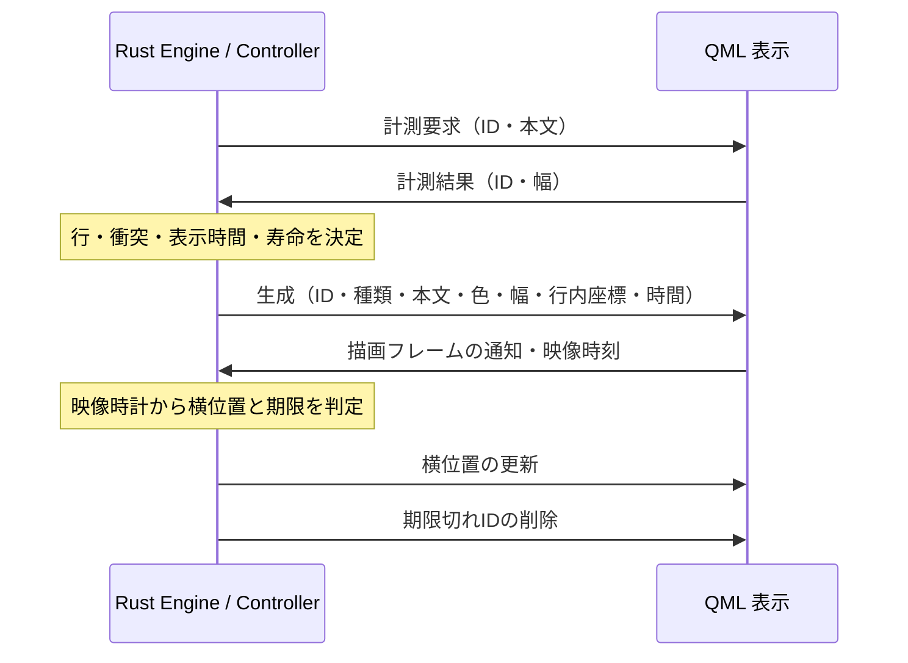

# 弾幕のコアと表示

## 文字サイズとドロップシャドウ

設定画面の「コメント」と再生設定から、文字サイズを14〜72pxで変更できる。
初期値は21px。保存値の上限も72pxとし、以前の設定にある12〜13pxは引き続き読み込む。
文字サイズはスライダー操作中から表示中のコメントにも反映する。
既存のLabelと表示期限を保持したまま、新しい文字幅・行高で配置を作り直す。
横流れは現在位置から新しい文字幅に対応した左端まで、元の残り時間で移動する。
文字が大きくなって同じ行で衝突する場合は別の行へ移し、固定コメントは中央を保つ。
影と自分の投稿の黄色枠も同じLabel上で更新する。
本文と行高の計測にはアプリ標準のNoto Sans CJK JPを明示し、大きな日本語の文字でも
別の既定フォントによる高さの過小評価を避ける。

ドロップシャドウは初期値ONで、同じ2か所から切り替えられる。
`comment_shadow_enabled`として保存し、設定項目のない旧ファイルはONで読み込む。
切り替えは表示中のコメントにも反映し、配置・移動・寿命を変更しない。
従来の黒い縁取りと、自分の投稿の1pxの黄色枠は維持する。

影は文字サイズの1/12だけ右下にずらした位置に、不透明度約50%の黒いTextを置き、
`MultiEffect`で影だけをぼかす。21pxでは1.75px、36pxでは3px、72pxでは6pxずらす。
ぼかしの最大半径は文字サイズの1/18を切り上げた値（最小2px）とする。
本文と影は両方とも`Text.QtRendering`を使う。影の描画資源は`DanmakuShadow`にまとめ、
影をOFFにしたときと親コメントを破棄したときにLoaderごと解放する。
通常のコメントでは文字とぼかしの入力を固定したまま親と一緒に移動する。
画面より長いコメントは`ShaderEffectSource.sourceRect`で画面幅とぼかし余白だけを
取り込み、移動に合わせて取り込み位置を変える。文字列の長さに比例した巨大なテクスチャーは作らない。
ぼかしにはオフスクリーン描画が必要なため、影なしよりGPU処理とメモリーを使う。
読み上げが重複しないよう、影用Textはアクセシビリティーの対象から除外する。
ぼかしの設定と負荷の扱いは[Qt MultiEffect](https://doc.qt.io/qt-6.10/qml-qtquick-effects-multieffect.html#performance)を参照。

## 責務の分担

弾幕のコアは `rust/crates/viewer-comments/src/danmaku.rs` に置く。
Qt、GPU、ネットワーク、実時間の時計に依存しない。テストから経過時間を注入できる。

| 層 | 所有する状態と責務 |
| --- | --- |
| Rust Engine | 型付きコメント、録画タイムライン、再生カーソル、行の占有、衝突判定、表示時間、一時停止、シーク、寿命 |
| Rust DanmakuController | Qtとの型付き境界、単調増加時計、計測要求、生成・削除通知、件数プロパティ |
| QML DanmakuOverlay | フォントと文字幅の計測、Label、NumberAnimation、透明度、UIオブジェクトの生成・破棄 |
| QML DanmakuTimeline | 再生位置・再生状態をRustへ渡すバインディングとメソッド転送のみ |

QML に行選択、衝突判定、ソート、再生カーソル、寿命の判定は置かない。
QMLの `visuals` は数値IDと表示オブジェクトの対応だけを保持する。コメントのコアモデルではない。
`activeCount` はQML配列の長さではなくRustの件数を参照する。



直接受信モードではQt Quickが表示を補間する。製品の再生同期モードでは、毎フレーム
映像の実際の時刻を読み、Rustが同じ軌道式から横位置と期限を更新する。
再生同期中は横移動のNumberAnimationを使わない。
縦方向も3種類の行グループの開始位置だけを通知し、ラベルごとの座標更新を送らない。
QMLのアニメーション完了通知はコア状態を変更しない。
直接受信モードのFrameAnimationは表示中コメントが存在して一時停止していない時だけ
Rustのtickを呼ぶ。再生同期モードでは、次のコメントの開始を検出するため、
表示中のコメントがない場合も再生中は映像時刻を渡す。
受信・計測結果・設定変更時にも時計を進めるため、描画フレームが遅れても古い占有を使わない。

## 型と資源

位置はRustの `Position` enum、色は検証済みの `Color`、時刻は `Duration`、表示IDは `Id`。
ライブ入力とJSONインポートの境界で本文、色、種類、時刻を検証する。QMLとの通知には
QString・整数・実数の型付き引数を使い、描画状態をJSONで毎フレーム送り直さない。

新着の計測待ちは最大1件。文字サイズ変更時は表示中IDの再計測を1バッチだけ保持し、
全件の幅が揃った型を受け取ってから配置を更新する。未完了の間は新着の配置を受け付けない。
再計測には世代IDを付け、連続変更やクリア前の古い結果を拒否する。
期限切れのコメントは再計測中も解放し、遅い応答で復活させない。
IDは再利用せず、u32を使い切ると
新しい要求を拒否するため、JavaScriptの整数精度や古い応答との衝突に依存しない。

衝突判定は候補行の表示中コメントだけを走査する。行ごとの格納領域は使用時に確保する。
空き行がなければLabelを作らない。固定64件の制限は設けず、画面と文字サイズと空き行が
表示数を決める。寿命更新は表示中要素を走査し、期限切れIDだけを返す。
全表示のスナップショットや新しい本文配列をフレームごとに生成しない。
clearで占有領域と計測待ちを解放し、resetでは録画タイムラインの保持領域も解放する。
Rustの借用はQtシグナル発行前に終了するため、QMLから同期で計測結果が返っても再入可能。

## ライブ表示と互換範囲

NX-JikkyoのmailをRustで解析し、位置 `naka` / `ue` / `shita` と標準色・末尾2の色・
`#RRGGBB` を保持する。受信履歴・新着・過去ログを日時付きで保持し、映像時刻に合わせて描画する。
本文はPlainText。改行はRustで空白に変換し、1件で1行を使う。

8行固定を廃止し、使用可能な高さと `max(30, フォント高さ + 6)` からRustで行数を決める。
番組名と上下余白を避ける。横流れは10pxの間隔と追いつき判定、固定は空き行を使う。
同じ行が混雑したコメントは見送り、後から遅延表示しない。異なる表示形式の行は独立するため、
横流れと固定など種類をまたぐ重なりはあり得る。重ねて全件を出すunlimitedモードは未提供。

横流れは右端からすぐ入り、通常5秒／全画面8秒。上下固定は通常4秒／全画面6秒。
表示時間は設定の速度倍率で割る。速度倍率だけを変えた場合、既存コメントの移動速度は変えない。
画面寸法、サイドメニュー開閉、全画面状態の変更では既存コメントを消去しない。
横流れは変更直前の軌道と速度・表示期限を保ち、新着との衝突判定もその軌道を使う。
上下固定は変更後の画面中央へ追従する。全画面での表示時間は新着から適用する。
画面を縮めて収まらなくなった部分は表示領域でクリップするが、コメント自体は保持する。
縦の行間を潰さず、横流れ・上固定は上端、下固定は下端を基準にする。
表示期限前に画面を広げれば、クリップされていた部分も再び表示される。
Player UIの表示時は上の番組名と下の操作パネルを避ける。Rustが占有中の行数と上下の余裕を
計算し、横流れ／上固定の開始位置を下へ、下固定を上へ動かす。QMLでは種類ごとの親Itemを
180msでアニメーションさせ、既存と新着が同じ移動を共有する。横移動・表示期限・行間隔は保つ。
全行使用中など上下の領域へ収まらない場合は、画面外へ押し出したり文字を潰したりせず、
移動量を制限する。既存コメントはUIに重なる場合があるが、消去はしない。
新着は上下のUIを避ける行だけに限定し、配置できなければ見送る。期限切れで余裕ができると
移動量を再計算する。UIを隠すと開始位置も戻る。
移動途中に新着が届く場合は、移動元と移動先の両方で画面内に収まる行だけを使う。
連続開閉でアニメーションが反転しても、この範囲を保持して下端・上端のはみ出しを防ぐ。
同じ種類の行間隔は一定。種類をまたぐ重なりの扱いは従来どおり。
一時停止はRust時計とQtアニメーションの両方を止める。
非表示状態もRustへ渡し、録画時計が進んでも計測待ちやLabelを生成しない。非表示中に過ぎたコメントは再表示時に出さない。
現在のアプリの停止ボタンはLoaderごと破棄する操作であり、一時停止とは別。

受信キュー256件、poll上限64件、履歴200件は描画上限とは別のため維持する。
投稿、文字サイズ／フォントコマンドは含まない。

## 録画側から使う契約

録画ファイルの選択・再生は[TS録画の再生](recording-playback.md)を参照。
録画・ライブ・タイムシフトを同じ放送時計へ接続し、受信済みコメントと過去ログを同期する。
時計・取得窓・保持上限は[録画の番組情報・実況の設計](recording-program-design.md)を参照。
部品として使う場合の接続例は次のとおり。

```qml
DanmakuTimeline {
    id: timeline
    overlay: danmakuOverlay
    position: recording.positionSeconds
    playing: recording.playing && !recording.buffering
}
```

recordingは説明用の再生元で、現在のPlayerのAPIではない。製品は`comment_timeline`と
`commentary_position()`を使って`DanmakuController.update_timeline()`へ渡す。
QMLからインポートする場合は `timeline.load(jsonString)` を使う。
型検証・データ保持・ソートはRustで行う。Rustからは `Engine::load(Vec<TimedComment>)` を使える。

```json
[
  {"time":1.25,"text":"横流れ","type":"right","color":16777215},
  {"time":3,"text":"上固定","type":"top","color":"#ff0000"},
  {"time":3,"text":"下固定","type":2}
]
```

- timeは動画先頭からの秒数（小数可）、typeはright/top/bottomまたは0/1/2。
- 不正入力はfalseとcontroller.errorを返し、既存データを維持する。
- 開始時刻に達したコメントを一度ずつ投入する。混雑で表示できないものも消費済みとする。
- 明示シークでは表示と計測世代を更新し、最大寿命の16秒前から候補を復元する。
  横位置は`W - (W + w) * age / lifetime`、寿命は元の寿命から経過時間を引く。
- 行配置は再現しない。計測した幅を使って衝突・追い越しのない行へ割り当て直す。
- 一時停止中のシークも静止したコメントを復元する。通常の一時停止では移動・期限が止まる。
- 取得窓の更新では既存の表示IDを保ち、重複したログを再投入しない。
  遅着したコメントも残り寿命がある場合だけ途中位置から表示する。
- 表示時刻・移動・期限は映像時計に従う。`clear()`はデータと表示を解放する。

## 検証

CPUテストで、可変行数・64件超・混雑時の見送り・速度変更時の衝突判定、表示時間、
一時停止と期限切れ、古い計測応答の拒否、解放、録画時刻順・シーク・入力検証を確認する。
QMLテストは実際のRust型を静的リンクしたQt Quick Testランナーを使い、生成通知から
Label表示、時間経過によるRustの削除通知、停止／再開、録画カーソルとの連携を確認する。
モックのスケジューラーは使わない。

```sh
CARGO_TARGET_DIR=build/comments-protocol cargo test --locked --manifest-path rust/crates/viewer-comments/Cargo.toml --features network
scripts/test-danmaku.sh
cmake --build build
```

scripts/test-danmaku.shはX11とGPUを検出・検証し、不足時には停止する。
QtQuickTestは開発用qml_tests featureのみでリンクし、通常ビルドへは追加しない。
QML内にRust型があるため、弾幕を含む試験では単体qmltestrunnerでなくこのランナーを使う。
長時間RSS、CPU/GPUのフレーム時間、録画映像との実同期、実サービスの色・位置指定は未測定。

## 参照

挙動の比較元は [DPlayer danmaku.js (bc43cc0)](https://github.com/DIYgod/DPlayer/blob/bc43cc0ac2470f3b3552414a81e64b913b107bb3/src/js/danmaku.js)。
受信形式は [NX-Jikkyo](https://github.com/tsukumijima/NX-Jikkyo)、
UI補間は [Qt Animation](https://doc.qt.io/qt-6/qml-qtquick-animation.html) を参照。

2026-09-08の修正後の確認: Rust crate 30件成功・外部サービス用1件除外、
実Rust型を使うQML試験116件成功（初期化・終了を含む）。
DISPLAY=:0のX11とNVIDIA RTX 4070 TiのOpenGLを検証してから実行した。
QML静的検査は生成済みの型情報と実QMLファイルを配置したimport pathで警告なし。
Qtテストはプロセスのメインスレッドで実行し、通常版にテスト用CLI分岐とQtQuickTestを含めない。
通常のCMakeリリースビルドと、Rust全ターゲットのClippy（警告をエラー扱い、開発用featureを含む）も成功。
通常バイナリーの依存ライブラリーにQtQuickTest/QtTestが含まれないことを確認した。

2026-09-13の文字サイズ・影の追加後の確認: Rust 147件成功・3件除外、QML 170件成功
（初期化・終了を含む）、Clippyと翻訳チェック成功。X11とNVIDIAのOpenGLを検証して実行した。
14・21・72pxで影のON/OFFによる描画差と、切り替え前後のコメント・黄色枠の維持を確認した。
通常版の設定画面と再生設定で72pxと影の値が連動し、影の切り替えが保存されることを確認した。
通常版・Flatpak版のビルド、Flatpakバンドルの更新インストールと起動・設定操作も成功。
画面操作の手動確認とQML試験は入力フォーカスを奪い合わないよう順番に実行する。
この確認は接続先を空にしたテスト設定と合成コメントを使い、外部への投稿は行っていない。

2026-09-14: 影のずらし幅を文字サイズの1/12にし、影だけにぼかしを追加した。
実GPU上のQML試験171件成功。14・21・72pxでぼかしとON/OFFによる描画差を確認し、
長いコメントの取り込み範囲が画面幅と余白に収まること、OFF・削除時に影の描画資源が
破棄されることも確認した。21・36・72pxの比較画像で文字本体と黄色枠を含めて目視確認した。
アニメーションの時計とコメントの移動方式は変更していない。
通常版とFlatpak版のビルド、通常版の起動・終了、Flatpakバンドルの更新インストール・
起動・終了も成功。長時間のGPUメモリー使用量・フレーム時間の比較は未測定。

2026-09-14: 画面サイズ変更・サイドメニュー開閉・全画面切り替えでの全消去を廃止し、
文字サイズも表示中のLabelを保持して反映するようにした。
弾幕コア49件成功（外部サービス用1件除外）、アプリのRustテスト156件成功・3件除外。
GPUでの弾幕QML試験18件成功、QML全体の回帰試験も186件成功。
コア試験と合わせて、14・21・36・72pxの変更、影と黄色枠の保持、
一時停止、元の表示期限、縮小時のクリップと再拡大、行の衝突回避を確認した。
接続試験と、本番Main.qmlでのサイドメニュー連続開閉・文字サイズ変更を追加した
起動試験も成功。通常版のビルドと、開発用featureを含むClippy（警告をエラー扱い）も成功。
X11表示、NVIDIAのOpenGL、PulseAudio出力を検証してから画面試験を実行した。
