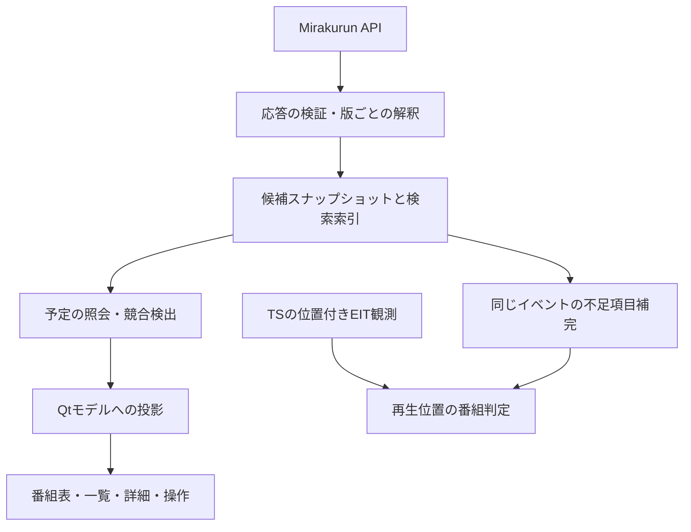

# EPGの時間帯重複とアーキテクチャの見直し

2026-09-25の調査とアプリ側の実装。

Mirakurunの番組一覧には、同一サービスで時間帯の競合する番組が含まれていた。
Mirakurun 4.1.3の公式ソースでも、古い候補の保持と削除済み番組の復活によって
競合が残る経路を再現した。アプリは受信した一覧を、矛盾のない確定済みの予定表として
扱えない。取得した候補を保持し、競合の検出と表示・操作の判断をRustに集約する。

## 実サーバーで確認したこと

指定されたMirakurunの`/api/version`、`/api/services`、`/api/programs`を読み取った。
最初の番組一覧の取得完了は2026-09-25 02:49:47 JST。報告されたバージョンは4.1.3、
サービス数は69、番組数は15,092、番組応答は9,694,260 bytesだった。

重複は`(networkId, serviceId)`が一致する番組間で数えた。
区間は開始を含み終了を含まない`[startAt, startAt + duration)`とし、
両番組の共通区間が9月25日00:00〜翌00:00 JSTに含まれる組を抽出した。
前の番組の終了と次の開始が一致する場合は重複に含めない。

| 指標 | 結果 |
| --- | ---: |
| 番組IDの重複 | 0件 |
| 全期間の時間帯重複 | 44組 |
| 9月25日の時間帯重複 | 43組・32番組 |
| NHK総合1・京都 / 総合2・京都 | 各17組 |
| NHK総合1・大津 / 総合2・大津 | 2組 / 7組 |

43組は番組のペア数であり、43の独立した障害を意味しない。
1番組が複数の候補と重なれば複数組になる。別サービス間の同時放送も数えていない。

京都の総合1には、次の候補が同時に含まれていた。

| eventId | 時間（JST） | 番組名 | 応答の補助フラグ |
| --- | --- | --- | --- |
| 60827 | 01:11〜03:35 | 放送番組未定 | `_isFollowing` |
| 60818 | 01:20〜03:35 | 放送番組未定 | `_isFollowing` |
| 20219 | 01:56〜02:42 | スポーツ×ヒューマン | `_isFollowing` |
| 24224 | 02:06〜02:08 | 連続テレビ小説「ブラッサム」PR | なし |
| 24373 | 02:08〜02:38 | ダーウィンが来た！特選映像集 | なし |

02:51:54 JSTの再取得でも、重複した32番組の全フィールドは同じだった。
他局には更新があり、サーバー全体の応答が止まっていたわけではない。
`/api/status`の時計は取得時刻と整合し、京都の`epgUpdatedAt`は02:25:25 JSTだった。
サービス単位の更新時刻から、個々の競合候補の新旧は判定できない。

実装後の03:43:37 JSTの再取得では番組数15,091、同日の重複は32組・26番組だった。
取得間で候補は変化したが、時間帯の競合は残っていた。この再取得分も別の入力として検証した。

## Mirakurun 4.1.3の再現結果

公式タグの`Program.ts`、`EPG.ts`、`common.ts`を取得し、Node.jsで型を除去して
メモリー内で実行した。保存・ジョブ登録・ログ出力をテスト用に置き換え、
番組の追加・更新・競合削除と、デコード済みEITの処理には元の実装を使った。
サーバーへの書き込み、チューナー操作、TS取得は行っていない。

| 再現した入力 | 公式ソースでの結果 |
| --- | --- |
| followingのAに重なるfollowingのBを追加 | AとBが残る |
| followingのAに重なるscheduleのBを追加 | AとBが残る |
| presentのBでAを論理削除し、Aの説明文を更新 | Aが復活してBと重なる |
| 続けてBの同じ開始・長さを再設定 | 値が不変なので競合は解消されない |
| EITのfollowingをA→B→空セクションと更新 | 古いA・Bのfollowingが残る |
| 既存番組を新しいEPGインスタンスで初めて受信 | 同じ版を再受信しても開始・長さが既存値のまま。版の変更で更新される |
| EITの継続時間が未定 | `duration: 1`へ変換される |

競合削除では既存のpresent/followingを保護し、新規presentの場合などに削除する。
一方、論理削除からの復活は説明文の更新でも発生し、その経路では時間帯を再検査しない。
この組み合わせで、競合のない状態から競合のある状態へ戻り得る。
[公式の番組管理処理](https://github.com/Chinachu/Mirakurun/blob/4.1.3/src/Mirakurun/Program.ts)

EITの処理はイベントごとに状態を持つ。followingの新しいイベントや空セクションを
受信しても、旧イベントのfollowingを一括して失効させる処理はない。
したがってAPIに残った`_isFollowing`を「今の次番組」の証拠にはできない。
また、実応答に2件あった`duration: 1`には、終了未定の表現が混ざる可能性がある。
[公式のEIT処理](https://github.com/Chinachu/Mirakurun/blob/4.1.3/src/Mirakurun/EPG.ts)

これらは公式4.1.3で再現できる処理上の問題・制約である。今回の32番組がどの順序で
作られたかは未確定。既存ログ1,000行には対象局の削除・復活メッセージがなく、
当時のEITも採取していない。放送側の予定変更、受信間隔、サーバーの状態復元を含めた
発生原因と、実際に放送された内容までは断定しない。

`_pf`などは[公開Program型](https://github.com/Chinachu/Mirakurun/blob/4.1.3/api.d.ts)に
含まれない内部フィールドである。対応版のアダプターで任意の補助情報として扱い、
欠落するサーバーでも動作させる。番組ごとの更新時刻やEITの版も公開Program型にない。
APIの取得が新しくても、その中の候補が新しいとは限らない。

## 変更前のアプリで判断が揃っていなかった箇所

| 箇所 | 変更前の処理 | 競合時の問題 |
| --- | --- | --- |
| [model.rs](../rust/src/features/program_info/model.rs) | 局・開始・ID順にソートし、同じ組を除去 | 別IDの重複時間帯はそのまま残る |
| `Snapshot::current` | 開始が最も遅い候補を選ぶ。同時開始なら大きいIDになる | 開始やIDの順序は訂正の新しさを表さない |
| 旧`grid.rs` | 表示日に重なる全候補を渡す | 競合という状態がない |
| [GuideTimeline.qml](../rust/qml/GuideTimeline.qml) | 生の開始・長さで配置し、時刻を含む先頭候補をキー操作で選ぶ | セルが重なり、Rustの現在番組と違う候補を選ぶ |
| [GuideProgramDetails.qml](../rust/qml/GuideProgramDetails.qml) | 各候補の開始・長さから放送中を判定 | 複数候補に視聴ボタンを出せる |
| [watch.rs](../rust/src/features/program_info/watch.rs) | Rustが選んだ現在番組との一致を要求 | 表示された視聴ボタンを押しても拒否され得る |

取得データを02:07 JSTに照合すると、京都の総合1では4候補が時間内になる。
変更前のアルゴリズムではRustの選択はeventId 24224、キー操作の選択は60827となる。
これは取得データに実装の選択条件を適用した結果で、実GUIの操作試験ではない。

再生中の番組表示は、既にTSの位置付き情報を使う経路がある。
[player/stream.rs](../rust/src/player/stream.rs)と
[録画・TS番組情報の設計](recording-program-design.md)の境界を維持する。
番組表やチャンネル一覧の「現在の予定」と、再生位置で観測した番組は別の問い合わせにする。

## 採用したデータの境界



受信した候補本文は一つのスナップショットが所有する。索引と競合情報は本文への参照を
持ち、文字列や日別の全番組コピーを増やさない。元の開始・終了と、表示に使う区間を
分ける。セルの配置を直すために受信した放送時間を書き換えない。

予定の照会結果は`Gap / Single / Conflict`のenumで表す。
競合を`Option<Program>`へ早い段階で縮約せず、候補と判断根拠を保持する。
Mirakurun 4.1.3の終了未定の表現は入力アダプターで解釈し、内部では
`KnownEnd / UnknownEnd`に分ける。終了未定を1msの確定番組として扱わない。

検証済みスナップショットだけを公開できるよう、解析途中の型を消費して検証済み型を
返す。フィールドとコンストラクターは非公開にし、局照合・区間検証・競合検出を
呼び出し側が省略できないAPIにする。正確に同じ入力の重複と、同じIDに異なる内容が
入る不整合も分け、後者をソート順だけで捨てない。

競合を自動解消する根拠がない場合は、番組表に競合を示し、詳細から候補を参照できる
表示にする。「開始が遅い」「IDが大きい」「説明が長い」だけでは採否を決めない。
present/followingの内部フラグを無条件に優先する方式も、今回の保持状態を解消できない。
候補をまとめる表示では開始・終了の境界ごとに状態を計算し、連鎖した競合に含まれる
番組を区間全体で同時放送しているかのように表示しない。

番組表・一覧・詳細・キー操作は同じ照会結果を参照する。番組が競合していても局の
ライブ再生は可能なので、その場合の操作は「このチャンネルを視聴」として提供する。
「この番組が放送中」という断定と局への接続を分離し、表示と実行で別の候補を選ばない。
サーバー変更・番組更新を跨ぐ操作は、サーバー世代と局・候補の識別情報で再検証する。
競合中のサブチャンネルも、同時放送と確定できないまま一覧から隠さない。

TSのpresent観測は、そのサービスと再生位置・連続区間でのみ番組判定に使う。
一局の観測から全局の予定表を書き換えず、タイムシフトや録画にPCの現在時刻を当てない。
EPGからの補完はサービス・イベント・開始の一致で検索し、予定の現在番組選択を経由しない。
時刻訂正やID再利用で一致が曖昧なら、別番組の本文を補完しない。

## 更新方式と検証方針

既存の全件取得・成功時のスナップショット置換・失敗時の前回成功分保持は残せる。
イベント集約、定期取得、取得中の追加要求の集約、停止完了後の再接続にも
今回の重複を解消する根拠はないため、まず競合モデルの導入を優先する。
番組通知は再取得の契機として使い、通知本文の到着順だけで全件結果を上書きしない。
公開型にはスナップショットと通知を一意に整列させる版がなく、単純な差分反映では
再同期の問題を別途抱えるためである。

実装は次の境界に分けた。

- [schedule.rs](../rust/src/features/program_info/schedule.rs)は開始・終了の境界を走査し、
  重ならない表示区間と`Resolution`を構築する。空白にはセルを作らない。
  競合区間には候補数を保持し、候補本文は詳細を開くときに参照する。
- [model.rs](../rust/src/features/program_info/model.rs)は検証済みの候補・索引を非公開で保持する。
  同じ識別情報でも、解釈済みの本文が異なれば候補を残す。APIの未使用フィールドの差は
  別候補とは扱わない。現在・次の予定は候補が一つで終了が既知の場合だけ返す。
- [view.rs](../rust/src/features/program_info/view.rs)は表示日の区間と操作キーを作る。
  日境界でセルを切っても、候補の元の時刻は変更しない。キー検索には索引を使う。
- [guide_model.rs](../rust/src/guide_model.rs)は区間一覧・候補一覧のQtモデルを提供する。
  番組表のJSON一覧とQML側の候補選択ロジックを廃止した。既存のチャンネル一覧・現在番組の
  投影にも同じ競合状態を渡す。競合のある搬送波のサブチャンネルは隠さない。
- [watch.rs](../rust/src/features/program_info/watch.rs)はサーバー世代、局、現在区間、操作種別を
  再検証する。競合・終了未定の候補を特定番組の視聴として扱わない。

終了未定には、次の異なる開始時刻を表示上の境界として使う。次の開始がなければ表示日の
末尾まで描く。これは予定表の照会範囲を区切る規則であり、実際に放送が終了した証拠ではない。
詳細には元の開始時刻と「終了時刻未定」を表示し、架空の終了時刻や進捗を出さない。
この規則で次番組を予定として照会できても、放送中の内容の確定にはTSの観測が必要である。

候補本文は`Arc`で共有し、日別に複製しない。番組表を閉じるアニメーション中はモデルを
保持し、終了後に解放する。サーバー変更時は操作キーを失効させる。

CPU試験では入力順に依存しない結果、半開区間の境界、日跨ぎ、候補増減、サーバー変更、
終了未定、旧結果の拒否を確認する。組み合わせの多い区間の性質には`proptest`を使う。
50,000件上限を維持し、全重複ペアの保持で二乗のメモリーを使わないよう索引を設計する。
診断は候補数・競合サービス数・不明な終了の件数を更新時に記録し、描画ごとには出さない。
Qt境界の変更時はモデル検査・QML部品試験・製品Main.qmlの起動試験を行う。

Mirakurun側の改修を行う場合は別の変更として、サービス単位のp/fの交代と空セクション、
論理削除からの復活時の再検査、新しい解析インスタンスによる既存番組の更新を対象にする。
削除を強めるだけでは受信順によって有効な候補を失うため、予定と観測の情報源・版・有効範囲を
分けた上で回帰試験を用意する。実サーバーにこの改修を適用する判断は今回の調査に含めない。

## 証跡と検証範囲

取得応答、解析結果、公式ソース、再現スクリプトはGit対象外の
`benchmark/epg-architecture-review-20260925/`へ保存した。
`programs.json`と`programs-2.json`が2回の取得、`analysis.json`が重複ペア、
`reproduction.json`が6ケースのassert成功結果、`log-summary.json`がログの検索結果である。
`verification.json`には全ペア比較による重複件数の再検証と取得ファイルのSHA-256を残した。
説明文による復活と同じ時刻の再設定は一つのケース内で検証した。

再現はNode.js 22.22.1で次のように実行できる。取得済みソースを使うため通信は不要。

```sh
node benchmark/epg-architecture-review-20260925/reproduce-upstream.cjs
python3 benchmark/epg-architecture-review-20260925/analyze.py
```

アプリ側の検証には、区間の性質テスト、Qtの`QAbstractItemModelTester`、
QML部品試験、製品`Main.qml`の起動試験を使う。画面試験はリポジトリーの専用GUI環境で
実GPU・仮想音声出力を検証して実行する。取得済みの実データも製品の解析・区間モデルへ
通し、全セルの非重複、候補数、キー検索、競合中のチャンネル視聴操作を検査する。

放送TSとの突合とMirakurun全体の統合試験は対象外であり、APIの候補のうち実際に
放送された番組は特定していない。Mirakurun側のデータ・設定・稼働バイナリーは変更しない。

実装後の検査ログはGit対象外の`build/epg-*.log`へ保存した。
Rust全体は`--test-threads=1`で343件成功・5件保留、QML部品は328件成功・18件スキップ。
初回の並列実行では既存のライブ追従試験が遅延の上限を超えたため、全体を直列で再検証した。
Rustの保留には別途実行する取得データ試験や外部TSが必要な試験を含み、
QMLのスキップは通常構成に含めない評価用機能によるもの。
Qtモデル検査、製品Main.qmlの起動・番組表開閉、メディア連携、日本語翻訳の試験も成功した。
通常・Qt統合テスト構成のClippy、全92ファイルのQML静的検査、配布用ビルドも成功した。
詳細画面を閉じてJavaScriptのGCを実行してから開き直す試験を含め、
候補モデルをRustが所有し続けることを確認した。

取得データを製品の解析・区間モデルへ通した結果は次のとおり。69サービスのうち、
チャンネルカタログに採用するテレビ局は54局だった。区間数は番組数や重複ペア数とは異なる。

| 取得時刻（JST） | 候補数 | 9月25日の表示区間 | うち競合区間 |
| --- | ---: | ---: | ---: |
| 02:49:47 | 15,092 | 1,903 | 29 |
| 03:43:37 | 15,091 | 1,898 | 20 |

両入力で全セルの非重複・日境界・キー検索・候補数を検査し、競合区間では現在番組を
返さずチャンネル視聴になることを確認した。再取得分は次のように再検証できる。

```sh
NAGAMETV_CAPTURE_DIR="$PWD/benchmark/epg-architecture-review-20260925/recheck" \
CARGO_TARGET_DIR=build/cargo cargo test --manifest-path rust/Cargo.toml --release --locked \
  validates_captured_server_catalog_and_guide -- --ignored --nocapture
```
