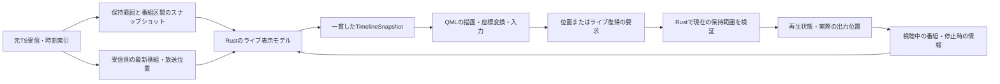

# ライブのシークバー・表示モデル

2026-09-17。`ccbd720` での問題を基準にした設計と実装仕様。
共通入力・保持容量・復帰規則は [共通TS入力の実装状況](ts-input-implementation.md) を参照。
実況コメントの巻き戻し・一時停止・ライブ復帰の今後の仕様は、
[録画・タイムシフトの番組情報と実況の設計案](recording-program-design.md)を参照。

## 変更前の問題

`player/program_info.rs` は、タイムシフト中の `current_program_data` と `program_progress` を
再生位置の元TS索引から取得する。一時停止位置の索引が破棄されると番組情報を取得できず、
`null` と進捗ゼロを公開する。シーク中も同じ扱いになる。

`RecordingTimeline.qml` はその番組情報から表示軸を決め、情報がないと保持範囲に切り替える。
そのため、一時停止位置の期限切れやシークによって軸の意味・縮尺まで変わってしまう。
放送中の番組と、映像が属する番組を一つの「現在の番組」で扱っていることが原因。

期限切れ復帰の修正とは分けて、表示モデルを見直す。

## 表示する情報

| 情報 | 意味 | 表現案 |
| --- | --- | --- |
| 放送中の番組と進捗 | 受信している現在の番組がどこまで進んだか | 番組開始から放送位置までの細い白線。再生位置から独立 |
| タイムシフト可能範囲 | 実際に保持され、移動できる区間 | 白線と中央を揃えた太めのアクセント色の帯 |
| 現在の再生位置 | 画面に表示している映像の位置 | 操作できる丸いカーソル |
| LIVE位置 | 受信できている最新位置 | 小さな菱形と `LIVE` 表示。通常再生時はカーソルと近接する |
| 番組の区間 | 過去番組と放送中番組の開始・終了 | 薄い境界線。収まる場合は番組名、ホバーでは時刻と番組名 |
| 視聴中の番組と進捗 | 表示中の映像が、その番組のどの位置か | 「視聴中」の番組名と経過時間／番組時間 |

番組の進捗には「放送側の進捗」と「視聴位置」がある。白線は放送側の進捗に固定し、
過去番組へ移動しても意味を変えない。視聴位置はカーソルと経過時間で示す。
経過時間は実際に視聴した割合ではない。途中をシークしても視聴済みとは扱わない。

放送中と視聴中が同じ番組ならタイトルをまとめられる。異なる場合は両方の名称を明示し、
番組詳細を開く操作は視聴中の番組を対象にする。「ライブに戻る」と遅れ時間も維持する。
色だけに依存せず、マーカーの形、ラベル、ホバー表示でも区別する。二本目のシークバーは作らない。

### 複数番組を保持する例

番組Aが20:00–20:30、Bが20:30–21:00、放送中のCが21:00–21:30。
21:15まで受信し、20:10以降を保持していて、20:20のAを見ている場合:

| 要素 | 表示 |
| --- | --- |
| 表示軸 | 20:00–21:30。Aの途中からしか戻れないことも分かる |
| アクセント色の保持帯 | 20:10–21:15 |
| 白い進捗線 | Cの21:00–21:15。放送進捗は50% |
| 再生カーソル | Aの20:20。視聴位置は20分／30分 |
| LIVEマーカー | 21:15 |
| 番組境界 | 20:30、21:00 |
| 操作できない部分 | 20:00–20:10の破棄済み部分と、21:15–21:30の未受信部分 |

保持できる時間は容量と受信量で変わり、番組数にも上限一件という制約はない。
「前番組」一件を特別扱いせず、保持区間と交差する番組の列として表す。
番組情報が欠ける区間もTSを保持していればシーク可能とし、名称だけを未取得表示にする。

## 表示軸のルール

表示軸とシーク可能範囲を別の値にする。基本表示は保持全体と放送中の番組を見渡す一つの軸。

- 左端は、最古の保持位置が属する番組の開始。開始が不明なら最古の保持位置。
  保持が空・無効なら放送中の番組の開始を使う。
- 例えば20:15–20:42の番組を20:36から受信し、現在20:38なら、表示軸は20:15–20:42、
  保持帯は20:36–20:38とする。番組開始が受信開始より前でも軸を切り詰めない。
- 右端は放送中の番組の終了予定。少なくとも最新の受信位置を含む。
- 番組情報が最初からない場合は暫定の受信経過時間軸を使う。時計・番組の情報が揃った時点で
  放送時刻の表示へ移ることを明示的な状態遷移とする。
- 一度取得した番組区間は、シークや一時的な情報欠落で捨てない。有効期限を過ぎた番組を
  放送中と偽って維持せず、後続番組が不明なら同じ時間座標上の未取得区間として扱う。
  不明な終了時刻を作らず、直前の表示右端を縮めずに受信位置まで必要に応じて延長する。
- 再生カーソルを別番組へ移動しても表示軸は変えない。番組情報の取得失敗だけで
  番組軸から保持範囲だけの軸へ切り替えない。
- 番組の切り替わりや最古の保持番組の消滅では、上記ルールに沿って軸を更新する。
  一時停止中も放送側と保持帯は更新するが、停止位置の期限切れだけを理由に軸を切り替えない。
- ドラッグ中は使用している表示軸を固定する。受信・破棄は止めず、確定時にRustで
  現在の移動可能範囲を再検証する。保持を失った目標位置は復帰規則に従って補正し通知する。

長時間保持で番組名が収まらなければ、文字を間引いて境界とホバーを残す。
密集した境界の描画も画面の解像度に応じて間引けるが、元の番組区間とシーク精度は維持する。
ズーム／番組単位の拡大は追加候補。初回の見直しでは、全体を見渡せる表示を基本案とする。

## 一時停止・期限切れ

| 状態 | カーソルと番組情報 | 再生再開 |
| --- | --- | --- |
| 保持内で一時停止 | 映像の位置と番組情報を維持。保持帯と放送側の進捗だけ更新 | 同じ位置から再開 |
| 一時停止位置が保持外 | 停止位置を自動で書き換えず、「保持範囲外で一時停止」と表示 | 現在の保持範囲内の余裕のある位置へ移動 |
| 停止位置が表示軸の左外 | 左端に範囲外を示すマーカーと停止時刻。左端が実際の再生位置であるようには表示しない | 同上 |

停止位置のTSや索引は容量制限どおり破棄する。停止フレームを説明する番組情報一件と
位置・時刻の対応だけを、停止中の表示状態として保持できるようにする。
これを理由に過去TSや全番組履歴を無制限に保持しない。再開・選局・停止で適切に解放する。

今回のコミットの復帰先規則（通常は先頭から5秒内側、短い保持では中点）は引き継ぐ。
再開が成功するまでは目標位置と実際の映像位置を区別し、カーソルの確定も出力確認に合わせる。

## RustとQtの分担

Rust側で放送中番組と視聴中番組を別々に投影する。放送側は再生用Readerではなく
受信側の情報で更新し、一時停止や巻き戻しに追従させない。
視聴側は実際の出力位置を使い、シークの目標を出力済みの位置として扱わない。

受信位置・番組の進捗には対応の取れたTSの時計を使う。LIVEは受信できた最新位置であり、
放送局の実時刻と無遅延で一致すると約束しない。シークで再生できる最新点と先行デコード量も区別する。
EPGはサービスと時刻を照合できる場合の補完候補。番組情報があるだけでシーク可能とは判断しない。

内部の再生時刻と、表示用の放送日時は別の型として扱う。PCR/TDTの不連続・再接続では
対応区間を区別し、日時の単純な引き算で別区間へシークしない。
番組・時計の検索には入力のナノ秒精度を保ち、QMLに渡す段階でミリ秒へ丸める。
丸めた表示値から検索位置を作り直すと、保持先頭の小数ミリ秒が切り捨てられて
カタログ範囲外になり、番組軸を保持範囲だけの軸へ縮めるためである。
受信欠落があれば番組区間と利用可能区間を分け、欠落部分を保持色で連続して塗らない。

`live_timeline::Snapshot` は次をまとめる。

- セッション識別子・更新番号、ライブ種別。録画・未開始はライブ用プロパティを `null` とし、録画用の表示モデルへ分離する。
- 表示軸と時刻表記の状態、実際に移動可能な区間。
- 放送中の番組・放送側の位置・LIVE位置。
- 視聴中の番組・実際の再生位置・停止位置の利用可否、シーク中なら目標位置。
- 保持中の複数番組区間。取得できない部分は不明区間として表現する。

排他的な状態はenumにし、その状態に必要な値をvariantに持たせる。現行の再生状態の所有者を
再利用し、表示用に独立した `playing` / `paused` などのフラグを同期し直さない。
完成したスナップショットをPlayerから一括通知し、番組と範囲の更新途中をQMLへ見せない。

QMLは色・配置・文字の整形・座標変換・ホバー・ドラッグなどを担当する。
番組の選択、放送進捗、表示軸の選択、期限切れ判定、復帰位置の決定はRustへ寄せる。
描画用の正規化座標から実際の移動先を得る際も、その表示に対応する軸を使う。
操作要求にセッションを対応付け、選局前のドラッグを新しい局への操作として受理しない。
シーク準備は既存の `Ready` / `SeekPlan` のように同じセッションを借用したAPIを維持し、
UIに渡した古い表示情報を実行許可の証拠にはしない。

番組区間は受信時に更新・集約する。描画更新のたびに全PCR索引を走査したり、QMLで
JSONの番組情報から番組列を作り直したりしない。容量上限・件数上限と期限切れの規則を
設け、保持中の区間・デコード後の出力待ち区間・放送中の番組・停止表示に必要な情報を保持する。
件数上限に達して詳細を省く場合は不明区間として扱い、TS自体のシーク可能範囲を狭めない。

## 実装順と確認項目

- [x] Rustに放送中／視聴中の別モデルと、複数番組の区間モデルを用意する。
- [x] 一時停止時の番組情報を、期限切れで消えるTS索引から切り離して保持する。
- [x] 表示軸の規則と一括通知をRustへ移し、ライブと録画の投影を分ける。
- [x] 一本のバーに保持帯・放送進捗・再生カーソル・LIVEマーカー・番組区間を描く。
- [x] ドラッグ中の軸固定、確定時の再検証、選局による古い操作の取消しを接続する。
- [x] 保持無効・取得途中・番組情報欠落でも、表示と操作可否を区別する。
- [x] 放送の番組切り替え中に過去番組を再生しても、両方の情報が混ざらないことを確認する。
- [x] 三番組以上を保持し、先頭番組の一部／全部が破棄される場合を確認する。
- [x] 一時停止中の期限切れ、長時間停止でカーソルが表示軸外になる場合、復帰成功／失敗を確認する。
- [x] シーク中・番組情報の一時欠落だけでは軸の定義が変わらないことを確認する。
- [x] 時計の不連続・受信欠落・番組延長／予定変更を確認する。
- [x] Rustの機器不要テスト、QML部品試験、一括通知試験、機器を検証した製品Main.qml試験を行う。

## 実装の入口

- `playback/input/store.rs` が元TSのPCR受信時に `live_timeline::History` を更新する。
  番組は最大512件・文字列等の保持量は1 MiB、時計の対応は最新128区間を保持する。
  受信済み区間は番組・時計の上限とは別に管理し、元TS索引の期限切れと一緒に破棄する。
  SI・時計のカタログは実際の表示位置も考慮し、出力待ちの映像に対応する情報を残す。
  先頭フレームが確定するまではカタログの容量・件数上限で保持し、確定後はTS保持先頭と
  表示位置の早い方からコメントの最大表示期間（16秒）を引いた位置で期限切れにする。
  このメタデータ保持は、TSの容量・期限やシーク可否を変更しない。
  時計や番組を省略した古い部分も、TSが利用可能ならシークできる。
- `playback/session.rs` がライブ専用 `Presenter` を所有し、選局・停止時に解放する。
  一時停止・シーク中の映像位置と番組情報は、この所有者のスナップショットで維持する。
- `player/stream.rs` が `live_timeline` のJSON、視聴中の番組情報、再生状態を更新してから
  Qtへ通知する。放送中の情報を視聴中の番組詳細へ混ぜない。
- `PlaybackTimeline.qml` がライブ／録画部品を選ぶ。`LiveTimeline.qml` は完成した軸と区間を描き、
  `seek_timeline(session, milliseconds)` と `timeline_preview(session, milliseconds)` を使う。
  軸の選択、番組の選択、期限切れの判定・復帰先の計算はRust側にある。
- ドラッグ開始時の軸とセッションを保持し、確定時に現在の受信区間を再検証する。
  期限切れ・受信欠落への移動は次の利用可能区間の安全な位置へ補正する。

表示時刻はTSのTDT/TOTに基づく。時計がない区間では受信経過時間を表示し、
番組情報がない区間は「番組情報未取得」とする。時計の小さな揺れは秒精度を考慮して吸収し、
PCR世代変更と1.5秒を超える時計補正では対応を分ける。
受信欠落は入力索引で認識できた区間を扱う。欠落時間をUTC差から推測してTS時間に挿入しない。
EPGによる補完、ズーム、番組単位の拡大は追加候補。

## 検証結果

Rust214件成功・3件明示的除外、QML227件成功。三番組の区間、部分／全番組の破棄、
時計未取得・時計補正・PCR世代変更、番組予定の変更、メタデータ上限、古いドラッグ、
補正シークの拒否時に停止位置が残ることを確認した。

接続・通知、翻訳／カタログ欠落、全ターゲットClippy、CMakeリリースビルドも成功。
表示・GPU・PulseAudio出力を検証して製品Main.qmlの起動試験全体を実行し、
最終差分でもタイムシフト試験を再実行した。メモリー／FSの両方で、受信中の一時停止、
巻き戻し、ライブ復帰、容量超過後の再開と4秒間の継続再生が成功した。
実際のQt通知中にスナップショット・視聴中番組・進捗・再生状態が一致することも確認した。

ライブ入力は合成TSを配るローカルHTTPサーバーを使用した。三番組以上・長時間停止・
時計不連続の表示規則はRustの機器不要試験、マウス／キー入力と描画位置はQML試験で確認した。
数時間の実放送連続視聴を今回実施したという意味ではない。
ログは無視対象の `benchmark/live-timeline/` に保存。

### 保持先頭の時刻精度の修正（2026-09-17）

小数ミリ秒を含む保持先頭をミリ秒へ切り捨ててからカタログへ問い合わせると、
実際の保持範囲より前の位置となり、番組の開始を使えず保持先頭が軸の左端になっていた。
番組・時計の検索と停止位置の再問い合わせに元のナノ秒位置を使うよう修正した。

修正前に失敗する回帰テストを追加し、本体Rust230件、接続・通知の試験、Clippy、
CMake製品ビルドが成功した。QMLのLiveTimelineは9件すべて成功し、20:15–20:42の
番組軸に20:36–20:38の保持帯を表示する配置と、保持外のクリック拒否を確認した。
QML全体は画面ロック中にアニメーション試験4件が失敗したが、ロック解除後の再実行で
229件すべて成功した。製品Main.qmlのタイムシフト試験も、メモリー／ファイル方式の
一時停止・巻き戻し・ライブ復帰・容量失効後の再開を含めて成功した。

### タイムシフト無効時の番組情報のちらつき（2026-09-17）

無効時の2秒の受信バッファからTSを破棄すると、その映像がデコード後のキューに
残っていてもSI・放送時計まで破棄され、番組表示が取得中へ戻っていた。
カタログの期限切れに出力確認済み位置とコメントの表示期間も反映し、TSの保持容量や
シーク可否を変えずに、表示中・出力待ちの番組と時計を保持するよう修正した。
シーク目標は保持期限を進めず、実際の映像が切り替わってから更新する。

修正前に失敗する実TS入力の回帰テストを追加した。TS保持外でデコード済みの位置を
二番組にまたがって投影し、番組・時計の維持、移動中コメントの時刻変換、通過後の
メタデータ破棄、破棄済みTSの読み出し拒否を確認した。本体Rust231件、接続・通知の試験、
ClippyとCMake製品ビルドが成功。
製品Main.qmlの再生試験はPulseAudio接続の復旧後に再実行し、成功した。
タイムシフト無効時と一時停止から無効へ切り替えた後の各4秒間、番組情報と放送時計が
取得済みの状態を維持することを確認した。メモリー／ファイル方式の一時停止・巻き戻し・
ライブ復帰・容量失効後の再開も成功した。入力はローカルHTTPサーバーの合成TSを使用した。
