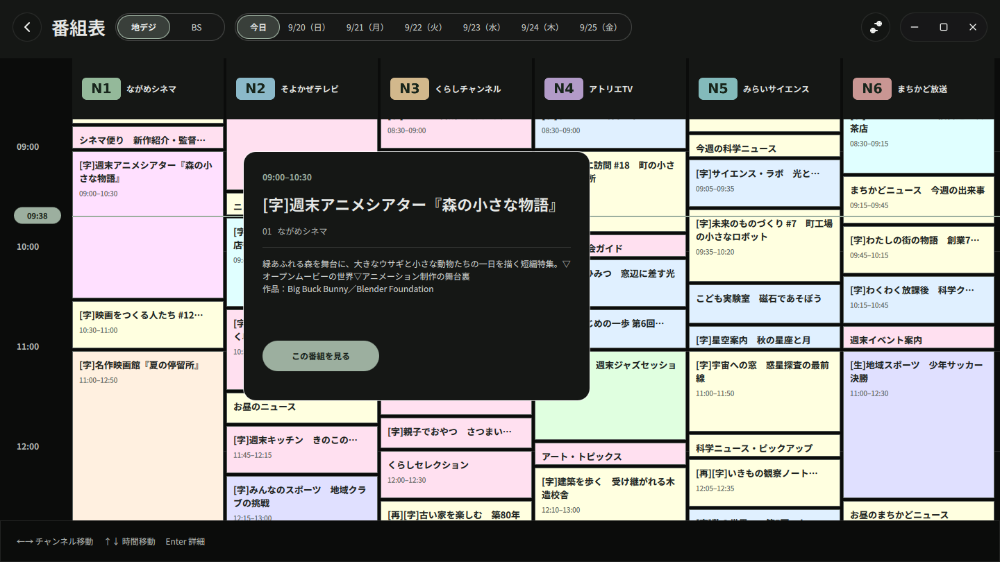
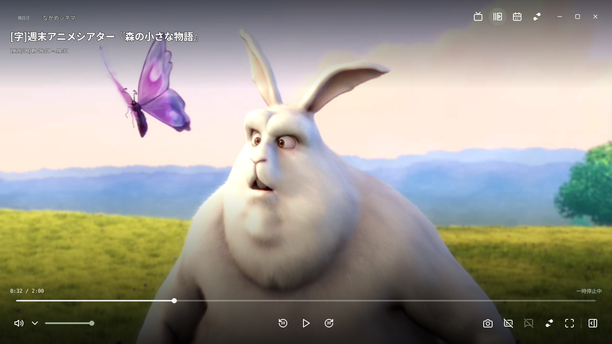

# ながめTVのスクリーンショット

画像は1440×810の実際のアプリ画面です。局名・ロゴ・番組情報は撮影用の架空のデータです。
ローカルの撮影用配信元と、下記の再配布可能な映像を使用しました。

## 視聴画面

映像に番組名・放送時間・再生操作を重ねて表示します。

## チャンネル一覧

放送種別を切り替え、放送中・次の番組を見ながら選局できます。

## 番組表

複数のチャンネルを並べ、今日から7日分の番組を確認できます。

番組を選ぶと詳細が開き、放送中ならその番組へ移動できます。

## TS録画の再生

ローカルのTSファイルを開き、一時停止・シークできます。画像は一時停止中です。

## 素材とクレジット

映像のある画像（`live.png`、`channels.png`、`recording.png`）は、
**Big Buck Bunny** の抜粋をアプリ内で再生して撮影しています。

> (c) copyright 2008, Blender Foundation / www.bigbuckbunny.org

- 作品・利用条件: [Blender Foundation / Big Buck Bunny](https://peach.blender.org/about/)
- ライセンス: [Creative Commons Attribution 3.0](https://creativecommons.org/licenses/by/3.0/)
- 入手先: [Blender公式ダウンロード](https://download.blender.org/peach/bigbuckbunny_movies/)
- 原素材: `big_buck_bunny_720p_stereo.ogg.zip`
- 加工: 映像の抜粋、TS変換、表示サイズの変更、アプリ画面としての撮影。
- 作品の正式な題名は **Big Buck Bunny** です。画面内の「森の小さな物語」は
  番組情報表示を説明するために付けた架空の番組名です。

READMEや紹介記事でこれらの素材を使うときは、上記の作品名・著作者・出典・ライセンスと
加工内容を併記してください。
番組表だけの2枚には原作品の映像は含まれません。

[撮影条件・再撮影手順・公開用の説明文](../publicity.md)
