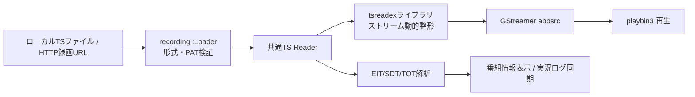

# 録画・動画ファイルの再生

ながめTVにおけるローカルまたはHTTP/HTTPS上のTS・MP4・MKVファイルの再生機能、対応フォーマット、シーク・一時停止操作、および番組情報連携に関する仕様書です。

---

## 概要と再生方法

ながめTVは、ネットワーク上のMirakurunサーバーが未設定・オフラインの状態でも、スタンドアロンの動画プレイヤーとして利用できます。

### 録画を開く方法

1. **ドラッグ＆ドロップ**: アプリウィンドウ内へ動画ファイル、または録画URLのリンクをドロップします。
2. **ショートカット**: **`Ctrl + O`** で「録画を開く」を表示します。
3. **UIボタン**: 右上の「録画」で録画一覧へ移り、「動画ファイルを開く」「URLを開く」を選びます。
   初回接続画面の「録画を開く」からもファイル選択・URL入力を表示できます。

「動画ファイルを開く」でローカルファイルを選ぶか、「録画URL」にURLを貼り付けて
「URLを開く」を押します。Mirakurunへの接続設定は不要です。

### EPGStationの録画URL

右上の「録画」では、接続先を保存してEPGStationの録画一覧から再生できます。
stuayu版の認証付き接続も含め、[録画一覧の操作方法](epgstation.md)を参照してください。

録画済み動画ファイルを直接返すHTTP/HTTPS URLを指定します。EPGStationの例は
`http://epgstation:8888/api/videos/123`です。`123`は録画IDではなくビデオファイルIDです。
[EPGStationのビデオ取得API](https://github.com/l3tnun/EPGStation/blob/master/src/model/service/api/videos/%7BvideoFileId%7D.ts)を参照してください。
録画一覧ページとHLSプレイリストのURLは対象外です。MP4・MKVは動画ファイルのURLを指定します。

サーバーにはHTTP Range要求への対応（206応答、正しいContent-Rangeと総バイト数）が必要です。
全体のダウンロードを待たず、再生・番組情報の探索・シークに必要な範囲だけを読みます。
HTTP読み取りカーソルごとのキャッシュ上限は512 KiBで、要求の時間上限は5秒です。
URLのクエリーを保持し、リダイレクトにも追従します。ブラウザーのログインCookieや
任意の認証ヘッダーを入力する機能はありません。

開始前に範囲読み込みとファイルの形式を検査し、TSではPATも検証します。失敗・キャンセル時は現在の再生を維持し、
停止後に再生するときは同じURLを再検証します。サイズ、強いETagまたはLast-Modifiedの
変更を検出した場合は読み込みを停止します。検証子を返さないサーバーでは同じサイズの
内容変更を検出できないため、再生中に更新されない録画済みファイルを指定してください。

---

## 主な対応機能

- **対応形式**: 188バイト形式のMPEG-2 TS、192バイトM2TS、204バイトTS、MP4・Matroska
- **再生操作**:
  - **再生 ／ 一時停止**: **`Space`** キーまたはコントロールバーの再生ボタン
  - **スキップ**: **`←`** キーで10秒戻し、**`→`** キーで30秒送り
  - **シークバー**: マウスホバーで移動先予定時刻のプレビュー、ドラッグ＆ドロップで任意位置へシーク
  - **再生速度変更**: 左下の速度ボタン（`x1.0`）から 0.5倍〜2.0倍（0.1刻み）で調節可能（音程維持機能付き）
- **番組情報の自動表示**:
  - TSストリーム内のPSI/SI（EIT・SDT・TOT/TDT）をリアルタイム解析し、再生位置に合わせて番組名、詳細説明、ジャンル、放送日時を自動更新して表示します。
  - 日本のデジタル放送規格（JST）に準拠しています。
- **実況コメント（過去ログ）同期**:
  - 実況コメント機能を有効にすると、TS内のサービスIDと放送時刻に基づいて過去ログAPIから実況コメントを自動取得し、再生位置に同期して弾幕を表示します。
- **字幕・音声制御**:
  - TSではARIB字幕の表示／非表示、主音声／副音声（二重音声）の切り替えに対応しています。
- **スクリーンショット**:
  - **`Ctrl + S`** で再生位置の映像（字幕・弾幕を含む）をPNG保存できます。

---

## アーキテクチャとパイプライン

TS録画再生とライブ視聴は、共通のTS入力パイプライン（`tsreadex` ライブラリ連携 → GStreamer `appsrc` → `playbin3`）を使用します。



### 1. 非同期の入力検証
- ファイルの読み込み要求を受け取ると、専用ワーカースレッド（`recording::Loader`）で入力の種類に応じてファイルまたはHTTP範囲を読み、ファイルの形式を非同期に検査します。TSでは先頭のPAT（Program Association Table）と構文も検証します。
- UIスレッドをブロックせず、ファイル検証中も画面操作や現在の再生を維持できます。
- 不正なファイルや存在しないパスの場合は安全にエラーを通知し、現在の再生状態を壊しません。

### 2. 動的整形と再生
- 元ファイルを別の変換ファイルとして全量再保存することはせず、再生位置から必要なパケットを読み出して `tsreadex` で動的に整形しながらデコーダーへ供給します。
- 詳細な入力パイプラインの構成は [共通TS入力とタイムシフト再生](ts-input-implementation.md) を参照してください。

---

## 制限事項・今後の拡張予定

- **一般動画の制約**: 画像字幕、CMカットの時刻補正、録画時刻・放送局が不明な動画の実況同期は未対応です。詳細は[MP4・MKVの再生](#mp4mkvの再生)を参照してください。
- **未実装機能**:
  - 再生位置（レジューム位置）の保存と次回再開
  - 複数サービスが混在するTSにおけるサービス手動選択UI（現在はPAT内の最小サービスIDを自動選択）
  - 詳細なバックログは [未実装機能・改善候補](backlog.md) を参照してください。

---

## 関連ドキュメント
- [共通TS入力とタイムシフト再生](ts-input-implementation.md): tsreadexとGStreamer連携パイプライン
- [実況過去ログの取得・保持](comment-archive-redesign.md): 録画再生時のNX-Jikkyo過去ログ同期
- [再生速度の仕様](playback-speed-design.md): 倍速再生の制御ロジック
- [ショートカットとウィンドウ・キー操作](shortcut-actions-design.md): キーボードショートカット一覧


## MP4・MKVの再生

「動画ファイルを開く」、ドラッグ＆ドロップ、HTTP URL、EPGStation一覧からMP4・MKVを
再生できます。ファイルの内容から形式を判別するため、拡張子のないEPGStationのURLも
同じ処理を使います。HTTPサーバーにはバイト単位のRange応答が必要です。
ファイル選択には同系統のMOV・WebMも表示しますが、初期の検証対象はMP4・MKVです。

MP4・MKVはコンテナ形式です。映像・音声の再生可否は内部のコーデックとインストール済みの
デコーダーに依存します。初期の試験用動画はH.264／HEVCとAACの組み合わせです。
AV1・VP9・Opus、10bit・HDRの表示品質、機種ごとのGPUデコードは個別に検証が必要です。
明示指定したGPUモードでデコード・描画できない場合は、従来どおりエラーにします。

一般動画では、検査済みのローカルファイル／HTTP Range Readerから、バイト位置でシークできる
GStreamer `appsrc`へ供給します。コンテナの分離、時刻・長さの取得はGStreamerへ任せ、
再生・一時停止・シーク・0.5〜2.0倍速・EOF後の操作にはTSと同じタイムライン制御を使います。
MP4の索引が末尾にある場合も、必要な位置へ移動して読み取ります。HTTPカーソルの保持は
512 KiBです。appsrcへは要求されたブロック単位で供給し、単一読取り要求は32 MiBまでとし、
それを超える要求はエラーにします。動画全体をメモリーや一時ファイルへ保存しません。

`Recording::Transport`だけがTSのサービスIDと検査結果を所有します。
`Recording::Media`は判別したコンテナと有限サイズを所有し、TSフィルターやARIB字幕解析には
渡しません。停止に成功してから入力のコールバックとHTTPクライアントを解放します。
読み込みの取消し・最新要求だけの反映・再再生時の検査は共通です。

### 一般動画の字幕

再生操作部の字幕ボタンから、表示のON/OFF、埋め込み字幕の選択、外部字幕の読み込みを
行います。狭い画面では「その他」の「字幕」から開きます。テキスト字幕（MP4のtx3g、
MatroskaのUTF-8・ASS／SSAなど）と、UTF-8で保存した外部SRT・ASS／SSAに対応します。
ASSの装飾・配置・アニメーションはlibassで描画します。フォントは利用環境から選び、
コンテナ添付フォントやPGS・VobSubなどの画像字幕は対象外です。

字幕は映像の表示位置に合わせるため、一時停止・シーク・倍速にも追従します。
外部ファイルはワーカーで検証し、失敗した場合は現在の字幕を残します。同じ動画を停止して
再生し直す場合は読み込み済みの外部字幕を保持し、別の動画では解除します。表示中の字幕は
スクリーンショットにも含まれます。TSのARIB字幕と常時縁取りの設定は従来どおりです。

### 一般動画の実況

EPGStationの一覧から開いた動画では、放送局と録画先頭の時刻を実況へ引き継ぎます。
`動画先頭の実時刻 + 再生位置`を放送時刻として使い、同じ時計で過去ログを映像上へ配置します。
一時停止・シーク・倍速では壁時計ではなく映像の再生位置に従います。

実況機能と実況表示が有効な場合、動画を開いて実際の長さが分かり次第、先頭から末尾までの
過去ログをバックグラウンドで取得します。シークしても取得対象は動画全体のままで、
取得済みの範囲はキャッシュを再利用します。過去ログAPIの公開待ちや通信回数の制限が
ある場合は、既存の待機・再試行処理に従います。

動画の`startAt`を優先し、一覧にない場合はstuayu版の動画メタデータAPIで取得します。
取得できない場合は同じ録画の元TSの`startAt`、録画の`startAt`の順に使います。
最後の値が番組開始時刻を表すサーバーでは、録画余白の分だけずれる場合があります。
コンテナの`startTime`は再生時間とは別の値なので加算しません。

CMカットや途中編集の補正は行いません。カット箇所以降の実況のずれを許容します。
ローカルファイルや直接入力したURLには放送局・実時刻の対応がないため、この自動同期は
適用しません。TS内の番組情報に相当する表示も一般動画には追加していません。

AppImageには`isomp4`・`matroska`・`subparse`を同梱し、字幕描画にはlibassをリンクします。
ネイティブ版・debでは既存のGStreamer Good Plug-ins、Flatpakではプラットフォーム側の
プラグインを使います。
配布形式ごとの動作確認は、ネイティブ版の試験とは別に扱います。

2026-09-24に、H.264／HEVC＋AACをMP4／MKVに格納した試験用動画で、ローカル・HTTPの
8通りをCPUデコーダーで検証しました。製品の起動試験では4ファイルの描画、一時停止、
前後シーク、1.5倍速、停止後の再再生、EOF後のシークを確認しています。EPGStationの
HTTP応答を使い、認証なし・トークン認証の両方でファイル選択とTSへの切り替えも確認しました。
GPU描画と専用の仮想音声出力を使用し、実サーバー・物理音声出力・配布パッケージは未検証です。

同日に、埋め込みテキスト字幕・ASSトラック選択・外部SRT／ASSの描画、シーク、
読み込み失敗時の表示維持、再再生、別動画への切り替えを確認しました。保存画像の字幕も
検査しています。実況時計はローカルのEPGStation API応答で、明示的な放送局ID、
動画先頭時刻、録画余白、再再生時の引き継ぎを検証しました。実サーバーの過去ログ取得と
映像の同時表示は、この検証には含みません。

```sh
CARGO_TARGET_DIR=build/cargo cargo test --manifest-path rust/Cargo.toml --release --locked playback::media
bash scripts/test-startup.sh
```
