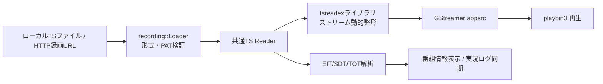

# TS録画の再生

ながめTVにおけるローカルまたはHTTP/HTTPS上のTS録画ファイルの再生機能、対応フォーマット、シーク・一時停止操作、および番組情報連携に関する仕様書です。

---

## 概要と再生方法

ながめTVは、ネットワーク上のMirakurunサーバーが未設定・オフラインの状態でも、スタンドアロンのTS動画プレイヤーとして利用できます。

### 録画を開く方法

1. **ドラッグ＆ドロップ**: アプリウィンドウ内へTSファイル、または録画URLのリンクをドロップします。
2. **ショートカット**: **`Ctrl + O`** で「録画を開く」を表示します。
3. **UIボタン**: ウィンドウ右上、または初回接続画面の「録画を開く」を選びます。

「TSファイルを開く」でローカルファイルを選ぶか、「録画URL」にURLを貼り付けて
「URLを開く」を押します。Mirakurunへの接続設定は不要です。

### EPGStationの録画URL

「録画を開く」→「EPGStationの録画」では、接続先を保存して録画一覧から再生できます。
stuayu版の認証付き接続も含め、[録画一覧の操作方法](epgstation.md)を参照してください。

録画済みTSファイルを直接返すHTTP/HTTPS URLを指定します。EPGStationの例は
`http://epgstation:8888/api/videos/123`です。`123`は録画IDではなくビデオファイルIDです。
[EPGStationのビデオ取得API](https://github.com/l3tnun/EPGStation/blob/master/src/model/service/api/videos/%7BvideoFileId%7D.ts)を参照してください。
録画一覧ページ、HLSプレイリスト、MP4に変換された動画のURLは対象外です。

サーバーにはHTTP Range要求への対応（206応答、正しいContent-Rangeと総バイト数）が必要です。
全体のダウンロードを待たず、再生・番組情報の探索・シークに必要な範囲だけを読みます。
HTTP読み取りカーソルごとのキャッシュ上限は512 KiBで、要求の時間上限は5秒です。
URLのクエリーを保持し、リダイレクトにも追従します。ブラウザーのログインCookieや
任意の認証ヘッダーを入力する機能はありません。

開始前に範囲読み込みとTSのPATを検証します。失敗・キャンセル時は現在の再生を維持し、
停止後に再生するときは同じURLを再検証します。サイズ、強いETagまたはLast-Modifiedの
変更を検出した場合は読み込みを停止します。検証子を返さないサーバーでは同じサイズの
内容変更を検出できないため、再生中に更新されない録画済みファイルを指定してください。

---

## 主な対応機能

- **対応形式**: 188バイト形式のMPEG-2 TS、192バイトM2TS、204バイトTS
- **再生操作**:
  - **再生 ／ 一時停止**: **`Space`** キーまたはコントロールバーの再生ボタン
  - **スキップ**: **`←`** キーで10秒戻し、**`→`** キーで30秒送り
  - **シークバー**: マウスホバーで移動先予定時刻のプレビュー、ドラッグ＆ドロップで任意位置へシーク
  - **再生速度変更**: 左下の速度ボタン（`x1.0`）から 0.5倍〜2.0倍（0.1刻み）で調節可能（音程維持機能付き）
- **番組情報の自動表示**:
  - TSストリーム内のPSI/SI（EIT・SDT・TOT/TDT）をリアルタイム解析し、再生位置に合わせて番組名、詳細説明、ジャンル、放送日時を自動更新して表示します。
  - 日本のデジタル放送規格（JST）に準拠しています。
- **実況コメント（過去ログ）同期**:
  - 実況コメント機能を有効にすると、TS内のサービスIDと放送時刻に基づいて過去ログAPIから実況コメントを自動取得し、再生位置に同期して弾幕を表示します。
- **字幕・音声制御**:
  - ARIB字幕の表示／非表示、主音声／副音声（二重音声）の切り替えに対応しています。
- **スクリーンショット**:
  - **`Ctrl + S`** で再生位置の映像（字幕・弾幕を含む）をPNG保存できます。

---

## アーキテクチャとパイプライン

録画再生とライブ視聴は、共通のTS入力パイプライン（`tsreadex` ライブラリ連携 → GStreamer `appsrc` → `playbin3`）を使用します。

### 1. 非同期の入力検証
- ファイルの読み込み要求を受け取ると、専用ワーカースレッド（`recording::Loader`）で入力の種類に応じてファイルまたはHTTP範囲を読み、先頭のPAT（Program Association Table）と構文を非同期に検証します。
- UIスレッドをブロックせず、ファイル検証中も画面操作や現在の再生を維持できます。
- 不正なファイルや存在しないパスの場合は安全にエラーを通知し、現在の再生状態を壊しません。

### 2. 動的整形と再生
- 元ファイルを別の変換ファイルとして全量再保存することはせず、再生位置から必要なパケットを読み出して `tsreadex` で動的に整形しながらデコーダーへ供給します。
- 詳細な入力パイプラインの構成は [共通TS入力とタイムシフト再生](ts-input-implementation.md) を参照してください。

---

## 制限事項・今後の拡張予定

- **未対応フォーマット**: MP4 / MKV等の一般的な動画コンテナ（MPEG-2 TS専用設計のため）
- **未実装機能**:
  - 再生位置（レジューム位置）の保存と次回再開
  - 複数サービスが混在するTSにおけるサービス手動選択UI（現在はPAT内の最小サービスIDを自動選択）
  - 詳細なバックログは [未実装機能・改善候補](backlog.md) を参照してください。

---

## 関連ドキュメント
- [共通TS入力とタイムシフト再生](ts-input-implementation.md): tsreadexとGStreamer連携パイプライン
- [実況過去ログの取得・保持](comment-archive-redesign.md): 録画再生時のNX-Jikkyo過去ログ同期
- [再生速度の仕様](playback-speed-design.md): 倍速再生の制御ロジック
- [ショートカットとウィンドウ・キー操作](shortcut-actions-design.md): キーボードショートカット一覧
