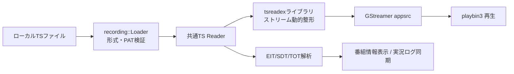

# TS録画の再生

ながめTVにおけるローカルTS録画ファイルの再生機能、対応フォーマット、シーク・一時停止操作、および番組情報連携に関する仕様書です。

---

## 概要と再生方法

ながめTVは、ネットワーク上のMirakurunサーバーが未設定・オフラインの状態でも、スタンドアロンのTS動画プレイヤーとして利用できます。

### ファイルを開く方法
1. **ドラッグ＆ドロップ**: アプリウィンドウ内へTSファイルを直接ドロップ
2. **ショートカット**: **`Ctrl + O`** を押してファイル選択ダイアログから選択
3. **UIボタン**: ウィンドウ右上の「TSファイルを開く」ボタン（録画モードアイコン）をクリック

> [!TIP]
> 初回起動時の「Mirakurun に接続」画面にも「TSファイルを開く」ボタンが用意されているため、サーバー接続設定を行わずに即座に録画ファイルを再生できます。

---

## 主な対応機能

- **対応形式**: 188バイト形式のMPEG-2 TS、192バイトM2TS、204バイトTS
- **再生操作**:
  - **再生 ／ 一時停止**: **`Space`** キーまたはコントロールバーの再生ボタン
  - **スキップ**: **`←`** キーで10秒戻し、**`→`** キーで30秒送り
  - **シークバー**: マウスホバーで移動先予定時刻のプレビュー、ドラッグ＆ドロップで任意位置へシーク
  - **再生速度変更**: 左下の速度ボタン（`x1.0`）から 0.5倍〜2.0倍（0.1刻み）で調節可能（音程維持機能付き）
- **番組情報の自動表示**:
  - TSストリーム内のPSI/SI（EIT・SDT・TOT/TDT）をリアルタイム解析し、再生位置に合わせて番組名、詳細説明、ジャンル、放送日時を自動更新して表示します。
  - 日本のデジタル放送規格（JST）に準拠しています。
- **実況コメント（過去ログ）同期**:
  - 実況コメント機能を有効にすると、TS内のサービスIDと放送時刻に基づいて過去ログAPIから実況コメントを自動取得し、再生位置に同期して弾幕を表示します。
- **字幕・音声制御**:
  - ARIB字幕の表示／非表示、主音声／副音声（二重音声）の切り替えに対応しています。
- **スクリーンショット**:
  - **`Ctrl + S`** で再生位置の映像（字幕・弾幕を含む）をPNG保存できます。

---

## アーキテクチャとパイプライン

録画再生とライブ視聴は、共通のTS入力パイプライン（`tsreadex` ライブラリ連携 → GStreamer `appsrc` → `playbin3`）を使用します。

### 1. 安全な非同期ファイル検証
- ファイルの読み込み要求を受け取ると、専用ワーカースレッド（`recording::Loader`）で先頭のPAT（Program Association Table）と構文を非同期に検証します。
- UIスレッドをブロックせず、ファイル検証中も画面操作や現在の再生を維持できます。
- 不正なファイルや存在しないパスの場合は安全にエラーを通知し、現在の再生状態を壊しません。

### 2. 動的整形と再生
- 元ファイルを別の変換ファイルとして全量再保存することはせず、再生位置から必要なパケットを読み出して `tsreadex` で動的に整形しながらデコーダーへ供給します。
- 詳細な入力パイプラインの構成は [共通TS入力とタイムシフト再生](ts-input-implementation.md) を参照してください。

---

## 制限事項・今後の拡張予定

- **未対応フォーマット**: MP4 / MKV等の一般的な動画コンテナ（MPEG-2 TS専用設計のため）
- **未実装機能**:
  - 再生位置（レジューム位置）の保存と次回再開
  - 複数サービスが混在するTSにおけるサービス手動選択UI（現在はPAT内の最小サービスIDを自動選択）
  - EPGStation等の録画サーバー連携一覧取得
  - 詳細なバックログは [未実装機能・改善候補](backlog.md) を参照してください。

---

## 関連ドキュメント
- [共通TS入力とタイムシフト再生](ts-input-implementation.md): tsreadexとGStreamer連携パイプライン
- [実況過去ログの取得・保持](comment-archive-redesign.md): 録画再生時のNX-Jikkyo過去ログ同期
- [再生速度の仕様](playback-speed-design.md): 倍速再生の制御ロジック
- [ショートカットとウィンドウ・キー操作](shortcut-actions-design.md): キーボードショートカット一覧
