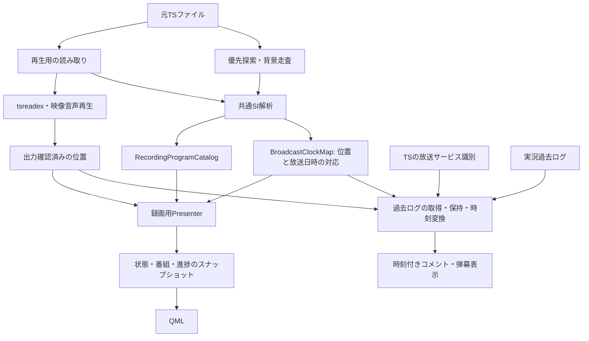

# 録画再生の番組情報 — 仕様・構成

2026-09-17。設計要件と実装の対応を記録する。拡張案も含むため、実装範囲は次節を参照。

録画ファイルに属する番組情報を蓄積し、実際の映像の再生位置から参照する。
番組情報の寿命を、シーク処理や疎なPCR索引の寿命から切り離す。
ライブでも映像に対応するTS情報を優先し、録画の実況コメント再生に備えて、
再生位置と放送日時の対応を番組情報から独立した共通基盤にする。

## 今回の実装範囲

作業ブランチ: `feature/ts-program-comment-timeline`。

- [Catalog](../rust/src/transport/programs/catalog.rs)が番組観測・連続区間・放送時計を所有する。
  PCRシーク索引を間引いてもSIを保持し、背景走査と再生Readerが同じカタログを更新する。
  ライブではTSの保持先頭と出力確認済みの位置の早い方から、コメントの最大表示期間分も
  含めてSI・時計を保持する。短い受信バッファの破棄で出力待ち映像の情報を失わない。
  シーク先の追加SI走査は出力の一時停止に依存せず、30秒・64MiB以内で実行する。
  次のシークで優先対象を置き換える。全体走査はその後に再開する。
- 未取得のpresentと有効な空presentを区別する。予定終了だけで現在番組を消さない。
  同じpresentイベントの連続した訂正は、その観測区間にも反映する。
- TOT/TDTの受信間隔による時計失効はない。PCR不連続では区間を分け、古い区間を保持する。
  PCRが連続していてUTCだけ変わった場合は、整合する二つの観測で変更を確認する。
  一件だけの外れ値で時計を切り替えない。時計未取得でも番組名は表示できる。
- ライブの番組表示とタイムラインは同じスナップショットから原子的に更新する。
  Mirakurunはservice・event_id・開始日時が一致した番組の欠けた名前・説明だけを補い、
  `fieldSources`に出典を付ける。録画へのEPG補完は行わない。
- [実況Replay](../rust/src/features/comments/replay.rs)がライブ受信と描画位置を分離し、
  放送日時に対応するコメントを録画・ライブ・タイムシフトへ渡す。
  [過去ログAPI](https://jikkyo.tsukumijima.net/)を120秒の窓で取得し、表示位置の手前16秒を含める。
  応答8MiB／2万件、保持16MiB／5万件を上限とする。取得失敗と空の成功は区別し、
  直近の過去ログは30秒間隔で再確認する。接続世代が変わると古い応答を破棄する。
- [弾幕Engine](../rust/crates/viewer-comments/src/danmaku.rs)が途中位置と残り寿命を復元する。
  行は再配置し、同じ行の衝突・追い越しを避ける。一時停止中のシークでも静止表示する。
  製品では描画フレームごとに実際の映像時刻から横位置・期限を求める。

永続キャッシュ、EIT scheduleによる全番組一覧、複数サービスの選択UI、
TSで番組を同定できない場合のEPG予定による補助表示、過去ログの一覧UIは今回の範囲に含めない。
既存のコメント一覧はライブ受信履歴を表示し、過去ログは映像上の弾幕へ接続する。

## 検討開始時の実装で確認できたこと

次の問題点は修正前の構造を記録したもの。

- 録画の番組表示は元TS由来。Mirakurunの現在時刻のEPGは使っていない。
  再生中のライブ映像の説明も現在はTSのライブ表示モデルから取得する。
  MirakurunのEPGは番組表・チャンネル一覧等の別の経路で利用している。
- 録画は背景スレッドで先頭から走査し、PCRの`Anchor`に現在／次番組・局名・時計の
  スナップショットを付ける。未走査の場所へのシークでは、局所探索が返した
  `Anchor`一件を`FileIndex.probes`に保存する。
- 再生用`Reader`の`Index`は番組解析を無効にしている。このため遠方シーク後に
  再生用Readerが新しいEITを読んでも、録画の番組表示用データは増えない。
- 表示は、背景走査が再生位置まで到達していれば背景索引を使い、それ以外では
  再生位置以前で最も近い探索結果を使う。探索で実際に確認した区間の終端は照合しない。
  背景索引への切り替えにも、番組情報の充足度を比較する処理はない。
- 放送時計を得ると、保存した現在／次番組の予定開始・終了内に入るかで選ぶ。
  どちらにも入らない場合は番組なしになる。シーク中も一律に`null`を公開する。
- 番組情報はPCR索引と一緒に間引かれる。解析範囲、番組の知識、時刻対応、
  表示状態が別々の寿命を持つモデルにはなっていない。

参照: [入力の選択](../rust/src/playback/input/source.rs)、
[Readerと背景走査](../rust/src/playback/input/mod.rs)、
[索引](../rust/src/playback/input/index.rs)、
[新しい番組カタログ](../rust/src/transport/programs/catalog.rs)、
[Playerの表示更新](../rust/src/player/program_info.rs)。

したがって、局所探索内に必要なSIがあるか、背景走査が追いついたか、保存した番組の
予定終了を過ぎたかによって表示が変わり得る。報告された実録画の原因を再現・特定した
という意味ではないが、仕様と構成として解消すべき経路は確認できる。

## 情報源と対象

| 表示対象 | 番組情報源 | 番組を選ぶ位置・時刻 |
| --- | --- | --- |
| Mirakurunの番組表・チャンネル一覧 | サーバーEPG | 番組表の対象日時・現在時刻 |
| ライブ／タイムシフトの映像 | 受信TSの番組履歴を優先し、照合できるサーバーEPGで補完 | 実際の映像の再生位置 |
| 録画の映像 | 対象ファイルのTSから作った番組カタログ | 対象ファイル内の実際の再生位置 |

今回の録画仕様はサーバー未設定でも成立させる。録画の欠落を現在のサーバーEPGで埋めない。
録画は複数番組・番組途中からの開始／終了を許容し、ファイル一つを番組一つと仮定しない。
対象サービスは既存の選択規則に従い、別サービスの情報を混ぜない。

### ライブの優先順位

映像に付ける番組名・説明と、番組表の予定を別に扱う。映像の番組選択は、
実際に出力している位置に対応した、検証済みのTSのpresent観測を優先する。
受信の先端に届いた新しい番組で、巻き戻して視聴している番組を置き換えない。
番組表・未来の予定・未視聴チャンネル一覧は引き続きMirakurun EPGを主に使う。

TSにない説明等は、同じ放送サービス・番組・放送日時と確認できるEPGで補完する。
event_id単独では照合せず、再利用・開始時刻の訂正も考慮する。
項目ごとの出典と改訂を残し、EPGの未取得や通信失敗でTSの有効な値を消さない。
TSの不完全なデータと、検証済みの訂正・項目削除を区別する。

TSで番組を同定できない場合は、対象位置の放送日時とサービスを照合できるEPGを
予定に基づく補助表示として使える。TSのpresentを後から得たら、同じ表示更新境界で置き換える。
明示的な空のpresentは未取得と区別し、予定のEPGで現在番組を復活させない。
映像の放送日時が不明な場合、PCの現在時刻のEPGを過去の映像に結び付けない。
起動直後の現在時刻による番組予定は、必要なら「放送中の予定」として別に表示する。

今回の補完は同定済みのTS番組の名前・説明に限定する。予定だけからの選択は拡張案。

## 利用者から見た仕様

1. 取得済みの対象区間へ戻れば、その区間の番組情報を再利用する。
   シークのたびにEITの再出現を待たない。
2. 未確認の場所へ移動した場合は「番組情報を確認中」とし、その場所を優先探索する。
   映像・音声の再生やシーク完了を番組情報待ちにしない。一時停止中でも探索を進められる。
3. 同じ区間の有効な情報は、部分的な読み取り、時計の未取得、解析失敗、
   探索担当の切り替えだけでは消さない。明示的な訂正や別番組の確認は反映する。
4. 番組の同定と項目の取得状況を分ける。番組名だけ分かれば表示し、
   局名・詳細・放送日時は取得できた項目から追加する。
   時計の対応を一度得た連続区間ではTOT/TDTの再受信がなくても放送日時を求め続ける。
   利用できる対応がない場合だけ放送時刻・番組内の進捗を未確定とし、ゼロとして捏造しない。
5. 移動先が別番組か不明なのに、移動前の番組を移動先の説明として表示し続けない。
   シーク中に旧フレームを保持する場合、その説明も旧フレームに属する状態として保持できる。
   シーク先のプレビューと、出力確認済みの映像の説明を分ける。
6. 再生位置と番組内の進捗は一時停止中に進まない。後から得た情報による説明の充実・訂正は許す。
7. 番組情報がない場合も、ファイル名・録画内の再生位置・シーク操作は利用できる。
   録画全体のシークバーの長さを、番組情報の有無で変更しない。

UIは以下の状態を区別する。内部状態はenumで表し、必要な情報を各variantに持たせる。

| 状態 | 意味 | 表示例 |
| --- | --- | --- |
| `Pending` | 対象位置・サービス・時計などの確認が進行中 | 番組情報を確認中 |
| `Available` | 対象位置の番組を選べる。選択根拠と未取得項目も保持 | 番組名・取得済みの説明 |
| `Unavailable` | 指定範囲の探索を終えたが同定できない | この位置の番組情報を取得できません |
| `Failed` | 必要な情報がなく、読み取り・解析処理が失敗 | 番組情報を読み取れませんでした |
| `Disabled` | 番組解析が無効 | ファイル名 |

探索範囲・量の上限到達は、その範囲で取得できなかったという結果であり、
ファイル全体にEITが存在しない証拠にはしない。CRC不正一件で解析全体を失敗扱いにせず、
正常な既存データを維持して診断件数に記録する。利用可能な番組がある場合、
追加探索の失敗は`Available`を壊さず、取得処理側の状態に記録する。

## 番組の予定と、録画内の対応を分ける

EIT p/fのpresentはその位置で通知された現在番組、followingは次番組の候補として扱う。
開始・継続時間は予定であり、presentの明示的な通知と予定時刻が食い違うことを許容する。
空のpresentセクションによる「現在番組なし」と、セクションを読めなかった状態も区別する。
根拠: [ARIB STD-B10 Version 5.13、Part 3 §1.4.1](https://www.arib.or.jp/english/html/overview/doc/6-STD-B10v5_13-E1.pdf#page=340)。

表示の根拠は次のように区別する。

- **位置付近のpresent観測**: 同一サービス・連続区間での観測を優先する。
  予定終了後もその番組のpresentが観測されていれば、予定終了だけを理由に消さない。
- **予定との照合**: presentで特定できず、有効な放送時計と予定の対応がある場合の補助。
  followingや将来のschedule情報から選ぶ場合は、観測済みの現在番組と区別する。
- **最後に確認した情報**: 観測の裏付けが途切れたときは、確認位置付きで保持できる。
  対象区間の外や未走査の空白を越えて、確認済みの現在番組として延長しない。

継続を裏付ける新しい観測がなく、予定範囲も外れた場合は「最後に確認した番組」として
補助表示するか未確定とする。単純なタイマーで古いタイトルを無期限に固定しない。
現在番組なしを確認した場合も、その観測と適用区間を記録し、過去の番組本文自体は削除しない。

番組Aを最後に観測した位置と、番組Bを最初に観測した位置の間は、正確な切り替え位置が
未確定の場合がある。観測間の境界の幅と、予定上の境界を区別する。
予定と時計から補助的に選べても、フレーム単位で切り替えを確認したとは扱わない。

## 構成案



### 録画単位の所有者

`RecordingProgramCatalog`を対象ファイルの入力セッションが所有する。
シーク・一時停止では破棄せず、別ファイルへの切り替え・明示的な停止で解放する。
停止後やアプリ再起動後の再利用は、後述の永続キャッシュを導入する段階で扱う。

同じ録画セッションがカタログと`BroadcastClockMap`を所有する。
番組カタログに時計のコピーを閉じ込めず、番組表示と実況が同じ対応を参照する。
セッション内では次の異なるデータを保持する。

| データ | 役割 |
| --- | --- |
| 番組本文と改訂 | タイトル・説明・詳細・ジャンル・予定時刻。本文の複製を抑える |
| 位置付きの観測 | 元ファイルのバイト位置、サービス、present／following／明示的な不在、セクションの版 |
| 番組の対応区間 | どの再生区間にどの番組が対応するか、観測／予定による照合の根拠 |
| 時刻の対応区間（共通の`BroadcastClockMap`） | 元TS位置・PCR／PTS・録画内時間・放送日時の対応と不連続 |
| 解析済み範囲と探索結果 | 読んだ範囲、欠落・破損・未走査、再探索できる範囲 |

シーク用のPCR索引と、番組の対応区間は別に管理する。
PCR索引を間引いても番組変更・情報なしへの遷移は残す。
番組本文は変更時に集約し、同じ本文を各PCRアンカーに保持し直さない。
番組検索は区間索引を使い、GUIの定期更新で全PCRアンカーを走査しない。

### 位置と時計

元ファイルのバイト位置、録画内の再生時刻、放送日時を別の型にする。
PCRの通常の周回は展開して連続した時計として扱う。
時計リセット・編集等で時計の連続性を失った場合は対応区間を分ける。
「録画開始日時＋再生秒数」が全編で成立するとは仮定しない。
概算のシーク位置から得た観測は元のバイト位置を残し、正確な索引完成時に再対応付けできるようにする。

TOT/TDTは放送日時とTS内の時計を結び付ける基準点として使う。
一度基準点を得たら、その連続区間ではPCRの進みを映像の再生位置に対応させ、
次のTOT/TDTがまだ来ていなくても放送日時を求め続ける。

```text
対象位置の放送日時 = 基準点の放送日時 + 基準点から対象位置までのTS時計の経過時間
```

経過時間はTSの時計に基づく。一時停止中のPC上の経過時間や、録画を開いてからの時間ではない。
録画内の30秒位置で21:00:30との対応を得て、時計が連続したまま90秒位置へ進めば、
その間にTOT/TDTがなくても21:01:30と求められる。

**TOT/TDTの受信間隔だけを理由に、対応済みから未確定へ戻さない。**
再受信がない時間にタイムアウトを設けて番組・進捗・コメント同期を解除する処理は作らない。
適用区間はTOT/TDTが入っていた小さな探索範囲や二つの受信点の間ではなく、
TS時計の連続性を確認できる範囲とし、読み取りの進行とともに延長する。
最後のTOT/TDTより先でも、その範囲内なら同じ基準を使う。

シーク・一時停止・番組変更・時計が連続しているPMT更新でも基準点を失効させない。
シーク先が既知の対応区間なら、移動先でTOT/TDTを再取得せずに利用する。
先の位置で初めて基準点を得た場合も、時計の連続性が確認できる既読範囲には
逆向きに適用できる。未走査の空白や不連続の境界を無検証でまたいで適用はしない。
探索先で対応がなければ前後の基準点を優先探索する。
索引の間引きやライブ保持領域の期限切れで基準点の元パケットを捨てても、
利用中の対応区間の変換に必要な値は保持する。

新しい正常なTOT/TDTは既存の対応と照合する。整合する観測は対応を検証・補強し、
時刻の粒度に収まる揺れのたびに表示やコメントの再生カーソルをリセットしない。
不正なセクションや単発の外れ値は有効な対応を消す根拠にしない。
大きく食い違う値は補正候補として扱い、後続の観測等で採用を検証する。
補正を採用する場合は適用範囲を決めて新しい対応へ一括更新し、
変更不要な過去区間の日時やコメントの消費済み状態を巻き戻さない。

放送日時を未確定とするのは、最初の対応をまだ得ていない場合、または
時計の連続性を失った先で利用可能な対応をまだ得ていない場合に限る。
不連続を見つけても既に確立した過去区間の対応は残す。
未確定の区間でも、位置付近のpresentで番組名を表示できる。
別区間の古い時計や、現在のシステム時刻・ファイル更新日時で補わない。

`BroadcastClockMap`は番組名や番組の予定開始に依存しない。番組情報が欠けていても、
TSから対象サービスと時計の対応を取得できれば実況過去ログを同期できる。
番組表示を無効にしても、実況同期が必要ならサービス識別と時計解析は動かす。
解析するSIの集合は利用機能の要求から決め、EPG表示用のフラグ一つに時計解析を従属させない。

時計の状態は、対象区間の基準未取得／対応済みなどのenumで表し、
対応済みの区間にはセッション・区間識別・対応の改訂・精度の根拠を持たせる。
最終TOT/TDT観測位置や補正候補は、対応の有効性とは分けて管理する。
TSの時計の粒度や補正を考慮し、フレーム単位の絶対時刻精度を約束しない。
有効な対応区間を借用した値からだけ時刻変換できるAPIにする。
最後のTOT/TDT観測点より先への延長は許し、連続性を確認できる適用区間の外への外挿を禁止する。
シーク用の概算位置が分かるだけでは、実況同期可能と判定しない。

### 複数の読み取り経路の統合

再生用読み取り・シーク先探索・背景走査は、同じSI解析器と検証済みの観測形式を使う。
再生用Readerも元TSの番組情報をカタログへ供給し、遠方シーク後の表示を更新できるようにする。
局所探索ではシーク用アンカー一件だけでなく、その探索範囲で得た番組・時計・解析範囲を返す。

同じTS位置を何度解析しても結果を重複させない。結果の到着順を番組訂正の順序にしない。
元ファイルの観測位置、連続区間、テーブル／セクション、版、内容から改訂を識別する。
EITの版は周回するため、版番号の大小だけで新旧を比較しない。

`event_id`だけで番組を識別しない。録画の同一性、放送サービスの識別子、
連続区間内の出現・開始時刻を照合する。開始時刻そのものが訂正される場合や日時未定もあるため、
開始時刻が変わっただけで別番組に分裂させず、出現の連続性と訂正根拠を保持する。

破損・未取得の記述子は既知の本文の削除と扱わない。一方、検証済みの完全な改訂で
項目が削除された場合は反映する。異なる版の拡張イベント記述子を継ぎ合わせない。
録画の表示には、同じ番組と確認できた範囲で収集済みの訂正・補完を利用する。
放送当時の説明文の更新過程を逐一再現する機能は初期対象にしない。

### 探索・取消し・上限

読み取りの優先度は、映像音声の供給、現在位置／シーク先の番組探索、背景走査の順とする。
既存の背景走査で読み出すTSも利用し、番組情報専用の全編走査を重ねない。
再生が一時停止していても、番組探索は限られた量を独立して読めるようにする。
一度の探索に読み取り量・実行時間の予算を持たせ、NASで全編の完了を待たせない。
OSの読み取り自体の中断可能性とは区別し、取消しは読み取り単位で確認する。

ファイルの同一性と選択サービスを確認した所有者からだけ解析処理を開始できるAPIにする。
開始済みの解析Jobを消費して、完了範囲・ファイル世代と結び付いた結果を受け取るTypestateを使う。
外部から任意の番組を無検証で挿入するAPIや、任意の録画へ流用できる完了トークンは公開しない。

録画セッションの世代とシーク要求の世代は分ける。同じ録画の旧シークで得た検証済みの情報は
カタログへ再利用できるが、旧要求の完了で現在の表示位置を切り替えない。
別ファイル・置換されたファイルの遅延結果は受理しない。

本文のバイト数、番組数、観測数、時計区間数にそれぞれ上限を置く。
重複集約を優先し、上限で追い出した範囲は未取得へ戻して再探索可能にする。
現在表示中の一件と探索中の対象を保護する。メタデータの上限で映像のシーク可能範囲を狭めない。
具体的な上限と探索予算は、既存の索引上限・実録画・低速ストレージでの測定を基に決める。

### 表示境界と既存コードの再利用

録画用`Presenter`が、カタログ、出力確認済みの位置、既存の再生状態から表示を作る。
番組・状態・未取得項目・進捗をまとめて更新してからQtへ通知する。
QMLは表示に専念し、番組の選択・保持・消去や情報源の切り替えを判断しない。

ライブには既に位置付き履歴と`Presenter`がある。
SI解析・番組識別・時計の対応などの共通部分を再利用するが、
ライブの受信順・保持期限・件数上限を録画のランダム探索へそのまま流用しない。
Mirakurunの外部モデルとTSの外部モデルは入口で分け、共通化は検証済みのデータや表示形式で行う。

## 録画・タイムシフトの実況コメント

録画とタイムシフトは共通の再生位置・放送日時の対応とコメント再生器を使う。
取得元の差を受信・過去ログ取得の入口で扱い、表示側に別々の時計を持たせない。
実装は段階的に進めるが、受信と表示の分離、保持範囲、ライブ復帰は今回の設計範囲に含める。

### 必要な情報と取得単位

過去ログ取得に必要なのは、実況チャンネルと放送日時の範囲である。
番組名・event_id・番組表への接続を必須条件にしない。
TSの放送サービス識別から既存の対応表を使って実況チャンネルを解決する。
名称の類似やファイル名で自動決定しない。未対応・曖昧な局は明示的な選択を追加できる境界を残す。
過去の録画では局の再編や地域差があるため、対応表には録画の放送日による差も扱えるようにする。

過去ログの取得元はアダプターとして分離する。候補の
[ニコニコ実況 過去ログ API](https://jikkyo.tsukumijima.net/)は、実況IDと開始・終了の
UNIX時刻で取得でき、ニコニコ実況・NX-Jikkyoの過去ログを提供している。
収集の遅れや対象期間の空の応答があるため、最新区間の空の結果を恒久的な欠落として保存しない。
取得元の決定・接続実装・実サービス試験は後続作業とする。

録画全編や番組全体を一括で取得せず、現在位置周辺の放送日時を求めて分割取得・先読みする。
時計の不連続では取得範囲を分割し、編集で削除された放送時間を連続した録画時間と扱わない。
番組の予定が訂正されても、録画位置と放送日時の対応が同じなら取得範囲は変わらない。

### コメントの時刻と再生位置

内部モデルには元の投稿日時、提供元の識別子、実況チャンネル、本文・表示指定を保持する。
秒未満の時刻を提供元が持つ場合は取り込み時に捨てず、精度も区別する。
時刻欠落をUNIX時刻ゼロに変換して同期させない。
`vpos`等の相対時刻は提供元の基準時刻を確認して変換し、番組開始や録画開始を基準と決め付けない。

同じ連続区間の対応点を再生時刻`m0`、放送日時`u0`とすると、
投稿日時`u`の表示開始位置は、通常速度の時刻座標で次になる。

```text
表示開始位置 = m0 + (u - u0) + コメント同期調整量
```

同期調整量は正なら映像に対してコメントを遅く表示する。基礎となるTSの時計対応を
書き換えず、配信遅延や視聴者の反応時間に応じたコメント専用の調整として持たせる。
時計が巻き戻ると同じ投稿日時が複数の録画区間に対応し得るため、変換には区間識別も必要。
同じ放送の映像を二度含む録画では、それぞれの出現位置で同じコメントを再生できる。

過去ログのキャッシュは実況チャンネル・提供元・元の投稿日時を基準に保持し、
録画内の表示位置への変換結果は時計対応の改訂と区間に結び付ける。
時計対応を訂正した場合は必要な区間だけ再変換し、元コメントを再取得する必要はない。
重複取得は提供元・チャンネル・スレッド・コメント番号等の安定した識別で統合する。
本文と時刻だけで別人の同じ反応を削除しない。識別子が不足する形式の扱いは取得元で定義する。

### 再生操作と表示

- 映像の出力確認済みの位置からコメントを選ぶ。受信時やダウンロード完了時に即座に流さない。
- 一時停止・バッファリング中は投入と移動を止める。過去ログの取得・先読みは継続できる。
- シーク成立時に旧区間の弾幕と投入カーソルをリセットし、実際の到達位置から再開する。
  失敗したシークの要求位置へカーソルを進めない。飛ばした区間のコメントをまとめて投入しない。
- 前後どちらのシークでも、到達時刻に通常再生で表示中となるコメントを途中位置から再構成する。
  一時停止中のシークでは、その瞬間の位置に静止表示する。
- 過去ログが遅れて届いたときも、表示期間が現在位置と重なるコメントは途中位置から追加できる。
  表示期間が終わった分をまとめて流さず、既存の表示や投入カーソルを無条件にリセットしない。
- 録画コメントの状態は、無効／局・時計の確認待ち／取得中／利用可能／その範囲にログなし／
  取得失敗を区別する。番組情報の有無や通信失敗によって映像再生を止めない。
- 過去ログ再生は表示機能として扱い、現在放送中の実況への投稿とは対象・状態を分離する。

### シーク先で表示途中のコメントを復元する

通常再生とシーク後の横位置・残り時間は、同じ移動式と再生時刻から求める。
利用者の方針により、シーク後の行の位置は通常再生時と異なってよい。
シーク先より前に表示を開始したコメントも、表示期間が残っていれば対象にする。
コメントを受信した実時間や、シーク完了後にLabelを作った時刻を表示開始時刻にしない。

表示幅が一定の横流れでは、コメントの左端位置と残り時間を次で求める。
`W`は映像の表示幅、`w`は計測済みの文字幅、`s`は録画内の表示開始時刻、
`D`は設定から決めた表示時間、`t`は出力確認済みの再生位置とする。
ここでの時刻と時間はすべて同じメディア時間の単位を使う。

```text
経過時間 a = t - s
表示対象: 0 <= a < D
左端位置 x = W - (W + w) * a / D
残り時間 = D - a
```

たとえば表示時間5秒のコメントが開始2秒後なら、移動距離の40%進んだ位置から
残り3秒だけ表示する。幅によって左端の画面上の位置が変わるため、
単純に「画面の40%の位置」とはしない。上／下固定コメントは位置を動かさず、残り時間だけ短くする。
開始時刻ちょうどは表示対象、終了時刻ちょうどは非表示として境界を統一する。

シーク先から最大表示時間分だけ過去へさかのぼり、表示期間が残る候補を時刻索引で集める。
最大表示時間は、上／下固定と横流れ、表示速度等の対応する設定から求める。
各候補の幅を計測して途中の横位置・速度・残り時間を求め、現在の画面で行へ配置し直す。
開始時刻・安定した識別子等で候補の処理順を決め、同じ入力で配置が無用に変わらないようにする。

行を選ぶ際は現在の文字の占有範囲に加え、残り時間中の追い付き・衝突も確認する。
横位置をずらして空きを作らず、別の行へ配置する。空き行がなければ既存の混雑時の方針で見送る。
上下固定も現在の空き行を使い、表示期間を最初から数え直さない。
過去の行配置や見送り履歴の完全な再現は求めず、行の履歴保存・チェックポイント・
録画冒頭からの配置再計算を初期実装の前提にしない。

復元する範囲のコメントを一括計測し、Rustで適用時点の復元計画を作ってQtへ渡す。
計算と計測は有界なバッチに分け、復元候補だけを処理する。
過去ログの取得・保持にも最大表示時間分の手前と同期調整分を含める。
タイムシフトの保持始点より前に開始して表示期間が重なるコメントは、
本文と開始時刻等の復元に必要な値を残す。
コメント本文・計測結果・復元候補数に上限を設け、取得・計測中も映像再生は止めない。

画面サイズ・フォント・表示速度等で配置条件が変わったら、配置の世代を更新する。
シーク時は現在の条件で位置と行を再計算する。過去の画面操作の履歴は再演しない。
コメントの追加・訂正や時計対応の訂正では影響する候補を再評価する。
情報追加だけで毎回全表示を消さず、既存の行を維持しながら追加分の配置を判断する。

表示途中の復元は、新着コメントの投入とは別の操作として設計する。
一時停止中でも復元・文字幅計測は実行でき、移動と寿命の進行だけを止める。
復元要求にはセッション・シーク世代・配置世代・データ改訂・対象位置を結び付け、
必要な計測が完了した計画だけを適用できるTypestateを使う。
古いシークの計測結果で別の位置の弾幕を生成しない。
非同期処理中に映像が進んだ場合は、適用時の実際の位置で生存判定・座標・残り時間を計算し直す。

録画・タイムシフトの弾幕は、表示開始だけでなく移動量と寿命もメディア時間に基づける。
QMLのアニメーションはその軌道の補間を担当し、生成時から独立した全表示時間を数え直さない。
一時停止・バッファリング・シーク・再開でRustとQtの状態をそろえる。
将来動画の倍速を実装する場合も、動画の再生倍率をメディア時間の進みに適用する。
既存の「コメントの流れる速さ」は表示時間`D`を決める別の設定として区別する。

### タイムシフトでの受信と再生

ライブの実況受信は、映像の再生カーソルとは独立して継続する。
一時停止・巻き戻し中も現在のコメントを有限の`CommentStore`へ蓄積する。
描画するコメントは共通の`CommentTimeline`が実際の映像位置から選び、
受信した新着をそのまま弾幕へ送る経路との二重投入をなくす。

| 再生の種類 | コメントの取得 | 表示の基準 |
| --- | --- | --- |
| ライブの先端 | リアルタイム受信を蓄積 | 出力中の映像の放送日時 |
| ライブの巻き戻し・一時停止 | リアルタイム受信は継続し、不足範囲は必要なら過去ログで補完 | 過去の映像位置に対応する放送日時 |
| 録画ファイル | 過去ログを分割取得・キャッシュ | 録画内の映像位置に対応する放送日時 |

たとえば21:10の放送を受信しながら21:00の映像を再生している場合、
弾幕には21:00に対応するコメントを流し、21:10の新着は後で再生するために蓄積する。
一時停止した間のコメントを、再開時にまとめて流さない。
投稿日時が現在の映像位置より先なら、対応する位置へ進むまで待機させる。

放送時計の対応が利用可能な通常のライブ表示も、同じ再生器を経由させる。
ライブ通信でわずかに遅着するコメントについては、現在の映像時刻に近いものだけを
途中位置から一度表示できる遅着許容幅を設ける。幅は実測して決め、元の投稿日時は変更しない。
表示期間が終わったコメントをこの救済で再生し直さない。過去ログの一括到着や
シークでは、表示期間が到達位置と重なるコメントだけを同じ再構成規則で表示する。
対応未取得時に従来の受信時表示を残す場合は独立したモードとし、
巻き戻し中には使わず、同期表示への切り替えでも同じコメントを二重に投入しない。

### 保持範囲と過去ログによる補完

`CommentStore`の保持対象は、映像を保持している区間に対応するコメントと、
受信先端付近の待機分・同期調整と表示途中の復元に必要な前後の余裕とする。
既存のサイドパネルの件数制限付き履歴とは別に所有し、
一覧から押し出されたコメントも、映像の保持範囲内なら再生用に残せるようにする。

コメントの件数・本文の総バイト数・取得並列数にも独立した上限を設ける。
上限で追い出した区間、コメント受信を無効にしていた区間、接続断・受信キューの欠落は
不足範囲として残す。映像の保持・シークをコメントの上限に従属させない。
保持範囲の判断には時計の連続区間も使い、放送日時の数値だけで古いデータを削除しない。
保持時間・容量の変更とタイムシフト無効化は、コメントの保持方針にも反映する。

弾幕の表示だけをOFFにした場合は、実況受信が有効なら保持を継続する。
実況機能自体をOFFにした場合は受信を止め、その期間を取得済みとは扱わない。
選局・別入力への切り替え・停止ではセッションを更新し、旧受信タスクや旧コメントの
投入結果を新しい映像へ混ぜない。再利用可能な過去ログキャッシュは表示セッションから分離する。

初期のタイムシフト対応は、視聴中に受信・保持したコメントだけで成立させる。
過去ログの取得は録画再生と共通化し、受信開始前や通信断等の不足範囲を後から補えるようにする。
過去ログへの反映待ちの時間帯には空白があり得るため、取得中・反映待ち・その範囲にログなし・
取得失敗を区別し、空の応答を無期限に確定保存しない。再取得には間隔と回数の予算を持たせる。
リアルタイムと過去ログの取得範囲が重なる場合は共通の識別で統合する。
同じコメントを識別できない取得元同士では、範囲ごとの採用元を固定して二重投入を避ける。

### ライブ復帰と保持期限切れ

ライブに戻る操作では、映像の移動が成立した位置へコメントのカーソルも移す。
到達位置で表示期間が残っているコメントを途中位置から再構成し、その後の新着へつなぐ。
到達位置より前に表示期間が終わったコメントは投入しない。
同じ再生器を維持するため、復帰の瞬間に受信時表示を別途起動しない。
失敗した移動要求や古いシークの完了で、コメントだけを先端へ進めない。

一時停止中に元TSが保持範囲外になっても、停止フレームと表示中の弾幕は止めたままにできる。
このために過去の全コメントやTSを保持し続けない。再開時は既存の映像側の復帰規則に従い、
実際に到達した位置へコメントもそろえる。停止フレームの小さな表示状態と再生用データを分離する。
TOT/TDTの再送待ちで有効な時計対応を捨てない規則は、タイムシフト中も同じとする。

### 既存実装との接続

[弾幕コア](../rust/crates/viewer-comments/src/danmaku.rs)には、`TimedComment`の読み込み、
録画位置からの投入、一時停止、前後シークがある。録画Playerからの接続、
検討開始時には過去ログ取得と時刻変換は未実装だった。当時の
[コメント受信](../rust/src/player/comments.rs)は録画を対象外とし、ライブの新着を表示する。
タイムシフト中の一時停止・シーク・一定以上の遅れでは新着の弾幕投入を抑制しているが、
保持したコメントの過去位置での再生は実装していない。
現在のQMLでは弾幕Loaderも再生状態に連動するため、一時停止時の表示を保持するには、
Loaderの寿命を再生中フラグから分けて明示的な停止・入力切り替えに結び付ける必要がある。

既存の`Engine::load`は全件置換とシークによる表示の消去を伴うため、
分割取得のたびに呼び直す方式にはしない。有界な窓のコメント追加・破棄と
カーソル維持を扱うAPIを後続実装で用意する。
現状では表示開始は映像時計を使うが、表示後の移動は別のアニメーション時計であり、
`seek`は表示を消して対象位置以降にカーソルを設定するだけである。
新しい仕様では移動と寿命も映像位置から求め、直前の表示期間内のコメントを
途中状態から復元して行へ配置し直す処理を追加する。
現在の新着用`prepare`／`measured`は一時停止中の生成を拒否するので、
停止中でも安全に適用できる復元用のAPIを別に用意する。
Qtへ途中の座標・終点・残り時間を渡す通知形式は既存の生成・再配置処理を活用できる。
途中復元、動画倍率の反映、長い描画停滞からの復帰が現時点で実装済みとは扱わない。

取得・キャッシュ・時刻変換はRust側で行い、QMLへ過去ログ全編を繰り返し渡さない。
本文サイズ、件数、キャッシュ容量、先読み幅、同時取得数を制限する。
古いシークの結果を現在位置へ投入しない世代管理と、同じ提供元・局・期間の有効な結果を
キャッシュへ再利用する処理を分ける。

## 導入順と受け入れ条件

1. **状態・時計対応・カタログを分離する。** 元TSの番組情報と解析範囲を保持し、再生Readerと
   探索結果を統合する。シーク後の更新停止と、一律`null`による表示を解消する。
   時計対応は将来の実況と共有でき、番組表示を無効にしても利用できる境界にする。
2. **番組の対応と改訂を整える。** presentの観測、予定、空のpresent、時計不連続、
   部分記述子、探索順が逆転する場合を扱う。録画用PresenterとQtの一括通知を完成させる。
3. **再オープンを速くする。** 必要ならアプリのキャッシュ領域へカタログを永続化する。
   ファイル名だけでは照合せず、サイズ・更新情報・内容の検証値・解析形式の版を確認する。
   不一致なら再構築し、元TSへの書き込みは必要としない。
4. **情報を広げる。** EIT scheduleによる補完・録画内の番組一覧は追加候補。
   予定が掲載されているだけで、その番組の映像が録画に含まれるとは判断しない。

初期実装はEIT p/f・SDT・TOT/TDTで成立させ、永続キャッシュとschedule解析は前提にしない。
実況コメントは共通の時計対応ができた段階で、次の実装単位で追加する。
永続キャッシュやschedule解析の完成は待たなくてよい。

1. リアルタイム受信から独立した有界な`CommentStore`と共通の`CommentTimeline`を用意する。
2. メディア時間に基づく途中位置の復元と、残りの軌道を考慮した行への再配置を追加し、
   受信済みコメントによるタイムシフト再生、一時停止、巻き戻し、ライブ復帰を接続する。
3. 過去ログアダプターを追加し、録画再生とタイムシフトの不足範囲の補完を接続する。

機器不要のモデル・解析試験では以下を確認する。

- 背景走査が遅いまま遠方へシークしても、再生側の観測で番組が更新される。
- 局所探索にEIT／TOTがなくても確定した不在にはせず、追加取得で表示が充実する。
- 一度確認した区間への再シークで再取得を要求しない。同一番組内のシークで情報が点滅しない。
- 取得経路の切り替えや疎なPCR索引の間引きで、既知の番組区間を失わない。
- 予定終了を過ぎても新しいpresentが同じ番組なら表示を維持する。
  presentが途絶えた場合は確認済み区間と未確定区間を区別する。
- 空のpresent、CRC不正、未取得、部分的な説明、完全な訂正を区別する。
- A→B→Aの前後シーク、連続要求、別ファイルへの切り替え、同じevent_idの再利用で混同しない。
- SIを受け取る順番が逆でも、同じ収集済み範囲なら同じ番組対応・本文を得る。
- 時計欠落・巻き戻り・PCR周回・番組途中からの録画でも、別区間の時計を使わない。
- TOT/TDTを最初の一件以降含まない合成TSでも、PCRが連続する間は放送日時・進捗・
  コメント同期が継続する。受信間隔に応じたタイムアウトは発生しない。
- TOT/TDTのない位置への前後シーク、一時停止、番組変更、連続したPMT更新、PCRの通常の周回、
  索引の間引き・基準点の元パケットの破棄でも、対象区間の既存の時計対応を再利用する。
- 後から得たTOT/TDTを同じ連続区間の既読範囲へ逆向きに適用できる。
  未走査区間や確認済みの時計リセットをまたいでは適用しない。
- 単発の不正値・外れ値では対応を失効させず、小さな揺れでコメントを再投入しない。
  確認済みの時計補正と不連続は対象区間に反映し、確立済みの過去区間の対応を維持する。
- 上限到達・取消し・局所探索失敗が、映像再生や既存の有効な番組表示を停止させない。
- ライブのTSとEPGが矛盾する場合、映像位置のTSを優先し、同じ番組の欠けた項目だけ補完する。
- 番組情報がなくてもサービスと時計があればコメントを対応付けられる。
  時計がなければ番組の予定開始や現在時刻でコメントを同期しない。
- 番組表示が無効でも必要な時計解析は継続し、番組の予定訂正でコメント時刻は変わらない。
- コメントの前後シーク、一時停止、取得遅延、重複取得、時計訂正・不連続で、
  旧区間の投入や取りこぼしたコメントの一括表示を起こさない。
- 同じコメント集合と固定の配置条件で、通常再生で到達した時刻の表示とシーク先の再構成を
  比較し、表示期間内の候補と各コメントの横位置・残り時間が一致する。行の一致は要求しない。
  横流れ・上固定・下固定、長い文字列、同時刻の複数コメント、開始／終了時刻の境界を含める。
- 再配置した同じ種類のコメント同士が、現在位置から終了まで重ならず、追い付かない。
  空き行がないときの見送りでも、横位置や表示期限を変更して表示を遅らせない。
- 一時停止中の前後シークでも途中のコメントが静止表示され、再開すると残り時間だけ進む。
  古い計測結果や連続シークで別位置の弾幕を復活させない。
- 保持始点直前に開始したコメント、配置条件の変更、過去ログの追加、時計対応の改訂でも、
  直前の必要範囲から復元でき、取得・計測・候補件数の上限を守る。
- タイムシフトの一時停止・巻き戻し中も実況受信は進み、新着を過去の映像に流さない。
  弾幕表示だけのOFFと実況受信のOFFを区別し、一覧の件数制限で再生用コメントを失わない。
- ライブ復帰・連続シーク・拒否されたシークで、映像とコメントのカーソルが一致する。
  復帰時に飛ばしたコメントの一括投入や、別経路からの同じ新着の二重投入を起こさない。
- 一時停止中の保持期限切れ・容量変更で無制限に保持せず、再開の実到達位置に同期する。
- リアルタイム受信と過去ログの重複、反映待ち、通信断、受信キューの欠落を区別し、
  古い取得結果で表示位置を変えたり、予算を超えて再取得を繰り返したりしない。

RustとQMLの境界を実装した段階で接続テストと製品Main.qmlの起動試験を行う。
表示・GPU・音声を使う試験は[開発手順](development.md)と機器要件に従う。
報告された実録画そのものでの症状の再現は行っていない。

## 実装の検証（2026-09-17）

- 本体のRustテスト: 229件成功、失敗0件、外部入力等を必要とする3件は未実行。
- `viewer-comments`のnetwork機能付きテスト: 53件成功、失敗0件、任意の1件は未実行。
- 本体・コメントクレートのClippyは`--all-targets -- -D warnings`で成功。
- 実GPUを使うQML部品テスト: 228件成功、失敗0件。
  別の画面試験との同時実行でフォーカス操作に1件失敗したため、単独実行で確認した。
- 接続・Qt通知の整合性、日本語表示と翻訳カタログ欠落時の試験は成功。
- 製品Main.qmlの起動・終了、時計リセット／PID変更の録画再生、メモリー／ファイル方式の
  タイムシフト（一時停止中の受信、前後シーク、ライブ復帰、容量による失効からの再開）は成功。
  表示・GPU・音声は試験スクリプトで検出・動作確認してから使用した。
- `cmake --build build`で製品バイナリーを生成した。

番組の予定終了、未取得と空presentの区別、部分記述子、PCR索引の間引き、
TOTの長い欠落・単発外れ値・確定した補正・PCR不連続、シークReaderによる時計範囲の
縮小防止を確認した。コメントは受信保持・重複・取得取消し・古い取得結果の破棄・
初回映像前の受信、横位置と残り寿命・行の衝突・一時停止中のシークを確認した。

過去ログ取得の通信試験はローカルHTTPサーバーとプロトコル入力を使った。
外部過去ログサービスの実データによる同期精度と、報告対象の実録画での再現確認は未実施。
