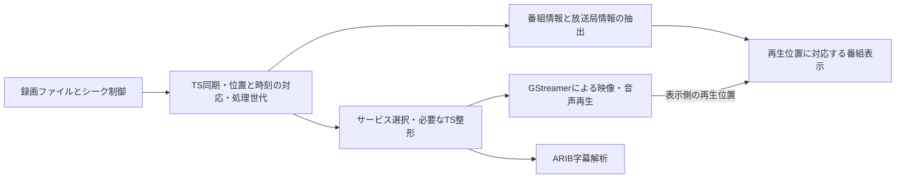

# TS録画のシーク・番組情報取得ロードマップ

作成日: 2026-09-16。作業ブランチ: `feature/recording-seek`。
開始点は作成時点の `main` の `f778a25`（既存のローカルコミットを含む）。
この文書は実装計画であり、チェック済みの準備項目を除き実装・検証は未完了。
現在利用できる機能は[TS録画の再生](recording-playback.md)を参照する。

## 最終目標

Mirakurunに接続していなくても、ローカルTSを一時停止・再開・シークできる。
シーク後も映像・音声・字幕が同期し、その再生位置に対応する番組名・説明・放送局・
放送日時をTSから取得して表示する。複数番組を含む録画では番組表示も前後に切り替わる。
PAT/PMTの変化や時刻の不連続を扱い、失敗・連続操作でも古い再生世代のデータを混ぜない。

| この計画で完了させるもの | 後続の拡張として扱うもの |
| --- | --- |
| 再生位置・長さ表示、シークバー、10秒戻し・30秒送り | サムネイル付きの連続スクラブ、フレーム単位の移動 |
| 一時停止・再開、終端からのシーク、キーボード操作 | 倍速再生、再生位置・視聴状況の永続保存 |
| TS再同期、対象サービスの追跡、字幕の復旧、安定化方式の選定と必要な対策 | 複数サービスの選択UI、192/204バイト形式への対応拡大 |
| TS由来の番組名・概要・詳細・ジャンル・放送局・放送日時の表示 | 録画一覧、番組チャプター、全局・全日程の番組表生成 |
| 録画の再生時刻と放送時刻の対応付け | 過去ログ同期、MP4、EPGStation連携 |

初期対応は現在と同じ188バイト形式のローカルTS。取得できない番組情報は欠落として扱い、
映像・音声が再生可能なら番組情報の取得失敗だけで再生を止めない。

## 現状と変更の入口

| 対象 | 現状 | 主な変更箇所 |
| --- | --- | --- |
| ファイル入力 | 先頭4MiB以内のPATを検証し、最小サービスIDを選択 | [録画検証](../rust/src/playback/recording.rs)、[TS共通処理](../rust/src/transport.rs) |
| 再生 | `playbin3`で開始・停止。字幕用の位置取得あり | [Playback](../rust/src/playback.rs)、[Session](../rust/src/playback/session.rs) |
| 状態管理 | 停止・開始待ち・再生中・停止失敗。終端では停止処理 | [再生状態](../rust/src/player/stream_state.rs)、[再生制御](../rust/src/player/stream.rs) |
| 字幕 | 入力TSを独自解析し、映像のstream timeへPTSを対応付ける | [字幕Session](../rust/src/features/subtitles/mod.rs)、[パーサー](../rust/src/features/subtitles/transport.rs)、[字幕時計](../rust/src/features/subtitles/gst_clock.rs) |
| 番組情報 | MirakurunのEPGと現在のシステム時刻を使用。録画では非表示 | [番組情報](../rust/src/features/program_info.rs)、[表示更新](../rust/src/player/program_info.rs) |
| UI | 再生・停止ボタン。録画用の時間表示やバーはない | [Player](../rust/src/player.rs)、[操作部](../rust/qml/PlayerControls.qml)、[Main](../rust/qml/Main.qml) |

## 設計方針

入力の位置・時刻・処理世代を共通の契約で扱う。以下は責務の配置であり、
専用の入力要素や全TSの再多重化を必須とするものではない。具体的な接続方式は段階0で決める。



- EIT・SDT・TOT/TDTは削除やPID変更より前のTSから取得する。出力を整形する場合、
  元のサービス識別情報・位置・時刻との対応を保持する。
- ファイル内の読み取り位置、画面の再生時刻、放送日時を区別する。
  先読みやシーク探索で得た情報を、そのまま現在番組として表示しない。
- シークは要求受付・移動中・完了・拒否/失敗を区別する。起動や音声変更に伴う
  `ASYNC_DONE`をシーク完了と誤認しない。GStreamerの[非同期シーク](https://gstreamer.freedesktop.org/documentation/application-development/advanced/queryevents.html)に従う。
- 再生状態はenumで表し、各状態で必要な対象・移動先・復帰状態を所有させる。
  検証済みの同じセッションにだけ操作できるTypestate/APIを設ける。
  `can_seek`などのQt公開値は状態から導出し、全体を更新してから通知する。
- 取消し、ファイル変更、停止で古い結果を無効化する。処理中は最新の移動要求だけを保ち、
  ワーカー・待機要求・字幕・番組情報の保持量に上限を置く。
- [コード規約](coding-conventions.md)に従い、既存の停止成功後に資源を置き換える保証を維持する。
  シークのために字幕Sessionを稼働中のまま破棄・再生成するAPIを外部へ公開しない。

## 準備

- [x] 既存の作業状態を確認し、`main`の現在位置から`feature/recording-seek`を作成する。
- [x] 最終目標、段階別チェックリスト、完了条件をこの文書へ記録する。
- [x] 録画再生の説明、開発資料、バックログからこの計画へリンクする。

## 段階0: 入力方式と検証基準を決める

依存: 準備。完了条件: 入力方式・対応範囲・比較条件・採用理由が文書化されている。

- [ ] 現行の`playbin3`で、総再生時間・時間単位のシーク可否・範囲・移動後の位置を調べる。
  APIの成功だけでなく、移動先のフレームと音声が出るまでを確認する。
- [ ] 短い合成TSに加えて、10秒戻し・30秒送りを確認できる長さの素材と、
  PAT/PMT変更、字幕、EIT/SDT/TOT、時刻不連続を含む再現用素材を用意する。
  リポジトリーへ追加する素材は合成し、生成方法を記録する。
- [ ] `FLUSH | KEY_UNIT`を初期候補として、指定時刻との差・前後移動・応答時間を測る。
  精密シークや独自インデックスの要否を決める。[シークの仕様](https://gstreamer.freedesktop.org/documentation/additional/design/seeking.html)
- [ ] 現行入力、tsreadexによる整形、アプリ内で必要な整形を行う方式を同じ素材で比較する。
  tsreadexを採用する場合は、外部プロセス・ライブラリー組み込み・GStreamer要素との接続を選ぶ。
- [ ] 整形する方式では元ファイルと出力のバイト位置が一致しないことを前提に、
  時刻から元ファイル位置への移動、長さの取得、取消し、再同期の担当を決める。
- [ ] シーク誤差・完了待ち時間・再探索の読み取り量・キュー上限・連続操作回数の
  受け入れ基準を、素材と検証環境を添えて決める。未知の長さや非対応入力のUIも決める。

[tsreadex](https://github.com/xtne6f/tsreadex)はサービス選択・PID固定・PAT/PMT再構成・
任意の音声等の補完を参考にする。`-s`は起動時のバイト位置指定で、出力は標準出力。
パイプで挟むだけで時間指定のランダムアクセスが維持されるとは扱わない。
本体採用や音声補完の要否は比較結果から決め、採用時はバージョン・配布・ライセンス表記も記録する。

## 段階1: TS解析とシーク時の再同期を共通化する

依存: 段階0。完了条件: 同じファイル内で前後に移動しても、移動前の構成・断片を混ぜない。

- [ ] TSパケット同期、セクション組み立て、サービス選択、解析結果の配信の所有者を整理する。
  既存の`transport`を基礎に、字幕と番組情報で構文処理を共有する。
- [ ] 選択サービスを維持しつつ、移動先の有効なPATからPMTを取得して構成を再確定する。
  選択サービスが見つからないときに別サービスへ黙って切り替えない。
- [ ] シーク境界でTS断片、PSI/PES断片、continuity counter、旧PAT/PMTの状態を無効化する。
  同一サービスへの`select_service()`やcounter不一致だけにリセットを依存させない。
- [ ] flush・segment・バッファー不連続・探索読み取りを、採用した入力方式で観測する。
  UI側のリセットとストリーミング側のデータ処理の競合を防ぐ。
- [ ] CRC、複数セクション、version変更、current/next、欠落・重複・破損を検証する。
  EIT等の長さ上限やTDT/TOTのヘッダー・CRC差異はPAT/PMTと区別する。
- [ ] ファイルの識別・再生世代・シーク世代・取得位置を必要な結果に結び付け、
  停止や入力変更後の遅延結果を破棄する。収集量・探索量・待ち時間を制限する。
- [ ] 機器不要の試験で、同じversionへの巻き戻し、サービス消失、セクション途中への移動、
  取消しと遅延到着を確認する。

## 段階2: シーク・一時停止の制御と字幕復旧

依存: 段階1。完了条件: UIから独立した操作APIで、再生状態と字幕の整合性を保って移動できる。

- [ ] 録画セッションから現在位置・総再生時間・シーク範囲を取得する。
  未取得・非対応・取得済みを区別し、長さの更新に追従する。
- [ ] 絶対位置へのシークと相対移動を共通の検証経路へ集約する。
  範囲外・無効値・ライブ・未準備の要求を処理し、時刻演算のオーバーフローを防ぐ。
- [ ] 一時停止・再開・シーク中・終端をenumで表し、シーク後に再生/一時停止の意図を維持する。
  明示的な停止は資源を停止し、終端は再シーク可能なセッションとして扱う。
- [ ] 要求受付と完了を分け、現在の操作に対応した完了だけを受理する。
  多重要求は実行中1件と最新の希望位置へ集約し、UIスレッドで完了を待たない。
- [ ] 拒否・実行中の失敗・待ち時間超過・停止失敗を区別する。
  拒否だけで先頭から再生し直さず、停止失敗時は必要な旧資源を保持する。
- [ ] 字幕の表示・待機キュー・PES・デコーダーの管理状態・PTS対応を同期してリセットする。
  新しいPAT/PMT、字幕管理情報、映像時刻の対応がそろってから表示を再開する。
- [ ] 放送の字幕管理情報・DRCSが欠ける区間の扱いを決める。
  再取得や必要な先行読み取りを検証し、移動前の字幕を表示し続けない。
- [ ] 一時停止中の移動、連続操作、終端からの移動、停止・別ファイル・ライブ切り替え、
  字幕ON/OFF、音声選択との競合を試験する。

## 段階3: 録画用の再生操作をUIへ公開する

依存: 段階2。完了条件: 製品のMain.qmlで、一時停止・前後移動・終端からの復帰を操作できる。

- [ ] 録画用に現在位置/総再生時間、シーク可否、状態と操作をQtへ公開する。
  通知の最中も値の組み合わせが整合していることを接続テストで確認する。
- [ ] 録画用シークバーと時間表示を追加する。長さ不明・操作準備中・非対応の表示を用意する。
  録画全体の再生位置と、番組内の進行率を区別する。
- [ ] 初期仕様はドラッグ中に予定時刻を表示し、離したときにシークする。
  定期的な位置取得でつまみを戻さず、ドラッグ中は操作部の自動非表示を抑制する。
- [ ] 10秒戻し・30秒送り、一時停止・再開、キーボード操作を追加する。
  テキスト入力中やダイアログ表示中のショートカット競合を防ぐ。
- [ ] 一時停止中は映像を保持し、停止画面を重ねない。停止・終端の表示とボタンを整理する。
- [ ] 狭い画面・全画面・サイドパネル併用、翻訳・操作説明を更新する。
  QML部品試験、接続テスト、製品Main.qmlの起動テストを行う。
- [ ] 既存リモートAPIのPlay/Stopと状態通知の意味を確認し、一時停止等との整合性を保つ。
  API拡張が必要ならProtobuf・生成物・利用文書を一緒に更新し、ファイルのフルパスは公開しない。

段階3とその回帰検証までを、シーク機能として最初にレビューできる単位とする。
番組情報がなくてもここまでの操作は利用できる構成にする。

## 段階4: TSから番組情報と放送時刻を取得する

依存: 段階1。時刻対応は段階2の再生位置と統合する。
完了条件: 対象サービスの情報を、出典・取得位置・時刻とともに有界なデータとして保持できる。

- [ ] 自TS・対象サービスのEIT p/fを取得し、現在/次の番組を区別する。
  original_network_id・transport_stream_id・service_idとevent_id、開始時刻を扱い、
  他局の番組や再利用されたevent_idを混同しない。
- [ ] 短形式/拡張イベント記述子から番組名・概要・詳細を、コンテント記述子からジャンルを取得する。
  拡張記述子の分割・言語・訂正・欠落と、ARIB文字列の復号を扱う。
- [ ] SDTからサービス名・放送事業者名を取得する。局ロゴ抽出はこの段階の必須条件にしない。
- [ ] TOT/TDTの放送時刻とPCR/PTS・ファイル位置を対応付ける。
  日本の放送でのJST、日時未定、時刻の巻き戻り・周回・不連続を検証する。
- [ ] 時刻対応を連続区間ごとに保持し、常に「録画開始日時＋再生秒数」で求められるとは仮定しない。
  対応が未確定ならその状態を明示し、現在のシステム時刻やファイル更新日時で埋めない。
- [ ] 番組の予定開始/終了と、録画内で確認した番組切り替わりを区別する。
  EIT scheduleを読む場合も、掲載された番組すべてが録画済みとは扱わない。
- [ ] 番組情報の状態を取得待ち・取得済み・情報なし・解析失敗等のenumで扱う。
  件数・文字列・セクション・履歴に上限を設け、音声・映像の開始を情報取得待ちで止めない。
- [ ] 合成素材で日本語・外字、説明の分割、CRC不正、EIT/TOT欠落、複数サービス、
  番組訂正、日時の境界・不連続を試験する。

番組情報と放送時刻は[ARIB STD-B10](https://www.arib.or.jp/english/html/overview/doc/6-STD-B10v5_13-E1.pdf)を参照する。
既存の`gstreamer-mpegts`には[セクション取得API](https://gstreamer.freedesktop.org/documentation/mpegts/gstmpegtssection.html)がある。
既存のPMT受信処理も候補にしつつ、DVB向け日時・文字列解釈を日本のTSへそのまま適用しない。
生TSから抽出する場合とbus経由で受け取る場合の両方で、シーク世代と取得位置を保証する。

## 段階5: 再生位置に番組表示を追従させる

依存: 段階2〜4。完了条件: 番組をまたぐ前後シークでも、再生中の区間に対応した情報を表示できる。

- [ ] ライブのサーバーEPGと録画のTS情報を別の情報源としてenumで表す。
  外部形式と内部の番組モデルを分離し、既存の表示用データへ変換する。
- [ ] 先読み・探索中のEIT受信では表示を切り替えず、映像側の再生位置で番組を選ぶ。
  一時停止中は番組内の進行率も停止する。
- [ ] シーク時は、検証済みの該当区間の情報か取得待ちを表示する。
  移動前の番組を残さず、巻き戻しで古い区間の情報を正しく選び直す。
- [ ] 録画でも番組名・概要・詳細・ジャンル・放送日時・局名を既存UIへ表示する。
  未取得項目を架空の値で補わず、番組名がない場合はファイル名を表示する。
- [ ] 録画の情報をライブの選択局・EPGキャッシュ・設定へ書き戻さない。
  開発用の機能制限と番組情報設定がTS解析・表示へどう適用されるかを定める。
- [ ] サーバー未設定、複数番組、番組情報の訂正、先読み、一時停止、前後シーク、
  連続したファイル変更を、モデル・Qt通知・製品UIの各境界で確認する。

## 段階6: TS安定化と製品としての完了確認

依存: 段階0〜5。完了条件: 採用方式の効果と限界、受け入れ基準の結果を記録している。

- [ ] 同じ素材で現行入力と採用方式を比較し、PID/PMT変更・音声の出入り・
  不連続・破損からの復旧について、改善と副作用を確認する。
- [ ] PID固定や補完が必要なケースには選定した対策を実装する。
  GStreamer標準処理で足りる場合は追加整形を不要とした根拠を記録する。
- [ ] 整形時も字幕・音声選択・EIT等のメタデータ・時刻対応を保つ。
  音声補完や字幕変換を採用する場合は、元の情報との違いと適用範囲を明記する。
- [ ] 長時間素材で前後シークを反復し、要求完了時間、到達誤差、AV/字幕同期、
  番組表示、メモリー・スレッド・FD・購読数を測り、段階0の基準と比較する。
- [ ] 停止・再開・終端・エラー・終了、ライブ視聴への復帰、音声選択・字幕切り替え・
  スクリーンショットを回帰検証する。任意の番組情報の失敗が再生を停止させないことを確認する。
- [ ] tsreadex等の依存を追加した場合はネイティブ/Flatpakのビルド・同梱・起動を検証する。
  Flatpakのファイル選択・読み取り・シーク権限も確認する。
- [ ] 現象を含む素材が得られたら、[放送切り替え時のフリーズ](backlog.md#放送切り替え時の再生安定化)も比較する。
  未再現の現象は解決済みにせず、既知の制約として残す。
- [ ] 録画再生の説明・バックログ・必要なAPI文書を実装結果に合わせて更新する。
  各チェックの検証コマンド、環境、結果、残る制約を記録して最終レビューする。

## 検証手順とチェックの運用

チェックは実装と該当する検証が完了した時点で付ける。条件付き項目は、採用しない理由や
検証対象外の理由を記録して判断を完了する。未実施・機器不足は合格として扱わない。
実装単位ごとに必要な検証を行い、結果はこの文書の末尾かリンク先の検証記録へ残す。

[開発手順](development.md)と[Qtテスト](qt-tests.md)に従う。通常のRustテストと接続テストは機器不要。

```sh
CARGO_TARGET_DIR=build/cargo cargo test --manifest-path rust/Cargo.toml --release --locked
bash scripts/test-connection.sh
```

Rust/QML境界の変更では、ビルド後に製品Main.qmlの起動テストと変更部品のQMLテストを行う。
スクリーンショットへの影響がある場合は専用試験も行う。

```sh
cmake -S . -B build
cmake --build build
bash scripts/test-startup.sh
# スクリーンショットへの影響を検証する場合
bash scripts/test-screenshot.sh
```

表示・GPU・音声を使う実行の前に、資源の検出と動作確認を行う。
必要な資源がなければ依存する実行を停止し、何が必要かを報告して利用者の確認・提供を待つ。
コンテナー構成変更や、欠けた機器をheadless・ソフトウェア描画・stubで黙って置き換えることはしない。
文書化された機器不要の試験は引き続き機器を使わない。

| 日付 | 段階 | 実装・検証記録 |
| --- | --- | --- |
| 2026-09-16 | 準備 | ブランチと計画文書を作成。再生コードの変更・再生試験は未実施。 |
