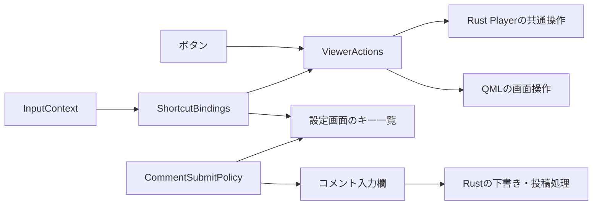

# ショートカットとウィンドウ・キー操作

ながめTVにおけるキーボードショートカット、ウィンドウ操作（全画面・リサイズ・ドラッグ）、フォーカス制御およびEscキーの階層的優先順位に関する統合仕様書です。

UIボタンとショートカットキーの操作を共通化し、キー割り当ての定義から設定画面のショートカット一覧案内までを一貫して管理するアーキテクチャを採用しています。

---

## アーキテクチャと責務

再生制御やコメント投稿などのコア状態と実行判断は **Rust** が、画面の開閉・アニメーション・フォーカス制御は **QML** が担当します。  
Qtの `Action` をボタンとキー操作の共通入口として利用し、表示状態とキー受付条件を分離しています。

| コンポーネント | 責務 |
| :--- | :--- |
| [`player/actions.rs`](../rust/src/player/actions.rs) | 再生状態（ライブ/録画/停止/一時停止）から有効な操作を導出し、再生APIを呼び出す |
| [`ViewerActions.qml`](../rust/qml/ViewerActions.qml) | 名前付きActionの集約、Rustへの接続、全画面・各パネル開閉の共有管理 |
| [`InputContext.qml`](../rust/qml/InputContext.qml) | アクティブフォーカス・ポップアップ状態・画面表示状態からキーの受付条件を判定 |
| [`ShortcutBindings.qml`](../rust/qml/ShortcutBindings.qml) | キー・操作・適用スコープ・キーリピート可否・説明文の定義および一覧の公開 |
| [`ShortcutBinding.qml`](../rust/qml/ShortcutBinding.qml) | ショートカット1件の登録・受付条件・発火処理 |
| [`CommentSubmitPolicy.qml`](../rust/qml/CommentSubmitPolicy.qml) | コメント投稿キーの判定、設定画面・入力欄の案内共有 |
| [`Main.qml`](../rust/qml/Main.qml) | 状態と画面操作シグナルの接続、コメント入力欄等の表示状態の所有 |
| [`PlayerControls.qml`](../rust/qml/PlayerControls.qml) | Actionからボタン操作・有効状態を取得し、コントロールバーを描画 |
| [`SettingsPanel.qml`](../rust/qml/SettingsPanel.qml) | 登録されたBinding一覧と投稿Policyからキーボードショートカット一覧を表示 |

---

## キーバインド一覧

すべてのショートカットは `Qt.WindowShortcut` として登録されます。左右キーのみ長押しリピートを許可しています。

| キー | 操作内容 | スコープ / 受付条件 |
| :--- | :--- | :--- |
| **`F11`** | 全画面表示の切り替え | `Window`（常時有効） |
| **`Ctrl + O`** | 録画を開く（ファイル選択／URL入力） | `Window`（初回設定中も利用可能） |
| **`S`** | チャンネル一覧の開閉 | `Navigation`（文字入力欄・ポップアップ表示中は無効） |
| **`C`** | コメント入力欄を開いてフォーカス | `Navigation`（コメント機能有効時、録画再生中以外） |
| **`G`** | 番組表（EPG）の開閉 | `Navigation`（EPG機能有効時） |
| **`Ctrl + S`** | スクリーンショットを保存 | `Navigation`（撮影可能時、番組表・局一覧が閉じていること） |
| **`PgUp` / `PgDown`** | 前／次のチャンネルへ選局 | `Navigation`（ライブ視聴中） |
| **`Space`** | 共通再生操作（再生／一時停止） | `Playback`（録画・タイムシフト再生中、パネル閉時） |
| **`←` / `→`** | 10秒戻る ／ 30秒進む | `Seek`（シーク可能時、スライダー操作を優先） |
| **`Escape`** | 前面の画面を閉じる ／ 全画面解除 | `Dismiss`（前面のポップアップ・パネルを階層順に閉じる） |

### スコープ判定（InputContext.Scope）
- **Window**: アプリケーション終了中以外は常に有効。
- **Navigation**: テキスト入力中、およびポップアップ表示中はキー入力をブロック（誤動作を防止）。
- **Playback**: Navigationの条件に加え、録画またはタイムシフト再生中であり、かつ番組表・局一覧が閉じている場合のみ有効。
- **Seek**: Playbackの条件に加え、スライダーにフォーカスがある場合はスライダーの左右移動を優先。
- **Dismiss**: ポップアップ自身のEsc処理を最優先。

---

## ウィンドウ操作と全画面

### 全画面表示の切り替え
- **ショートカット**: **`F11`** キーで通常表示（または最大化表示）と全画面表示を相互に切り替えます。
- **マウス操作**: 映像表示領域の **左ダブルクリック** でも全画面表示を切り替えられます。
  - 単一クリックはコントロールバーの表示およびフォーカス解除として機能します。
  - コントロールボタンやスライダー上のダブルクリックは、誤動作を防ぐため全画面切り替えを発火しません。
- **状態復元**: 全画面を解除した際は、全画面化する前の元の状態（通常ウィンドウサイズ、または最大化状態）へ正しく復帰します。

### Escapeキーの階層的クローズ順序
画面内に複数のオーバーレイやポップアップが開いている場合、**`Escape`** キーは視覚的に最前面にあるものから順に閉じます。

1. アクティブなコンボボックスやメニューなどの **ポップアップ**
2. **番組表（EPG）**
3. **チャンネル一覧（ブラウザー）**
4. **コメント入力欄**
5. **動画統計パネル**
6. **番組情報パネル**
7. **全画面表示の解除**（元のウィンドウサイズへ復帰）

### 枠なしウィンドウとドラッグ・リサイズ
- システム装飾（タイトルバー）を最小化した枠なしデザインを採用しています。
- **上部ドラッグ領域**: ウィンドウ上部の空き領域をドラッグすることでウィンドウを移動できます。
- **ダブルクリック**: 上部ドラッグ領域のダブルクリックで通常サイズと最大化を切り替えます（全画面表示へは遷移しません）。
- **ウィンドウ操作ボタン**: 右上に「最小化」「最大化／元に戻す」「閉じる」ボタンを配置しています。

---

## IME・Wayland / X11での入力制御

- **IBus / Mozc連携**: Linux環境（IBus）において、IME変換後のキーがフォーカス中のオブジェクトへ直接転送される経路に対応するため、`ShortcutBindings` がアクティブフォーカスの `Keys.pressed` も適切に監視します。
- **Wayland text-input-v3対策**: コメント入力欄から映像面へフォーカスが戻った際に、`Qt.inputMethod.update(Qt.ImEnabled)` を明示的に呼び出してIME入力状態を非アクティブ化し、文字キー（S, C, G等）が未確定文字として誤入力される現象を防止しています。

---

## コメント投稿キーの制御 (CommentSubmitPolicy)

- **送信方式の選択**: 設定画面の「コメント」から「Ctrl + Enterで送信」または「Enterで送信」を選択できます。
- **IME変換保護**: 日本語入力の未確定文字（変換中）がある間は、Enterキーを押してもコメントは送信されず、IMEの変換確定が優先されます。
- **キーリピート防止**: 長押しによる連続誤送信は行われません。

---

## 関連ドキュメント
- [オーバーレイ操作部の自動非表示](overlay-visibility.md): 操作部のフェードアウト制御
- [チャンネル選局とブラウザー](channel-browser.md): チャンネル選択の操作仕様
- [設定画面](settings-panel.md): ショートカット一覧の表示仕様
- [UIデザイン方針](ui-design.md): アニメーションとフィードバック設計
