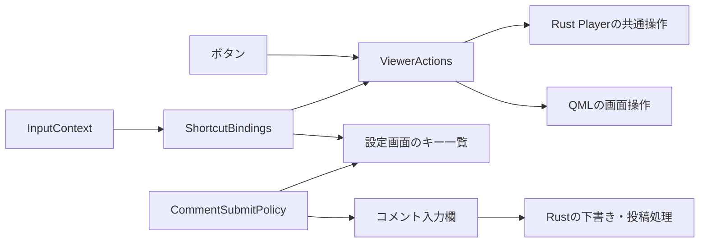

# ショートカットと共通操作

2026-09-18。作業ブランチ: `refactor/shortcut-actions`。
ボタンとキーの操作を共有し、割り当てから設定画面の案内を作る構成。
局一覧をSへ変更し、Cでコメント入力欄を開いてフォーカスする。
その他の既定キーと操作の意味を維持する。利用者による割り当ての編集・保存は今後の範囲。

## 責務と所有者

再生・投稿の状態と実行判断はRust、画面の開閉・フォーカスはQMLに置く。
QtのActionはボタンとキーから共通で呼ぶ入口。画面の開閉状態をRustへ移す段階は予定しない。

| 実装 | 責務 |
| --- | --- |
| [player/actions.rs](../rust/src/player/actions.rs) | 現在の再生状態から操作を導出し、既存の再生APIを呼ぶ。 |
| [ViewerActions.qml](../rust/qml/ViewerActions.qml) | 名前付きAction、Rustへの接続、全画面・パネル開閉の共有。 |
| [InputContext.qml](../rust/qml/InputContext.qml) | フォーカス・ポップアップ・画面表示からキーの受付条件を算出。 |
| [ShortcutBindings.qml](../rust/qml/ShortcutBindings.qml) | キー・操作・適用範囲・リピート・説明の定義と、その一覧を公開。 |
| [ShortcutBinding.qml](../rust/qml/ShortcutBinding.qml) | 一件分の登録・受付条件・起動処理。設定画面へ渡す一覧にもこの型を使う。 |
| [CommentSubmitPolicy.qml](../rust/qml/CommentSubmitPolicy.qml) | 投稿キーの判定と、設定画面・入力欄に表示する案内を共有。 |
| [Main.qml](../rust/qml/Main.qml) | 状態と画面操作signalを接続。コメント入力欄等の表示状態を所有。 |
| [PlayerControls.qml](../rust/qml/PlayerControls.qml) | Actionからボタンの操作・有効状態・説明を取得。配置と見た目を担当。 |
| [SettingsPanel.qml](../rust/qml/SettingsPanel.qml) | 渡されたBinding一覧と投稿Policyからキーの案内を表示。 |

旧WindowActionsは削除し、全画面の管理はViewerActions内に収めた。
Windowと同じ寿命のオブジェクトを一度だけ生成する。設定画面を開く際にShortcutを再登録しない。

## Rustの共通再生操作

`Player.toggle_playback()`が通常ライブの再生／停止、録画・振り返りの再生／一時停止を扱う。
`PlaybackAction { Unavailable, Play, Pause, Stop }`を既存のStateと選局状態から導出する。
QMLは公開された`playback_action`でボタンの表示と有効状態を決める。

内部のRust enumとQtへ公開するFFI enumを分けている。Qtのenumは未知の整数を保持できるため、
内部の網羅的なmatchには使わない。State・再生Phase・操作の分岐を列挙し、
再生状態を増やした際に操作の判断漏れを検出できる構造にする。

操作の実行時にも現在の状態を判定し直す。以前UIが読んだ利用可否は実行権利ではない。
状態と選局の変更を確定してから操作の変更を通知するので、通知中もgetterは最新値を返す。
接続中、停止失敗、録画の終端、停止後の再生対象は既存の動作を維持する。

選局・シーク・投稿は既存のRust APIと実行時検証を利用する。
ファイル検証・取消し・停止・再生開始の順序は既存の所有者とTypestateで維持する。
再生資源を持つ新しいControllerや状態のコピーは作らない。

## UI操作とキー受付の分離

Actionの利用可否と、キーを受け付ける文脈を分ける。
文字入力中はSpaceを入力欄へ渡すが、再生ボタン自体は利用できる。
Actionにshortcutを設定せず、ShortcutBindingsだけがキーを登録する。
ボタンの`action`と従来の`onClicked`を併用して二重実行しない。

ミュート・字幕等の表示はRustの状態へ束縛し、Actionのcheckedを独立して更新しない。
シーク量とボタンの数値は既存の[RecordingSeekSteps](../rust/qml/RecordingSeekSteps.qml)を共有する。
音量のドラッグ・任意位置へのシークは、操作途中の状態を持つ既存部品と専用APIを使う。

局一覧を開くボタンは`openChannels`、Sは`toggleChannels`として意味を区別する。
Cと鉛筆ボタンは`openComposer`を共有する。番組表・局一覧が開いていれば閉じてから
コメント入力欄を表示し、フォーカスする。既に表示中なら入力欄へフォーカスを戻す。
Escはポップアップ自身に先に渡し、その後は番組表→局一覧→コメント入力→統計→番組情報→
全画面解除の順に処理する。全画面の状態はWindow.visibilityから読み、通常／最大化への
復帰先だけを保持する。独立したfullscreenフラグを同期しない。

コメント入力欄の開閉とフォーカスはQMLに残す。番組表の表示状態は既存の
`Player.guide_visible`を利用する。同時表示可能なパネルは排他的なenumにまとめない。

## キー定義

全件`Qt.WindowShortcut`。左右キーだけリピートを許可する。

| キー | 操作 | Scope／追加条件 |
| --- | --- | --- |
| F11 | 全画面切り替え | Window |
| Ctrl+O | TSファイルを開く | Window。初回設定中も利用可能 |
| S | 局一覧の開閉 | Navigation |
| C | コメント入力欄を開いてフォーカス | Navigation、コメント有効、録画以外 |
| G | 番組表の開閉 | Navigation、EPG有効 |
| Ctrl+S | 撮影 | Navigation、撮影可能、番組表・局一覧が閉じている |
| PgUp / PgDown | 前／次の選局 | Navigation |
| Space | 共通再生操作 | Playback |
| Left / Right | 10秒戻る／30秒進む | Seek、シーク可能 |
| Escape | 前面の画面を閉じる／全画面解除 | Dismiss |

`InputContext.Scope`のenumに受付規則をまとめる。
Windowは終了中のみ抑制、Navigationは文字入力とポップアップ表示中も抑制する。
Playbackはさらに録画・振り返りへ限定し、番組表・局一覧を閉じていることを要求する。
SeekはPlaybackに加えてSliderの方向キーを優先する。DismissはポップアップのEscを優先する。

フォーカスは`FocusKind { Other, Text, Slider }`から導出する。
閉じたDrawerがOverlayを残していても、表示中のポップアップとは扱わない。
F11・Ctrl+Oは従来どおり文字入力やQMLポップアップで追加抑制しない。
ネイティブダイアログ等の別Windowへのキー配送はQtのWindowShortcutに従う。

LinuxのIBusは、IMEを使った後のキーをフォーカス中のQObjectへ直接転送する経路を持つ。
その経路ではWindowのShortcut判定を通らないため、ShortcutBindingsが現在の
フォーカス項目の`Keys.pressed`も監視する。通常のShortcutで消費されたキーは
この経路へ届かない。受付条件・Action・リピート可否は同じBindingから読み、
`ShortcutKey`がQtの`QKeySequence`で一つのキー組み合わせを照合する。
独自のスキャンコード表は持たず、キー変更も両方の経路と設定の案内へ反映する。
文字入力・ポップアップ・終了中の抑制を共用し、別Windowがアクティブな間は処理しない。
参照: [Qt IBusのforwardKeyEvent](https://github.com/qt/qtbase/blob/v6.10.2/src/plugins/platforminputcontexts/ibus/qibusplatforminputcontext.cpp)。

Waylandでは、キーがQtに届く前にIMEへ取り込まれる経路もある。
`InputContext`はフォーカス項目とWindowのアクティブ状態の変化後に、
`Qt.inputMethod.update(Qt.ImEnabled)`を呼ぶ。Qtのフォーカス更新が完了してから
実際の入力先へ問い合わせ、文字入力欄から同じWindowの視聴面へ戻った際にも
Waylandの文字入力を無効化する。別Windowがアクティブな場合は更新しない。
ショートカットの有効条件をIMEの有効条件へ流用したり、ユーザーのIMEを切り替えたりしない。
参照: [Qt WaylandのupdateとsetFocusObject](https://github.com/qt/qtbase/blob/v6.10.2/src/plugins/platforms/wayland/qwaylandinputcontext.cpp)。

設定画面は同じBindingのdescription・condition・nativeTextを読む。
現在キーが無効でも一覧から消さない。Ctrl+O・Space・左右キーも案内に含める。
現時点ではBinding一件につきキーは一つ。複数sequenceへ拡張する際は、
QtのnativeTextが先頭のキーしか返さないことに注意して全割り当てを表示する。

キーを差し替える場合はShortcutBindingsのsequenceを変更する。操作本体や設定画面の
キー文字列を別々に変更する必要はない。利用者向けの編集・保存には、今後、安定ID、
形式検証、同時に有効になるキーの衝突検出、検証済みの集合だけを適用する境界を追加する。

## 部品内の操作

番組表・局一覧・日付選択の方向キーとEnter、Sliderの操作は各部品に残す。
コメント投稿はCommentComposerのKeys.BeforeItemで処理し、WindowShortcutを追加しない。

CommentSubmitPolicyは`Mode { ControlEnter, EnterOrControlEnter }`と
`Disposition { PassThrough, Consume, Submit }`で投稿キーを扱う。
保存済みのcomment_send_on_enterからModeを選び、保存形式は変えない。
Return・テンキーEnterを受け付け、IMEの未確定文字がある間は入力メソッドに渡し、リピートでは送信しない。
確定後にカーソル属性だけが残る場合は投稿可能とする。
投稿可否・下書き・送信状態はRustが所有し、送信ボタンとキーは同じsend()を経由する。

遠隔操作は引き続きRust Playerの明示的な操作を呼ぶ。
QMLのフォーカスやポップアップで遠隔APIを制限せず、SetMuted等の冪等な操作も維持する。

## 検証

Rustの状態遷移試験と機器不要の接続試験で、再生モード別の操作、停止失敗・終端、
表示後の状態変化、Qt通知中の整合性を確認する。
QML部品試験ではボタンとSpaceの共通化、フォーカス中の二重実行防止、キー差し替えと
案内の追従、ポップアップ・Slider・終了中の抑制、Escの順序、IMEを確認する。
製品Main.qmlの起動試験にも実キーでの画面開閉・全画面・コメント入力・録画のSpaceを含める。
IMEの転送キーを使った繰り返し操作、確定後に残るカーソル属性、無効な投稿ボタンの
クリックも確認する。これらはQtイベントの配送試験で、IBus/Mozcプロセス自体の試験ではない。

2026-09-20: Ubuntu／IBus Mozcのユーザー環境のログで、Wayland text-input-v3を確認。
コメント入力欄から`surface`へ戻った後に`disableSurface`が呼ばれず、C・G・Sが
未確定文字として届くことを確認した。フォーカス更新後の`ImEnabled`再通知はこの経路への対策。
修正後は同じユーザー環境で繰り返し操作の成功を確認。ログでもコメント欄から戻る
3回すべてで直後に`disableSurface`が呼ばれ、入力欄の外への未確定文字の配送は0件だった。
QML試験275件が成功（評価用機能等の18件はskip）し、製品Main.qmlを使う起動試験も成功した。
実環境でのログ取得は[IME診断](platform-startup.md#waylandのime診断)を使う。

実行方法は[開発手順](development.md)・[Qtテスト](qt-tests.md)に従う。
GUI試験は[専用環境](gui-test-environment.md)で表示・実GPU・仮想音声を検証してから実行する。
機器不要の試験へGUIの初期化を追加しない。物理入力機器・モニター・スピーカーの試験ではない。
