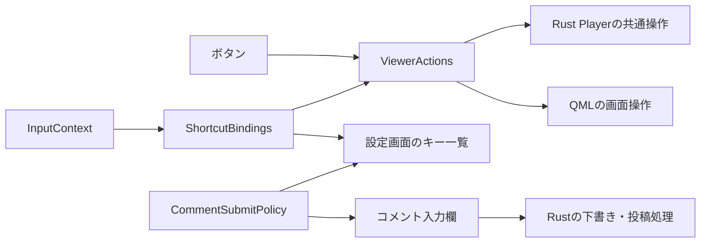

# ショートカットとウィンドウ・キー操作

ながめTVにおけるキーボードショートカット、ウィンドウ操作（全画面・リサイズ・ドラッグ）、フォーカス制御およびEscキーの階層的優先順位に関する統合仕様書です。

UIボタンとショートカットキーの操作を共通化し、キー割り当ての定義から設定画面のショートカット一覧案内までを一貫して管理するアーキテクチャを採用しています。

---

## アーキテクチャと責務

再生制御やコメント投稿などのコア状態と実行判断は **Rust** が、画面の開閉・アニメーション・フォーカス制御は **QML** が担当します。  
Qtの `Action` をボタンとキー操作の共通入口として利用し、表示状態とキー受付条件を分離しています。

```mermaid
flowchart LR
    Buttons[ボタン] --> Actions[ViewerActions]
    Bindings[ShortcutBindings] --> Actions
    Context[InputContext] --> Bindings
    Bindings --> Help[設定画面のキー一覧]
    Actions --> Rust[Rust Playerの共通操作]
    Actions --> View[QMLの画面操作]
    Policy[CommentSubmitPolicy] --> Composer[コメント入力欄]
    Policy --> Help
    Composer --> Posting[Rustの下書き・投稿処理]
```

| コンポーネント | 責務 |
| :--- | :--- |
| [`player/actions.rs`](../rust/src/player/actions.rs) | 再生状態（ライブ/録画/停止/一時停止）から有効な操作を導出し、再生APIを呼び出す |
| [`ViewerActions.qml`](../rust/qml/ViewerActions.qml) | 名前付きActionの集約、Rustへの接続、全画面・各パネル開閉の共有管理 |
| [`InputContext.qml`](../rust/qml/InputContext.qml) | アクティブフォーカス・ポップアップ状態・画面表示状態からキーの受付条件を判定 |
| [`ShortcutBindings.qml`](../rust/qml/ShortcutBindings.qml) | キー・操作・適用スコープ・キーリピート可否・説明文の定義および一覧の公開 |
| [`ShortcutBinding.qml`](../rust/qml/ShortcutBinding.qml) | ショートカット1件の登録・受付条件・発火処理 |
| [`CommentSubmitPolicy.qml`](../rust/qml/CommentSubmitPolicy.qml) | コメント投稿キーの判定、設定画面・入力欄の案内共有 |
| [`Main.qml`](../rust/qml/Main.qml) | 状態と画面操作シグナルの接続、コメント入力欄等の表示状態の所有 |
| [`PlayerControls.qml`](../rust/qml/PlayerControls.qml) | Actionからボタン操作・有効状態を取得し、コントロールバーを描画 |
| [`SettingsPanel.qml`](../rust/qml/SettingsPanel.qml) | 登録されたBinding一覧と投稿Policyからキーボードショートカット一覧を表示 |

---

## キーバインド一覧

下表のショートカットは `Qt.WindowShortcut` として登録されます。左右シークのみ長押しリピートを許可しています。
方向キーによるフォーカス移動と決定は、フォーカス中の部品が処理します。

| キー | 操作内容 | スコープ / 受付条件 |
| :--- | :--- | :--- |
| **`F11`** | 全画面表示の切り替え | `Window`（常時有効） |
| **`Ctrl + O`** | 録画を開く（ファイル選択／URL入力） | `Window`（初回設定中も利用可能） |
| **`S`** | チャンネル一覧の開閉 | `Navigation`（文字入力欄・ポップアップ表示中は無効） |
| **`C`** | コメント入力欄を開いてフォーカス | `Navigation`（コメント機能有効時、録画再生中以外） |
| **`G`** | 番組表（EPG）の開閉 | `Navigation`（EPG機能有効時） |
| **`Ctrl + S`** | スクリーンショットを保存 | `Navigation`（撮影可能時、番組表・局一覧が閉じていること） |
| **`PgUp` / `PgDown`** | 前／次のチャンネルへ選局 | `Navigation`（ライブ視聴中） |
| **`Space`** | 共通再生操作（再生／一時停止） | `Playback`（録画再生中・一時停止可能なライブ視聴中、パネル閉時） |
| **`←` / `→`** | 10秒戻る ／ 10秒進む | `Seek`（映像にフォーカスがあり、シーク可能なとき） |
| **`Escape`** | 前面の画面を閉じる ／ 全画面解除 | `Dismiss`（前面のポップアップ・パネルを階層順に閉じる） |
| **戻るキー（`Back`）** | 前面の画面を閉じる | `Dismiss`（全画面表示は維持する） |

### スコープ判定（InputContext.Scope）
- **Window**: アプリケーション終了中以外は常に有効。
- **Navigation**: テキスト入力中、ポップアップ表示中、録画一覧の表示中は無効。
- **Playback / Seek**: Navigationの条件に加え、録画再生中または一時停止可能なライブ視聴中であり、番組表・局一覧が閉じ、映像にフォーカスがある場合のみ有効。実行可否は各Actionでも確認します。
- **Dismiss**: ポップアップ自身のEsc処理を最優先。

データ放送への入力はサイドパネルの「リモコン」から送る。再生操作部と「…」メニューには
データ放送ボタンを置かない。方向・決定・戻る・四色・数字・Dを含むキーボード入力は
BMLへ直接配送せず、BMLの表示状態や`used-key-list`によってアプリのショートカットを変更しない。
WebEngineはキーボードフォーカスを取得しない。

リモコン内では方向キーでボタンを選び、Enterで選択中のボタンを実行する。
`used-key-list`と表示・入力対象の状態は、リモコンの各ボタンの有効条件に使う。
リモコンのdは未起動なら起動し、起動済みならBMLへDataButtonPressedを渡す。
リモコンの「戻る」はBMLへ戻る入力を送る。Esc・Back・Backspace・Xはサイドパネルを閉じる。
機能が無効、または再生対象が対応していない場合は「リモコン」タブを表示しない。

`Escape`と`Back`は常にアプリの通常の閉じる操作に従う。前面のポップアップやパネルを
閉じ、閉じる対象がなければEscは全画面を解除する。データ放送のブラウザーは保持する。
データ放送機能全体を停止するときは、設定でOFFにする。
自動表示と起動の根拠は[データ放送の設計](data-broadcast-design.md#起動表示操作の規定)を参照する。

## 視聴画面のD-pad操作

映像にフォーカスがあるとき、上で上部ナビゲーション、下または決定（Enter / Return）で
再生操作部へ移ります。決定の最初の一押しはフォーカス移動だけを行います。
ボタン上では方向キーで配置に沿って移動し、決定でそのボタンを実行します。
非表示・無効なボタンは飛ばし、小さいウィンドウで操作部が2段になった場合は上下で段を移れます。

上下の移動順は「上部ナビゲーション ↔ シークバー ↔ 再生操作部」です。
シークバーが使えない場合は飛ばし、再生操作部へ戻ると直前のボタンにフォーカスを戻します。
シークバーでは左右とも1回10秒ずつ位置を調整します。
連打・長押しでは、移動中の最新の目標位置に操作量を加算します。移動先はバー上のマーカーで示し、
進行中のシークが完了した後に最新の目標位置へ移動します。上で上部ナビゲーション、
下・決定・戻るで再生操作部へ戻ります。音声・速度のポップアップはスライダーにフォーカスを置いて
開き、左右で調整、上下で他の項目へ移動、決定で閉じます。

映像にフォーカスがあるときの左右シークは、映像にフォーカスを保ったまま操作部を表示します。
シークを受け付けると、ライブ・録画ともバーとつまみを太くし、移動先の上に時刻を表示します。
連打・長押しでは表示を延長し、最後の入力から1秒で強調を解除します。
シークバーにフォーカスがある間は強調と時刻表示を維持し、白いつまみの外側にアクセント色の
リングを追加します。強調時のつまみは直径18pxとし、2pxの間隔を空けて太さ2pxのリングを描きます。
つまみとリングにはアンチエイリアスを適用し、拡大・縮小中も中心を揃えます。
ポインターのプレビュー中はその表示を使い、左右シークを入力すると移動先時刻を優先します。
シーク完了前の時刻は最新の目標位置から求め、確定済みの再生位置と進捗はそのまま表示します。

選局一覧を戻る操作で閉じると、開く前の操作位置へフォーカスを戻します。選局を決定した場合は
映像へ戻ります。上部ナビゲーションから開いた番組表・録画一覧も、閉じると元の操作位置へ戻します。
これらの画面の内部操作は各画面の仕様に従います。

方向キーで操作中のボタンには太いフォーカス枠と操作名を表示し、操作部の自動非表示を止めます。
表示だけのツールチップはキー入力を遮りません。戻る操作で操作部から映像へ戻ると、再生中は
操作部を隠します。移動・値調整の長押しは受け付け、決定と戻るの長押しによる連続実行は抑止します。

`DirectionalFocus.qml`は明示的に列挙したボタン間の移動と操作位置の保持を担当します。
一覧のカーソル移動は各一覧が担当し、領域間の接続は画面側が指定します。

サイドパネルの視聴設定では、上下で設定項目を移動し、左右で値を調整します。
Enterで切り替え・実行し、画面外の項目にはスクロールを追従させます。
閉じるボタン、設定内容、下部タブを方向キーで往復できます。
[設定の配置と今後追加する項目](settings-panel.md#視聴中のサイドパネル)も参照してください。

全体設定では、上下でカテゴリを切り替え、右・決定で設定項目へ進みます。項目間は上下、
値の調整は左右で操作し、戻る・Escでカテゴリへ戻ります。カテゴリで戻ると設定画面を閉じます。
選択メニューや数値の直接入力などの操作は[設定画面](settings-panel.md)に記載しています。

録画一覧では、上下で録画行や検索欄、ページ送りへ移り、Enterで再生・選択します。
検索欄と録画URL欄は、方向キーで選んでからEnterで編集を始め、戻る・Escで編集を終えます。
[録画一覧の操作方法](epgstation.md)も参照してください。

---

## ウィンドウ操作と全画面

### 全画面表示の切り替え
- **ショートカット**: **`F11`** キーで通常表示（または最大化表示）と全画面表示を相互に切り替えます。
- **マウス操作**: 映像表示領域の **左ダブルクリック** でも全画面表示を切り替えられます。
  - 単一クリックはコントロールバーの表示およびフォーカス解除として機能します。
  - コントロールボタンやスライダー上のダブルクリックは、誤動作を防ぐため全画面切り替えを発火しません。
- **状態復元**: 全画面を解除した際は、全画面化する前の元の状態（通常ウィンドウサイズ、または最大化状態）へ正しく復帰します。

### Escapeキーの階層的クローズ順序
画面内に複数のオーバーレイやポップアップが開いている場合、**`Escape`** キーは視覚的に最前面にあるものから順に閉じます。

多ボタンマウスの「戻る」ボタン（`Qt.BackButton`）でも、同じ順序で閉じます。
キーボードやリモコンの戻るキー（`Qt.Key_Back`）も同じ順序で閉じます。
閉じる画面や戻すフォーカスがない場合、Escapeは全画面を解除し、戻るキー・マウスの戻るボタンは全画面を維持します。
ウィンドウ内のボタンや入力欄、ポップアップの上でも使え、1回押すごとに1段階戻ります。
サイドパネルにフォーカスがある場合は、背景の動画統計より先にサイドパネルを閉じます。
`ShortcutBindings` が所有する入力フィルターは、ポップアップが開いている間だけ戻る操作をEscapeとして渡します。
ポップアップの終了条件や入力欄の下書きの扱いは共通です。通常の視聴画面では戻る専用のActionへ渡します。

1. アクティブなコンボボックスやメニューなどの **ポップアップ**
2. **録画一覧、または番組表（EPG）**
3. **チャンネル一覧（ブラウザー）**
4. **コメント入力欄**
5. **動画統計パネル**
6. **番組情報パネル**
7. **操作部から映像へフォーカスを戻す**（方向キーで操作中の場合）
8. **全画面表示の解除**（Escapeのみ。元のウィンドウサイズへ復帰）

### 枠なしウィンドウとドラッグ・リサイズ
- システム装飾（タイトルバー）を最小化した枠なしデザインを採用しています。
- **上部ドラッグ領域**: ウィンドウ上部の空き領域をドラッグすることでウィンドウを移動できます。
- **ダブルクリック**: 上部ドラッグ領域のダブルクリックで通常サイズと最大化を切り替えます（全画面表示へは遷移しません）。
- **ウィンドウ操作ボタン**: 右上に「最小化」「最大化／元に戻す」「閉じる」ボタンを配置しています。

---

## IME・Wayland / X11での入力制御

- **IBus / Mozc連携**: Linux環境（IBus）において、IME変換後のキーがフォーカス中のオブジェクトへ直接転送される経路に対応するため、`ShortcutBindings` がアクティブフォーカスの `Keys.pressed` も適切に監視します。
- **Wayland text-input-v3対策**: コメント入力欄から映像面へフォーカスが戻った際に、`Qt.inputMethod.update(Qt.ImEnabled)` を明示的に呼び出してIME入力状態を非アクティブ化し、文字キー（S, C, G等）が未確定文字として誤入力される現象を防止しています。

---

## コメント投稿キーの制御 (CommentSubmitPolicy)

- **送信方式の選択**: 設定画面の「コメント」から「Ctrl + Enterで送信」または「Enterで送信」を選択できます。
- **IME変換保護**: 日本語入力の未確定文字（変換中）がある間は、Enterキーを押してもコメントは送信されず、IMEの変換確定が優先されます。
- **キーリピート防止**: 長押しによる連続誤送信は行われません。

---

## 関連ドキュメント
- [オーバーレイ操作部の自動非表示](overlay-visibility.md): 操作部のフェードアウト制御
- [チャンネル選局とブラウザー](channel-browser.md): チャンネル選択の操作仕様
- [設定画面](settings-panel.md): ショートカット一覧の表示仕様
- [UIデザイン方針](ui-design.md): アニメーションとフィードバック設計
