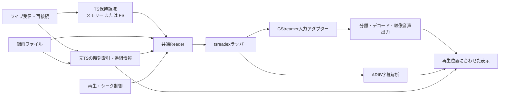

# ライブ・録画共通のTS入力設計案

2026-09-17。ライブ・録画・将来の振り返り再生をまとめた設計案。以下の共通入力層と
振り返り機能は未実装。[tsreadex試験](tsreadex-trial.md)は事前変換したファイルの比較であり、
ライブラリを再生経路に組み込んだ結果ではない。GStreamerへの接続方式は試作で確定する。

## 全体構成

tsreadexをC++ライブラリとして`cxx`で包み、ライブと録画で共用する。
元TSを保持し、読み出し時に整形する。録画は元ファイルを直接読み、常時全量の
変換コピーを作る方式にはしない。デコード・映像表示・音声出力はGStreamerを使う。

| 部分 | 責務 |
| --- | --- |
| Source | 録画ファイルとライブ受信をenumで区別。ライブ側が受信・再接続・Storeへの書き込みを所有する。 |
| Store | 上限付きで元TSを保持。時刻の解釈・PID変更は行わない。 |
| Index | 元TS位置、PCR/PTS、放送日時、PAT/PMTと番組情報を区間ごとに対応付ける。 |
| Reader | 指定位置から読み、データ・追記待ち・保持期限切れ・終端・I/Oエラーを区別する。 |
| Normalizer | tsreadexの`CServiceFilter`を所有し、選択サービスのTSを整形する。 |
| PlaybackSession | Reader、Normalizer、GStreamer、字幕、再生状態と処理世代を所有する。 |

ライブの書き込み位置とReaderの読み出し位置は独立する。再生キューが満杯でも
受信・保持をそのキューで待たせない。GStreamerへの先読み量には別の上限を設ける。
保存が受信に追いつかない場合やI/O失敗は欠落・エラーとして通知し、正常な履歴と区別する。

選局・ファイル変更・終了では元入力を含む所有者が処理を取り消し、資源を解放する。
シークでは再生側の世代だけを更新し、同じライブ受信・Storeを継続する。
Normalizerの状態を別セッションで共有しない。今の停止成功後にだけ資源を置き換える保証を維持する。

## メモリーとFS

| 保存先 | 実装案 | 上限時の動作 |
| --- | --- | --- |
| Memory | チャンク単位のメモリーリング | 古いチャンクを破棄 |
| Filesystem | セッション専用ディレクトリー内の分割TS | 古い分割ファイルを削除 |

同じStore契約で追記・読み出し・保持範囲取得・破棄を扱い、時刻索引とシークは共通にする。
論理アドレスには入力識別子・区間・元TS位置を使い、配列添字やファイル名は公開しない。
物理領域を再利用しても、古い要求が別のデータを読むことは許さない。

保持時間とバイト容量の両方に上限を設け、実際の再生可能範囲をUIに示す。
読み出し中・先読み中の量も上限管理に含め、古い読者のために無制限に保持しない。
読者の位置が期限切れになったら専用の結果を返す。FSでは容量不足・一時ファイルの
破棄・異常終了後の掃除も扱う。上限値・単位・規格値は名前付き定数や型で表す。

初期案では保存先をセッション開始時に選び、自動切り替えや二段キャッシュは後続とする。
PAT/PMTの復元に必要な情報と索引も保持範囲に合わせて管理し、復元できない位置は
シーク可能範囲に含めない。保存先・上限値の設定UIは振り返り実装時に確定する。

## 時刻・シーク

元TSのバイト位置、整形後のバイト位置、再生経過時間、放送日時を区別する。
tsreadexは出力サイズを変えるため、出力側のバイト位置で元ファイルを直接シークしない。
PCR/PTSのラップ・巻き戻りや再接続は区間を区別して扱い、単なるPID変更だけで
経過時間をゼロへ戻さない。欠落を含む時刻対応の規則は試作で検証する。

録画の索引は元ファイルの探索で作成し、ライブでは受信に合わせて追加する。
疎な索引から選んだ開始点を実データで検証する。全フレームの索引や全TSの
メモリー保持を前提にしない。未探索の位置と検証済みのシーク可能範囲は区別する。
索引の探索はUIスレッド外で行い、取消しと、要求された移動先の優先探索を扱う。

1. 移動先と保持範囲を検証し、その時点のPAT/PMTを復元できる読み出し開始点を選ぶ。
2. 旧読み出しを取り消し、GStreamerと字幕をflushする。ライブ受信は継続する。
3. 新しい世代のNormalizerを作り、適切なPAT/PMTを先に渡してからTSを読み出す。
4. デコード可能な位置から先行デコードし、指定時刻より前の出力を抑制する。
5. 新しい世代・segmentの出力準備を確認して完了し、再生中／一時停止を復元する。

`SeekPlan`のような検証済みの型を同じセッション内で作り、準備前に実行できないAPIにする。
保持範囲は動くため実行時にも期限切れを確認する。連続シークは最新要求を優先し、
旧世代の完了・データ・EOFを新しい状態へ反映しない。

## ライブ・字幕・番組情報

- ライブの最新位置で未受信なら追記待ちとし、録画のEOFとは区別する。
- 通常ライブと振り返りを区別し、「ライブに戻る」で最新の再生開始可能位置へ移動する。
- 保持範囲から再生位置が外れた場合の初期案は、通知して最古の再生可能位置へ補正する。
  一時停止中なら停止状態を維持する。この動作は利用者向け仕様として確定する。
- 選局時は前局の保持領域を破棄する案とする。再接続時は保持領域を残し、新しい区間を追加する。
- 手元で保持する方式では受信開始前には戻れない。サーバー蓄積への接続は別の拡張とする。

振り返り無効のライブも整形・再生経路は共通にする。初期の共通入力実装では
上限付きの逐次受け渡しを使い、履歴を保持するStoreは後続で追加する。
Qtへは入力種別だけでなく、その時点の操作可能範囲を公開する。

EIT/SDT/TOT/TDTは元TSから取得し、位置・時刻・区間と結び付ける。受信中の最新番組を
そのまま表示せず、映像の再生時刻から選ぶ。字幕は整形後のPIDと出力時計に合わせ、
シーク時に旧管理情報・DRCS・表示待ちを破棄する。再送がない区間の復元は追加検証する。
先読みした情報を現在位置の表示へ混ぜない。実況には別の履歴保持と時刻同期が必要。

## 接続方式と実装順

[`appsrc`](https://gstreamer.freedesktop.org/documentation/app/appsrc.html)への供給を試作候補とする。
`need-data` / `enough-data`で再生側の供給量を制御する。`seek-data`だけで元TSの時刻シークが
成立するとは扱わず、TIME seek、flush、segmentとseqnum、demuxの時刻変換・長さ問い合わせを
一体で検証する。現在のplaybin3を維持できる範囲と、専用source要素の要否は試作で判断する。

GStreamerの[タイムシフト設計](https://gstreamer.freedesktop.org/documentation/additional/design/buffering.html#timeshifting)
と既存の保持要素も比較対象とする。通常キューと消費済みデータを読み戻せる保持領域を区別し、
queue2の設定だけで本設計のシーク・期限切れ管理が完成すると仮定しない。

1. `cxx`ラッパーを作り、CLIとライブラリの結果を比較する。設定をenumで表し、
   パケット境界を検証する。終端の映像1枚の差、音声・字幕・SI保持も調べる。
2. 録画と通常ライブの共通入力を試作し、録画の前後シーク・一時停止復帰と、
   ライブのPID変更・再接続をメモリー出力で検証する。
3. 製品の映像・音声・字幕・番組表示へ接続し、ライブ・録画の回帰試験と同梱ビルドを行う。
4. 同じStore契約でメモリーとFSを実装し、上書き・期限切れ・容量不足・受信継続を検証する。
5. ライブの移動可能範囲・遅れ表示・「ライブに戻る」をUIへ接続する。

検証では指定時刻の実際の出力と旧世代の排除、停止・取消し時の資源解放、長時間の
RAM・ディスク・FD使用量、ネイティブ／Flatpakを確認する。機器不要の試験と製品画面の
試験を分け、画面・GPU・音声は既存手順で検出・検証してから使用する。
