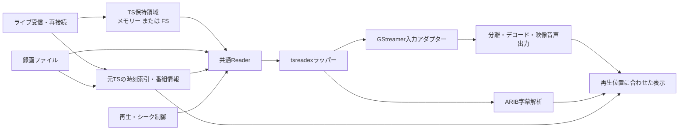

# ライブ・録画共通のTS入力設計案（過去の設計記録）

> [!NOTE]
> 本設計案は実装が完了し、**[共通TS入力とタイムシフト再生](ts-input-implementation.md)** に統合されました。  
> 現在のTS入力パイプライン、tsreadex連携、タイムシフト（ライブ振り返り）の最新仕様は統合先のドキュメントを参照してください。

以下は、2026-09-17に設計合意した際の実装方針および判断材料の記録です。

---

## 過去の設計概要

tsreadexをC++ライブラリとして `cxx` で包み、ライブ放送と録画再生で共用する設計を採用した。  
元TSを保持し、読み出し時に動的整形する。デコード・映像表示・音声出力には GStreamer playbin3 を用いる。

- **Source**: 録画ファイルとライブ受信をenumで区別。
- **Store**: 上限付きで元TSを保持（メモリーまたは一時ファイル）。
- **Reader / Normalizer**: tsreadex の `CServiceFilter` で選択サービスのTSを整形して GStreamer `appsrc` へ供給。
- **タイムシフト**: ライブ視聴中の一時停止・シーク・「ライブに戻る」機能を提供。
